---

# Capítulo II

## 2.1. Competidores

Llevamos a cabo este análisis competitivo para poder darnos cuenta de nuestras ventajas y desventajas dentro del mercado con competidores que cuentan con un modelo de negocio similar o parecido al nuestro.

### BabyCenter

BabyCenter es una plataforma en línea centrada en la salud y el bienestar durante el embarazo, el parto y la crianza de los hijos. Ofrece contenido educativo confiable, herramientas de seguimiento del embarazo y desarrollo del bebé, así como foros comunitarios para que los padres intercambien experiencias y consejos. Además, cuenta con una aplicación móvil que proporciona artículos personalizados según la etapa del embarazo o edad del niño.

### Clue

Clue es una aplicación de salud femenina enfocada en el seguimiento del ciclo menstrual, la ovulación y la fertilidad. Utiliza datos científicos y algoritmos personalizados para ayudar a los usuarios a comprender sus ciclos y síntomas. Ofrece funciones como recordatorios, predicciones de menstruación, PMS y días fértiles.

### Ovia Health

Ovia Health es una plataforma de salud digital centrada en el bienestar reproductivo y familiar. Ofrece tres aplicaciones principales: Ovia Fertility, Ovia Pregnancy y Ovia Parenting, diseñadas para cubrir todas las etapas desde la concepción hasta la crianza temprana. La plataforma proporciona herramientas de seguimiento altamente personalizadas y contenido médico validado.

### 2.1.1. Análisis competitivo

#### Competitive Analysis Landscape

**¿Por qué llevar a cabo el análisis?** Este análisis se lleva a cabo con la finalidad de poder conocer la competencia y cómo HelpMom se diferencia ante esta.

| Categoría | Elemento | HelpMom | BabyCenter | Clue | Ovia Health |
| :--- | :--- | :--- | :--- | :--- | :--- |
| **Perfil** | **Overview** | Plataforma móvil unificada que integra monitoreo IoT y soporte mediante un Asistente IA, sumado a un "Modo Compañero" para la pareja. | Plataforma en línea centrada en la salud y el bienestar durante el embarazo, el parto y la crianza de los hijos. | Aplicación de salud femenina enfocada en el seguimiento del ciclo menstrual, la ovulación y la fertilidad. | Plataforma de salud digital centrada en el bienestar reproductivo y familiar. |
| **Perfil** | **Ventaja competitiva ¿Qué valor ofrece a los clientes?** | Triage Inteligente (IA), reducción de ansiedad visual (Semáforo IoT) e integración activa del acompañante en el día a día. | Gran comunidad, información verificada, seguimiento detallado del embarazo. | Monitoreo detallado del ciclo menstrual y seguimiento de embarazo. | Monitoreo avanzado, personalización de la salud reproductiva. |
| **Perfil de Marketing** | **Mercado Objetivo** | Gestantes primerizas y sus parejas que buscan vivir el embarazo de forma segura, conectada y sin ansiedad médica. | Gestantes, padres recientes, familias en general. | Mujeres que buscan monitorear su ciclo menstrual y embarazo. | Gestantes, mujeres en fase de fertilidad, padres recientes. |
| **Perfil de Marketing** | **Estrategias de Marketing** | Publicidad en redes sociales, alianzas con fabricantes de dispositivos IoT y campañas enfocadas en la dinámica familiar. | Publicidad digital, alianzas con marcas de productos de bebé, contenido de blogs. | Publicidad en redes sociales y aplicaciones móviles. | Marketing de contenido, SEO, recomendaciones a través de profesionales. |
| **Perfil de Producto** | **Productos y Servicios** | Aplicación móvil con Asistente IA 24/7, traducción de datos IoT, alertas de apoyo rápido y contenido desbloqueable. | Aplicación móvil para seguimiento de embarazo, comunidad online, consejos de salud. | App para seguimiento de ciclo menstrual, embarazo, y salud general. | Monitoreo de salud, telemedicina, consejos personalizados. |
| **Perfil de Producto** | **Precios y Costos** | Modelo freemium (Plan Básico gratuito y Plan Integral de pago para activar uso ilimitado de IA e IoT). | Gratis con opciones premium. | Gratis con opciones premium. | Gratis, con opción premium. |
| **Perfil de Producto** | **Canales de distribución (Web y/o Móvil)** | Aplicación móvil (iOS/Android). | Aplicación Web y aplicación móvil. | Aplicación móvil. | Aplicación Web y aplicación móvil. |
| **Análisis SWOT** | **Fortalezas** | Respuestas inmediatas 24/7 (IA), traducción amigable de datos clínicos (cero estrés) e involucramiento del padre. | Comunidad activa, información verificada, gran cantidad de usuarios. | Buena experiencia de usuario, fuerte en la fase de monitoreo menstrual. | Personalización avanzada, enfoque en salud femenina, telemedicina. |
| **Análisis SWOT** | **Debilidades** | Posible barrera inicial para ganar confianza en las respuestas de la Inteligencia Artificial y dependencia de hardware (IoT). | No tan fuerte en postparto ni en la consulta directa con médicos. | No enfoque específico en postparto ni telemedicina. | Foco en fertilidad y embarazo, falta de apoyo postparto. |
| **Análisis SWOT** | **Oportunidades** | Posicionarse como líder en un mercado desatendido (salud en pareja) con una solución altamente escalable gracias a la automatización. | Expansión a un público más amplio y mayor integración médica. | Expansión de servicios postparto, integración de más expertos. | Creación de más contenido y servicios para la madre postparto. |
| **Análisis SWOT** | **Amenazas** | Desconfianza hacia los diagnósticos de IA y riesgo de que plataformas ya establecidas copien las funcionalidades del Modo Compañero. | Competencia con plataformas grandes como Ovia y Clue. | Competencia de apps más especializadas y plataformas de telemedicina. | Competencia con apps que ofrezcan más servicios médicos. |

### 2.1.2. Estrategias y tácticas frente a competidores

Nuestra estrategia principal para destacar frente a alternativas consolidadas como BabyCenter u Ovia Health radica en la hiper-personalización accionable y la reducción del estrés. Mientras otras aplicaciones saturan a la usuaria con foros, publicidad o datos médicos crudos que pueden asustar, HelpMom apuesta por una interfaz "limpia" apoyada en un Sistema de Semáforo que traduce los datos del IoT a alertas visuales simples y tranquilizadoras (ej. un ícono verde para indicar que todo está bien).

Además, utilizamos una táctica de inclusión familiar mediante el Modo Compañero. La competencia suele enfocar su producto exclusivamente en la gestante, dejando al padre o acompañante en un rol pasivo; HelpMom le otorga a la pareja una vista propia, consejos prácticos ("Tips para papá") y un sistema de notificaciones rápidas ("Pasa la Voz") para que se convierta en un apoyo activo. Esto fortalece el vínculo de la pareja y crea una barrera de salida alta, ya que el uso de la aplicación se convierte en una dinámica familiar diaria y no solo en una herramienta clínica de uso individual.

## 2.2. Entrevistas

Las entrevistas estarán dirigidas a madres gestantes y padres/acompañantes, con el objetivo de comprender sus necesidades específicas en el acceso a información médica confiable, seguimiento prenatal/postnatal y comunicación con los padres.

### 2.2.1. Diseño de entrevistas

#### Segmento 1: Madres Gestantes
El objetivo con este segmento es validar la fricción actual en la comunicación, el nivel de ansiedad respecto a la salud del bebé y la disposición a confiar en un sistema automatizado.

1. **Gestión de la ansiedad:** Actualmente, ¿qué aspecto del embarazo te genera mayor incertidumbre o ansiedad en el día a día, y cómo buscas tranquilidad cuando eso ocurre?
2. **Confianza en el IoT:** ¿Qué opinas sobre el uso de un dispositivo (sensor) en casa para monitorear los latidos de tu bebé? ¿Prefieres ver los datos médicos exactos o te daría más paz mental un indicador visual simple (como un semáforo verde o amarillo)?
3. **Validación del Asistente IA:** ¿Te sentirías segura realizándole consultas sobre tus síntomas a un asistente de Inteligencia Artificial disponible 24/7, sabiendo que está programado para derivarte a emergencias si detecta algo grave?
4. **Fricción de comunicación:** A veces, explicar cómo te sientes o pedir ayuda puede resultar agotador. ¿Qué tan útil te resultaría tener botones de "alerta rápida" en tu celular para avisarle a tu pareja que tienes náuseas, un antojo o necesitas descansar, sin tener que escribirlo?
5. **Privacidad de datos:** ¿Qué tan importante es para ti mantener tu registro de peso y síntomas clínicos de forma privada, compartiendo con tu pareja únicamente el estado general del bebé y las alertas de apoyo?
6. **Soporte emocional:** Durante el embarazo hay muchos cambios físicos. ¿Cómo te haría sentir recibir notificaciones sorpresa durante el día con mensajes que validen tu esfuerzo y te recuerden cuidar tu autoestima?
7. **Consumo de contenido:** ¿Cómo prefieres consumir información sobre tu embarazo (artículos largos, videos cortos, tips diarios) y sientes que la información que encuentras en internet está lo suficientemente personalizada a tu semana de gestación?
8. **Seguimiento clínico:** Cuando vas a tus controles médicos, ¿te resulta difícil recordar todos los síntomas o problemas de sueño que tuviste durante el mes para contárselos al doctor?
9. **Monetización (Disposición de pago):** Considerando que la app tendría un plan gratuito básico, ¿estarías dispuesta a pagar una suscripción mensual por el "Plan Cuidado Integral" que incluye el sensor de latidos y el bot de emergencias 24/7? ¿Por qué?
10. **Pregunta abierta:** Si pudieras crear una herramienta digital perfecta que te quite un peso de encima durante el embarazo hoy mismo, ¿qué haría exactamente?

#### Segmento 2: Padres / Acompañantes
El objetivo aquí es validar el nivel de exclusión que sienten con las herramientas actuales y probar si las funciones del "Modo Compañero" realmente facilitan su involucramiento activo.

1. **Involucramiento actual:** ¿Cómo participas actualmente en el seguimiento del embarazo de tu pareja y qué herramientas (apps, libros, blogs) utilizas para informarte?
2. **Comprensión de los cambios:** ¿Sientes que logras comprender completamente los cambios físicos y hormonales que experimenta tu pareja semana a semana, o a veces te sientes desorientado sobre por qué se siente de cierta manera?
3. **Validación de la Guía Diaria:** En lugar de recibir información médica general, ¿qué tan útil te resultaría recibir una sugerencia diaria y accionable en tu celular (por ejemplo: "Hoy un masaje lumbar de 10 minutos le ayudaría mucho" o "Asegúrate de que tome agua hoy")?
4. **Respuesta a emergencias/alertas:** Si recibieras una notificación directa desde la app de tu pareja diciendo "Necesito un descanso", ¿crees que esto mejoraría la dinámica diaria entre ustedes frente a que ella te lo tenga que explicar?
5. **Monitoreo pasivo (IoT):** ¿Qué tanta tranquilidad te aportaría poder abrir tu celular y ver un indicador verde que confirme que los latidos del bebé están bien, sin tener que preguntarle constantemente a ella?
6. **Preparación logística:** ¿Qué tan preparado te sientes para tareas como los trámites de la clínica, el armado del bolso o lo que debes preguntar en la próxima ecografía? ¿Te gustaría recibir píldoras informativas sobre esto?
7. **Sensación de exclusión:** ¿Sientes que la mayoría de los recursos sobre el embarazo están diseñados exclusivamente para la madre, dejándote a ti en un rol de espectador?
8. **Frecuencia de notificaciones:** ¿Te resultaría invasivo recibir una notificación push cada mañana con el "Tip del Día" para apoyar a tu pareja, o lo verías como una herramienta útil para empezar el día enfocado?
9. **Monetización (Valor percibido):** ¿Considerarías adquirir o regalar la suscripción premium de esta plataforma sabiendo que, además de monitorear la salud de tu bebé, te dará instrucciones claras para ser un papá/acompañante mucho más activo?
10. **Pregunta abierta:** ¿Cuál consideras que es el mayor desafío al que te enfrentas hoy como acompañante en este proceso y cómo podría la tecnología ayudarte a resolverlo?

---

### 2.2.2. Registro de entrevistas

#### Segmento objetivo 1: Madre Gestante
   
* **Entrevista 1**

*   **Nombre:** Aixa Zamalloa
*   **Edad:** 25 años
*   **Distrito:** Monterrico
*   **Duración:** 5:26
*   **Link:** [Ver entrevista](https://drive.google.com/file/d/1rVtir8Wdmz3F_0g1PKRu2hoFadW2FNCq/view?usp=sharing)
*   **Resumen:** Aixa, una joven de 25 años con cinco meses de embarazo, expresa que su mayor ansiedad diaria es el bienestar de su bebé, por lo que valoraría enormemente una aplicación integral y accesible que le brinde control y tranquilidad mediante el uso de un sensor doméstico de latidos. Esta herramienta ideal debería incluir un asistente de inteligencia artificial para orientación de madrugada, un botón de alerta rápida para notificar a su pareja sin dar explicaciones, y una función para registrar síntomas en tiempo real que facilite sus consultas médicas. Además, Aixa enfatiza la necesidad de mantener su historial clínico en estricto privado y prefiere recibir apoyo emocional y consejos a través de videos cortos y notificaciones que estén completamente personalizados a su semana exacta de gestación, evitando sentirse acompañada por mensajes genéricos o automatizados
#### Segmento objetivo 2: Padres / Acompañantes

**Entrevista 2**

*   **Nombre:** Juan David Saldaña De Souza
*   **Edad:** 28 años
*   **Distrito:** Santa Anita
*   **Duración:** 7:20
*   **Link:** [Ver entrevista](https://drive.google.com/file/d/1deOo86JMTC_AD6Qg1AGDqAHqpDv2n5_m/view?usp=sharing)
*   **Resumen:** Juan nos dice que sería muy buena idea la aplicación móvil, ya que al ser un padre primerizo no tiene noción de los cuidados que se tiene que tener con la madre y con el bebé. También le gusta la idea de poder estar al pendiente de su pareja por si ocurre alguna emergencia, le facilitará mucho ya que es un hombre ocupado con sus pendientes. Por último, nos comenta que estaría interesado en adquirir este servicio porque le ayudará mucho a ser un buen padre.

**Entrevista 3**

*   **Nombre:** Manuel Alonso Milla Coronado
*   **Distrito:** Lince
*   **Duración:** 6:38
*   **Link:** [Ver entrevista en YouTube](https://youtu.be/RirAGLBOhxM)
*   **Resumen:** En la entrevista realizada a Manuel, un joven de 21 años residente en Lince que asume el rol de padre primerizo, se evidenció una fuerte frustración inicial por sentirse excluido y desorientado ("un espectador") frente a las herramientas tradicionales y el sistema de salud, los cuales se enfocan exclusivamente en la madre. Manuel validó de forma entusiasta las propuestas del "Modo Compañero" de HelpMom, destacando que recibir sugerencias diarias accionables y notificaciones directas sobre las necesidades de su pareja ("Pasa la Voz") mejoraría significativamente su dinámica diaria, evitando malentendidos o la sensación de ser una carga al preguntar constantemente. Asimismo, confirmó que el uso de un semáforo visual para monitorear los latidos del bebé le brindaría gran paz mental sin generarle estrés, mostrándose plenamente dispuesto a adquirir un plan de suscripción que le permita transformar su rol pasivo en uno de soporte logístico y emocional activo durante todo el embarazo.

---

### 2.2.3. Análisis de entrevistas

A partir de las entrevistas realizadas, se han identificado patrones claros de comportamiento y necesidades, especialmente en el segmento de padres/acompañantes, que validan la propuesta de valor central de HelpMom:

1.  **Sensación de exclusión en el mercado actual:** Se evidencia una fuerte frustración en los padres primerizos, quienes se sienten relegados a un rol de "espectadores". Las herramientas y el sistema de salud tradicional se centran exclusivamente en la madre, dejando al acompañante desorientado y sin noción clara de los cuidados necesarios.
2.  **Validación del "Modo Compañero" y Alertas Rápidas:** Existe un entusiasmo marcado por funciones que faciliten la comunicación. Recibir sugerencias accionables diarias y alertas directas ("Pasa la Voz") se percibe como una solución clave para mejorar la dinámica de pareja, reduciendo malentendidos y evitando la fricción de tener que preguntar constantemente.
3.  **Tranquilidad a través del Monitoreo Visual:** La propuesta de traducir datos médicos a un sistema visual sencillo (semáforo IoT) es altamente valorada, ya que proporciona la paz mental necesaria para monitorear el bienestar del bebé sin generar el estrés que provocarían los datos médicos crudos.
4.  **Disposición de Pago (Monetización):** Los entrevistados muestran una alta disposición a adquirir una suscripción premium, reconociendo que la herramienta no solo asiste en emergencias, sino que les otorga el conocimiento y la facilidad logística para convertirse en un soporte activo y ser "buenos padres".

## 2.3. Needfinding

Utilizando la información recolectada, hemos realizado un análisis de las necesidades de los usuarios, que nos permitirá identificar y priorizar las funcionalidades que se incluirán en la plataforma orientada a dispositivos móviles.

### 2.3.1. User Personas

**User Persona 1: Daniela Gomez (Madre Gestante)**

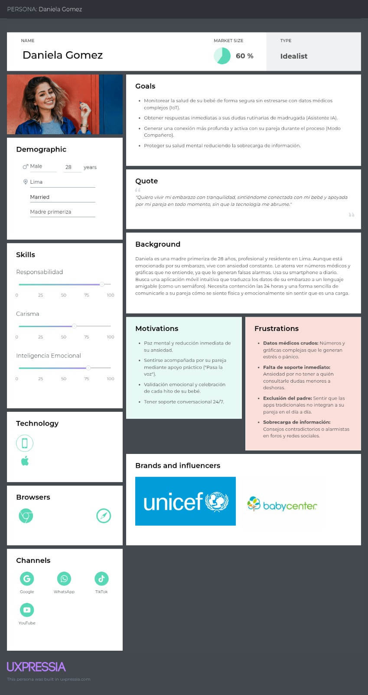

**User Persona 2: Mateo Suarez (Padre / Acompañante)**

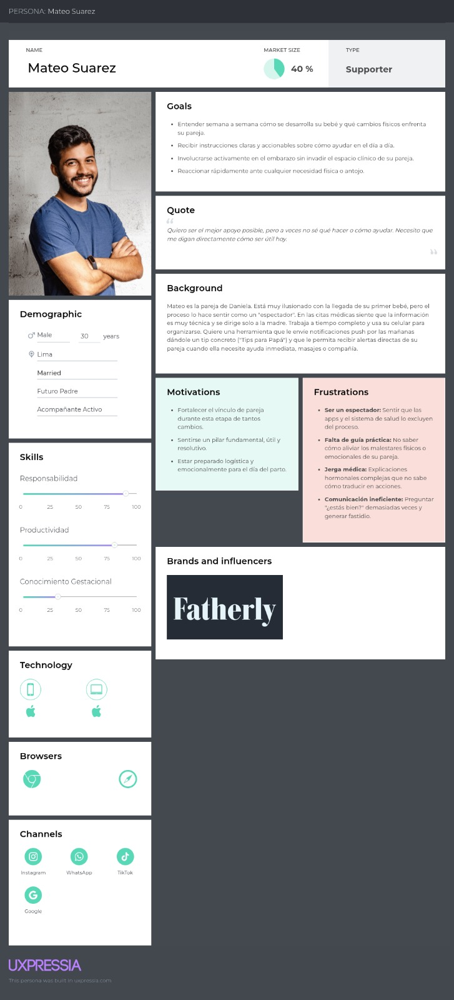

### 2.3.2. User Task Matrix

En esta sección se presenta la matriz de tareas, la cual muestra las actividades principales que realizan la madre gestante y el acompañante en la plataforma, evaluando su frecuencia de uso e importancia.

**Segmento 1: Madre Gestante**

| Actividad | Frecuencia | Importancia |
| :--- | :--- | :--- |
| Registrar síntomas y datos de salud (Vista "Mi Cuerpo") | Alta | Alta |
| Revisar estado del bebé (Sistema de Semáforo IoT) | Alta | Alta |
| Consultar dudas de rutina (Asistente IA 24/7) | Alta | Alta |
| Enviar/Recibir alertas de apoyo ("Pasa la Voz") | Media | Alta |
| Revisar "Tips diarios" y desarrollo semanal (Hitos) | Baja | Media |
| Activar Triage de Emergencia (Alerta crítica) | Rara vez | Alta |

**Segmento 2: Padre / Acompañante**

| Actividad | Frecuencia | Importancia |
| :--- | :--- | :--- |
| Registrar síntomas y datos de salud (Vista "Mi Cuerpo") | Nunca | Baja |
| Revisar estado del bebé (Sistema de Semáforo IoT) | Media | Alta |
| Consultar dudas de rutina (Asistente IA 24/7) | Baja | Media |
| Enviar/Recibir alertas de apoyo ("Pasa la Voz") | Media | Alta |
| Revisar "Tips diarios" y desarrollo semanal (Hitos) | Alta | Alta |
| Activar Triage de Emergencia (Alerta crítica) | Rara vez | Alta |

### 2.3.3. User Journey Mapping

El User Journey Mapping nos permitirá conocer el recorrido de nuestros usuarios interactuando con las nuevas funciones tecnológicas de HelpMom.

**Segmento #1 - Madre Gestante**

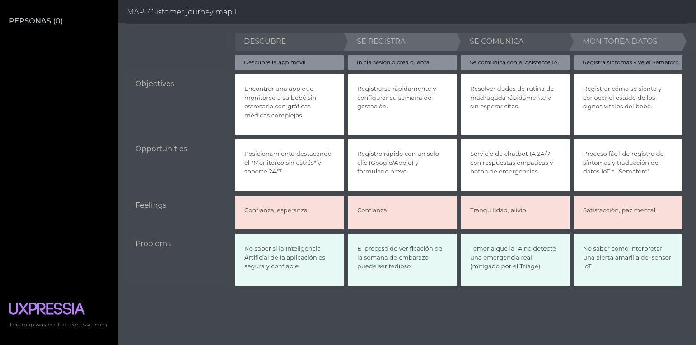

**Segmento #2 - Padre / Acompañante**

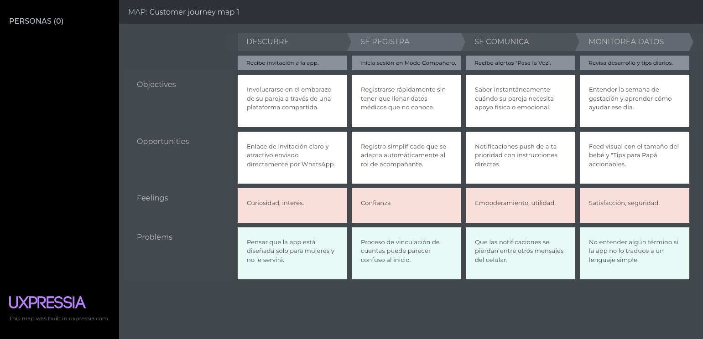

### 2.3.4. Empathy Mapping

El Empathy Mapping nos ayudará a crear perfiles detallados comprendiendo mejor los pensamientos, emociones y comportamientos de nuestros segmentos ante la etapa del embarazo.

**Segmento Objetivo 1:**

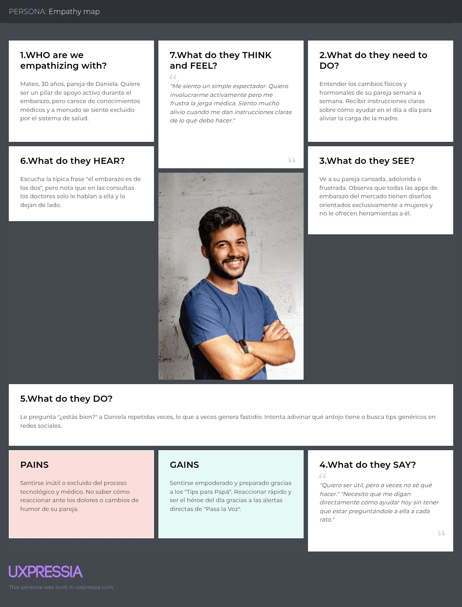

**Segmento Objetivo 2:**

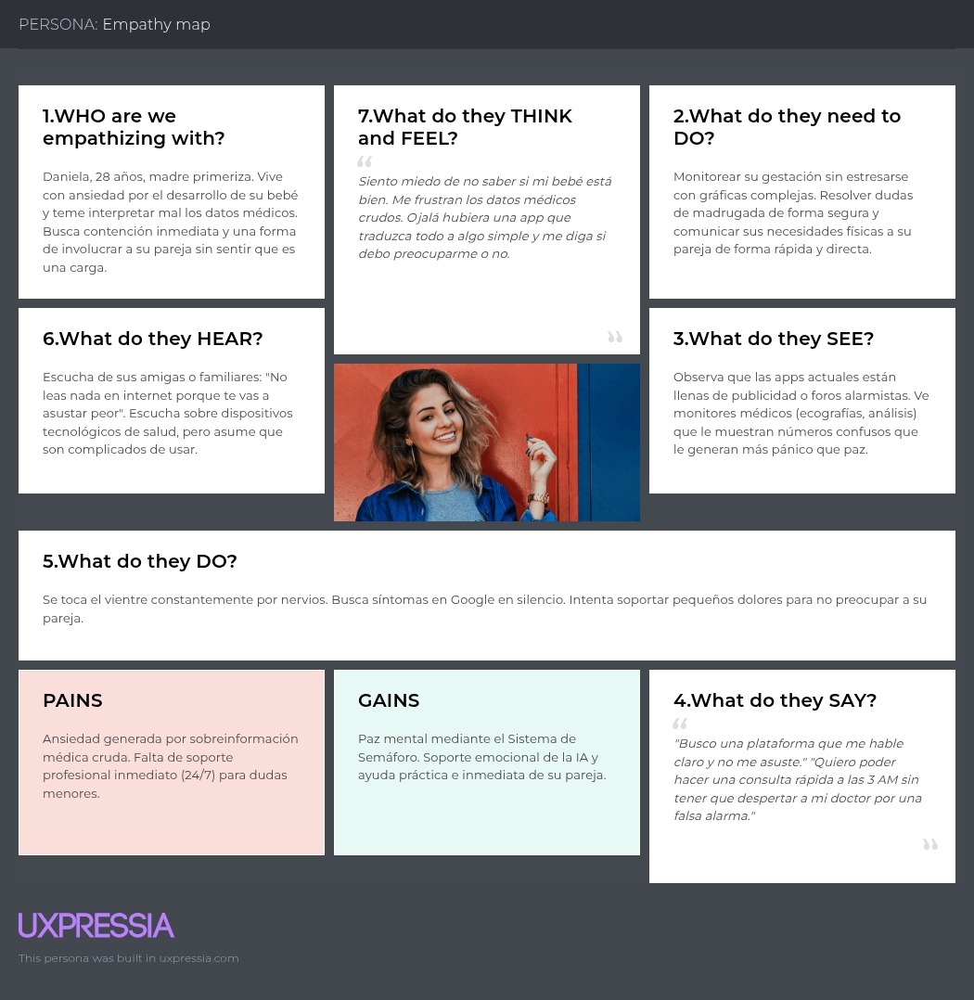

## 2.3.5. Big Picture EventStorming
 
Para esta sección se aplicó la técnica de Big Picture EventStorming utilizando la herramienta Miro, con el objetivo de mapear de forma colaborativa el dominio completo de HelpMom: el acompañamiento de la gestante y su pareja durante el embarazo mediante monitoreo IoT simplificado, asistencia conversacional con IA y sincronización familiar. La sesión permitió visualizar de manera integral cómo interactúan la madre gestante, el acompañante, el sistema de sensores y los servicios externos, identificando los puntos críticos donde la plataforma debe intervenir para reducir la ansiedad prenatal y activar al acompañante.
 
El trabajo se desarrolló siguiendo el orden clásico de la técnica: primero el reconocimiento de los *domain events* en línea temporal, luego la incorporación de los *actores* que los desencadenan, la definición de los *commands* que impulsan dichos eventos, la identificación de las *policies* o reglas automáticas del negocio, el mapeo de los *external systems* involucrados y, finalmente, el levantamiento de *hotspots* con las dudas que el equipo debe resolver antes del diseño técnico. Este ejercicio resultó especialmente relevante en HelpMom por tratarse de un dominio sensible, donde una regla mal definida (por ejemplo, el umbral de disparo del triage de emergencia) tiene consecuencias directas sobre la seguridad de la usuaria.
 
### Leyenda de elementos utilizados
 
| Elemento | Color | Descripción |
| --- | --- | --- |
| **Domain Event** | Naranja | Hecho del negocio que ya ocurrió y no puede cambiarse. Se redacta en pasado (ej. "Semana gestacional actualizada"). |
| **Command** | Azul | Expresa la intención de un actor de realizar una acción sobre el sistema. |
| **Actor** | Amarillo pequeño | Persona, rol u organización que interactúa con el sistema o provoca eventos. |
| **Policy** | Lila | Regla de negocio que conecta automáticamente un evento con un comando ("cada vez que… entonces…"). |
| **External System** | Rosado | Servicio o plataforma externa que interactúa con HelpMom sin estar bajo nuestro control. |
| **Hotspot / Question** | Rojo (rotado 45°) | Punto de incertidumbre, duda o posible conflicto que el equipo debe resolver. |
| **Definition** | Blanco | Explicación breve de un concepto clave del dominio. |
| **Comment** | Blanco | Nota, aclaración o hipótesis que documenta el contexto sin alterar el flujo. |
 
Se identificaron siete dominios: **IAM y Vinculación de Cuentas**, **Suscripciones y Pagos**, **Monitoreo IoT y Semáforo de Estado**, **Asistente IA y Triage de Emergencias**, **Mi Cuerpo (Registro Clínico)**, **Aprendizaje y Bienestar Emocional**, y **Modo Compañero**.
 
---
 
### Big Picture EventStorming 1 — IAM y Vinculación de Cuentas
 
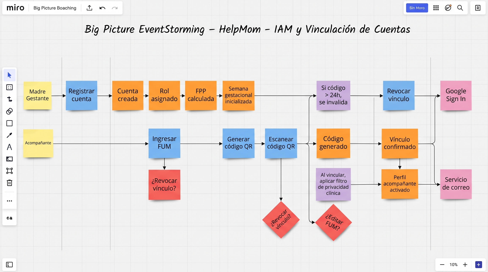
 
En este primer mural se mapean los domain events relacionados con el registro, la autenticación y la redirección automática por roles. El actor principal es la madre gestante, quien se registra, declara su fecha de última menstruación (FUM) y genera un código QR de invitación; el acompañante ejecuta el flujo espejo escaneando dicho código. El sistema interviene calculando la semana gestacional inicial, validando la vigencia del código QR y aplicando la política de segregación de datos, que garantiza que el acompañante nunca acceda a los registros clínicos privados de la madre. Finalmente se plantean hotspots sobre la gestión del vínculo, como qué ocurre si la madre desea revocar el acceso o si el mismo acompañante debe poder vincularse a más de una gestante.
 
- **Actores:** Madre Gestante, Acompañante.
- **Commands:** Registrar cuenta, Iniciar sesión, Ingresar FUM, Generar código QR de vinculación, Escanear código QR, Revocar vínculo.
- **Domain Events:** Cuenta creada, Rol asignado (Madre / Acompañante), Fecha probable de parto calculada, Semana gestacional inicializada, Código de vinculación generado, Código de vinculación escaneado, Vínculo de pareja confirmado, Perfil de acompañante activado, Vínculo revocado.
- **Policies:** Cuando una cuenta es creada con rol Madre, entonces se inicializa el contador de semana gestacional. Cuando un código QR supera las 24 horas, entonces queda invalidado automáticamente. Cuando un vínculo es confirmado, entonces se aplica el filtro de privacidad clínica sobre la vista del acompañante.
- **External Systems:** Proveedor de autenticación (Google / Apple Sign In), Servicio de correo transaccional.
- **Hotspots:** ¿Puede un acompañante estar vinculado a más de una gestante? ¿Qué sucede con el historial compartido si la madre revoca el vínculo? ¿Se permite editar la FUM luego del registro y cómo se recalcula el contenido ya desbloqueado?
---
 
### Big Picture EventStorming 2 — Suscripciones y Pagos
 
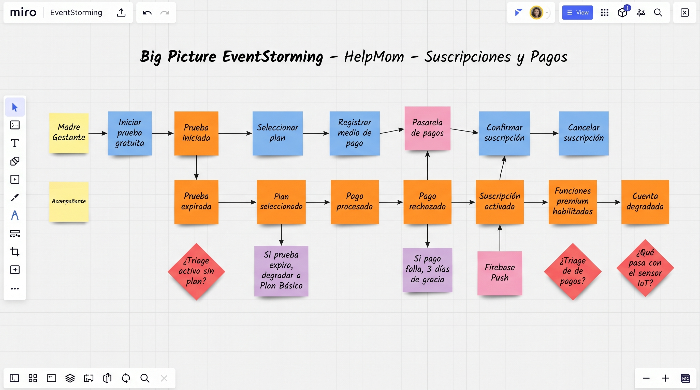
 
El segundo mural recoge los domain events del modelo de monetización: el inicio de la prueba gratuita de 14 días, la selección de plan (Básico o Cuidado Integral), la confirmación o el rechazo del pago y la habilitación progresiva de funcionalidades. El actor principal puede ser tanto la madre como el acompañante, ya que el modelo contempla que la suscripción premium pueda ser adquirida o regalada por la pareja. El sistema valida la transacción a través de una pasarela externa, actualiza el estado de la cuenta y aplica la política de degradación de plan, que desactiva el Asistente IA y la lectura IoT sin eliminar los registros históricos de la madre. Los hotspots apuntan al manejo de casos límite, particularmente qué ocurre con el triage de emergencia si la suscripción vence en pleno tercer trimestre.
 
- **Actores:** Madre Gestante, Acompañante (como comprador o regalante).
- **Commands:** Iniciar prueba gratuita, Consultar planes, Seleccionar plan, Registrar medio de pago, Confirmar suscripción, Cancelar suscripción, Regalar suscripción.
- **Domain Events:** Prueba gratuita iniciada, Prueba gratuita expirada, Plan seleccionado, Pago procesado, Pago rechazado, Suscripción activada, Funcionalidades premium habilitadas, Suscripción renovada, Suscripción cancelada, Cuenta degradada a Plan Básico.
- **Policies:** Cuando la prueba gratuita expira sin conversión, entonces la cuenta se degrada al Plan Básico. Cuando un pago es rechazado, entonces se otorga un periodo de gracia de 3 días antes de degradar. Cuando una suscripción Cuidado Integral es activada, entonces se habilita el emparejamiento del sensor IoT.
- **External Systems:** Pasarela de pagos (Culqi / Niubiz / Stripe), Servicio de notificaciones push (Firebase Cloud Messaging).
- **Hotspots:** ¿El triage de emergencia debe seguir activo aunque la suscripción esté vencida, por responsabilidad ética? ¿Qué pasa con el sensor IoT físico si la usuaria cancela? ¿La suscripción es por cuenta de madre o por vínculo de pareja?
---
 
### Big Picture EventStorming 3 — Monitoreo IoT y Sistema de Semáforo
 
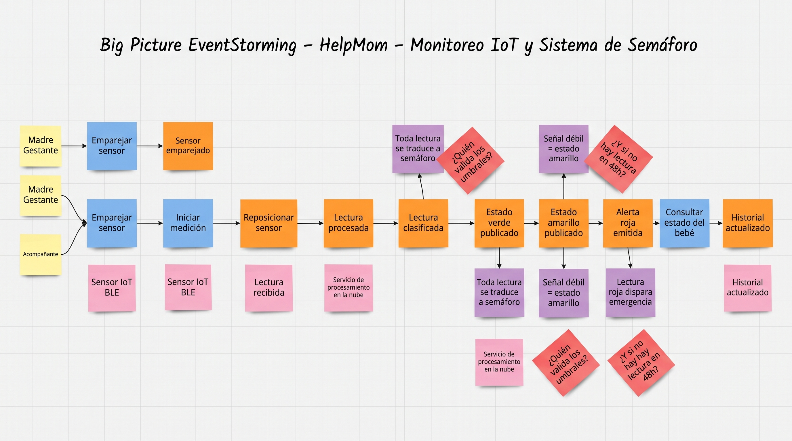
 
El tercer mural representa el núcleo diferenciador de la propuesta: la traducción de datos médicos crudos a un lenguaje visual tranquilizador. El flujo inicia con el emparejamiento del sensor y continúa con la captura periódica de la frecuencia cardíaca fetal, su procesamiento en el backend y la publicación de una tarjeta de estado con código de color. La política central del dominio establece que la interfaz nunca expone ondas ni valores crudos a la madre: el sistema clasifica la lectura en verde (regular), amarillo (lectura poco confiable, requiere reposicionar el sensor) o rojo (derivación inmediata). Los hotspots concentran las decisiones médicas y legales más delicadas del proyecto, como quién valida clínicamente los umbrales del semáforo.
 
- **Actores:** Madre Gestante, Acompañante (solo lectura del estado resumido).
- **Commands:** Emparejar sensor, Iniciar medición, Reposicionar sensor, Consultar estado del bebé, Repetir lectura.
- **Domain Events:** Sensor emparejado, Medición iniciada, Lectura de frecuencia cardíaca fetal recibida, Lectura procesada, Lectura clasificada, Tarjeta de estado verde publicada, Tarjeta de estado amarilla publicada, Alerta roja emitida, Lectura descartada por baja calidad de señal, Historial de mediciones actualizado, Batería del sensor baja notificada.
- **Policies:** Cuando una lectura es recibida, entonces se procesa y se traduce al sistema de semáforo antes de mostrarse. Cuando la señal es de baja calidad, entonces se muestra estado amarillo con instrucción de reposo y reposicionamiento, nunca un valor numérico. Cuando una lectura es clasificada en rojo, entonces se dispara el modal de emergencia del dominio de Triage. Cuando se publica un estado, entonces se sincroniza el resumen a la vista del acompañante.
- **External Systems:** Dispositivo sensor IoT (Bluetooth Low Energy), Servicio de procesamiento de señal en la nube, Firebase Cloud Messaging.
- **Hotspots:** ¿Quién valida clínicamente los umbrales verde/amarillo/rojo? ¿Qué se muestra si no hay lectura en 48 horas? ¿Se debe permitir a la madre exportar la data cruda para su obstetra? ¿Cómo se evita que una falla del sensor se interprete como emergencia fetal?
---
 
### Big Picture EventStorming 4 — Asistente IA y Triage Inteligente de Emergencias
 
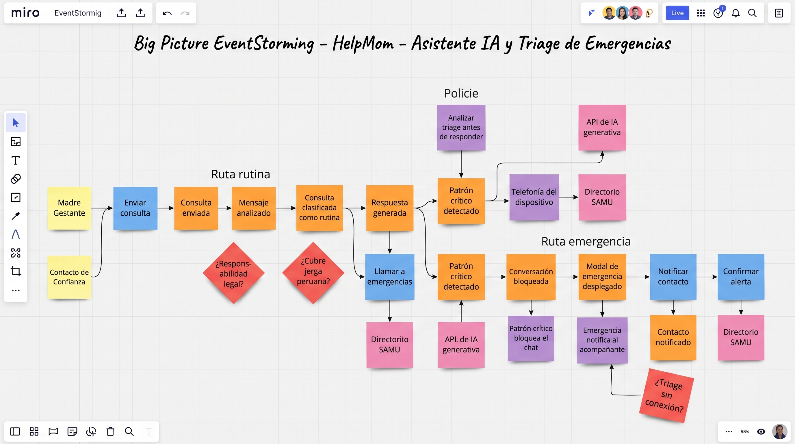
 
El cuarto mural modela el flujo conversacional y su mecanismo de seguridad. La madre formula una consulta de rutina y el asistente responde contextualizado a su semana gestacional; sin embargo, antes de generar cualquier respuesta, el sistema ejecuta el análisis de triage sobre el mensaje entrante. Si se detectan patrones críticos (sangrado abundante, contracciones regulares pretérmino, ausencia de movimiento fetal), la política de bloqueo de seguridad interrumpe la conversación normal y despliega el modal rojo a pantalla completa con acceso directo a llamada de emergencia y al contacto de confianza. Este dominio concentra el mayor riesgo del producto, por lo que los hotspots levantados son de naturaleza crítica y deben cerrarse antes del desarrollo.
 
- **Actores:** Madre Gestante, Contacto de Confianza / Acompañante.
- **Commands:** Enviar consulta al asistente, Confirmar comprensión de la alerta, Llamar a emergencias, Notificar al contacto de confianza, Descartar alerta.
- **Domain Events:** Consulta enviada, Mensaje analizado por triage, Consulta clasificada como rutina, Respuesta generada, Respuesta entregada, Patrón crítico detectado, Conversación bloqueada, Modal de emergencia desplegado, Llamada a emergencias iniciada, Contacto de confianza notificado, Episodio de emergencia registrado en historial.
- **Policies:** Cuando un mensaje es recibido, entonces se analiza por el triage antes de generar cualquier respuesta. Cuando se detecta un patrón crítico, entonces se bloquea la conversación y se despliega el modal de emergencia sin excepción. Cuando el modal de emergencia es desplegado, entonces se notifica automáticamente al acompañante vinculado. Cuando el asistente no alcanza un umbral de confianza, entonces deriva a consulta médica presencial en lugar de responder.
- **External Systems:** Proveedor de modelo de lenguaje (API de IA generativa), Servicio de telefonía del dispositivo, Directorio de centros de emergencia / SAMU, Firebase Cloud Messaging.
- **Hotspots:** ¿Quién es responsable legalmente si el triage no detecta una emergencia real? ¿El diccionario de palabras clave cubre variantes coloquiales peruanas? ¿Debe el asistente funcionar sin conexión para el triage? ¿Se guarda el historial de chat y por cuánto tiempo?
---
 
### Big Picture EventStorming 5 — Mi Cuerpo (Registro Clínico y Seguimiento)
 
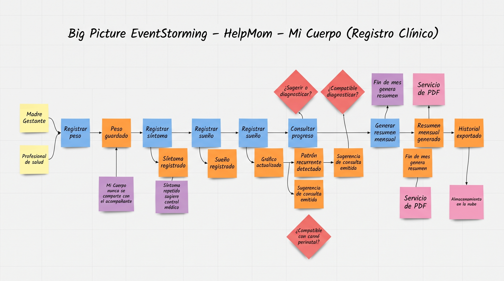
 
El quinto mural aborda el reemplazo digital del expediente en papel. La madre registra peso, síntomas y horas de sueño, y el sistema consolida esa información en gráficos amigables y en un resumen mensual exportable para el control obstétrico. La política de privacidad clínica es transversal a este dominio: ningún registro de esta sección se sincroniza con la vista del acompañante. Además, el sistema detecta patrones recurrentes de síntomas y sugiere consultarlos en el próximo control, sin emitir diagnósticos. Los hotspots giran en torno al límite entre sugerencia y diagnóstico, y al manejo de registros que podrían indicar riesgo.
 
- **Actores:** Madre Gestante, Profesional de salud (receptor externo del resumen).
- **Commands:** Registrar peso, Registrar síntoma, Registrar horas de sueño, Consultar progreso, Generar resumen para el control médico, Exportar historial.
- **Domain Events:** Registro de peso guardado, Síntoma registrado, Horas de sueño registradas, Gráfico de progreso actualizado, Hito de seguimiento alcanzado, Patrón de síntoma recurrente detectado, Sugerencia de consulta médica emitida, Resumen mensual generado, Historial exportado.
- **Policies:** Cuando se guarda un registro en Mi Cuerpo, entonces no se propaga a la vista del acompañante. Cuando un síntoma se repite más de N veces en una semana, entonces se sugiere incluirlo en el próximo control médico. Cuando se completa un mes gestacional, entonces se genera automáticamente el resumen descargable. Cuando se registra un avance, entonces se celebra visualmente el hito en lugar de compararlo con un estándar clínico.
- **External Systems:** Servicio de generación de PDF, Almacenamiento en la nube.
- **Hotspots:** ¿Dónde está el límite entre sugerir y diagnosticar? ¿Qué hacer si el patrón de peso sugiere un riesgo clínico? ¿El formato del resumen es compatible con el carné perinatal del MINSA? ¿Se debe permitir compartir el resumen directamente con el obstetra desde la app?
---
 
### Big Picture EventStorming 6 — Aprendizaje y Bienestar Emocional
 
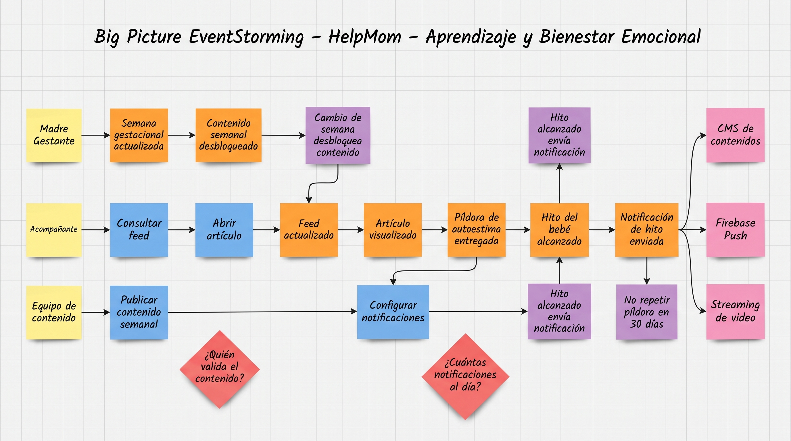
 
El sexto mural cubre el contenido educativo dinámico y el sistema de soporte emocional. El disparador central de este dominio no es un comando de usuario sino el paso del tiempo: cada cambio de semana gestacional desbloquea automáticamente un nuevo lote de artículos, videos y tips, y activa las alertas de hitos del bebé. En paralelo, el programador de notificaciones emite las "píldoras de autoestima" a lo largo del día. La política de personalización asegura que el contenido mostrado corresponda exactamente a la semana en curso, evitando la sobreinformación que genera ansiedad. Los hotspots se concentran en la curaduría y la frecuencia.
 
- **Actores:** Madre Gestante, Acompañante, Equipo de contenido de WebExpert.
- **Commands:** Consultar feed de aprendizaje, Abrir artículo o video, Marcar contenido como favorito, Configurar frecuencia de notificaciones, Publicar contenido semanal.
- **Domain Events:** Semana gestacional actualizada, Contenido semanal desbloqueado, Feed de aprendizaje actualizado, Artículo visualizado, Contenido marcado como favorito, Píldora de autoestima programada, Píldora de autoestima entregada, Hito del bebé alcanzado, Notificación de hito enviada, Preferencias de notificación actualizadas.
- **Policies:** Cuando la semana gestacional cambia, entonces se desbloquea el contenido correspondiente y se archiva el anterior. Cuando se alcanza un hito de desarrollo fetal, entonces se emite una notificación celebratoria a la madre y al acompañante. Cuando la usuaria reduce la frecuencia de notificaciones, entonces se priorizan únicamente hitos y recordatorios de autocuidado. Cuando se entrega una píldora de autoestima, entonces no se repite el mismo mensaje en los siguientes 30 días.
- **External Systems:** CMS de contenidos, Firebase Cloud Messaging, Servicio de streaming de video.
- **Hotspots:** ¿Quién valida médicamente el contenido publicado? ¿Cuántas notificaciones diarias son aceptables antes de resultar invasivas? ¿El contenido se adapta también al posparto? ¿Se muestran hitos si la gestación presenta complicaciones?
---
 
### Big Picture EventStorming 7 — Modo Compañero (Alertas Rápidas y Guía Diaria)
 
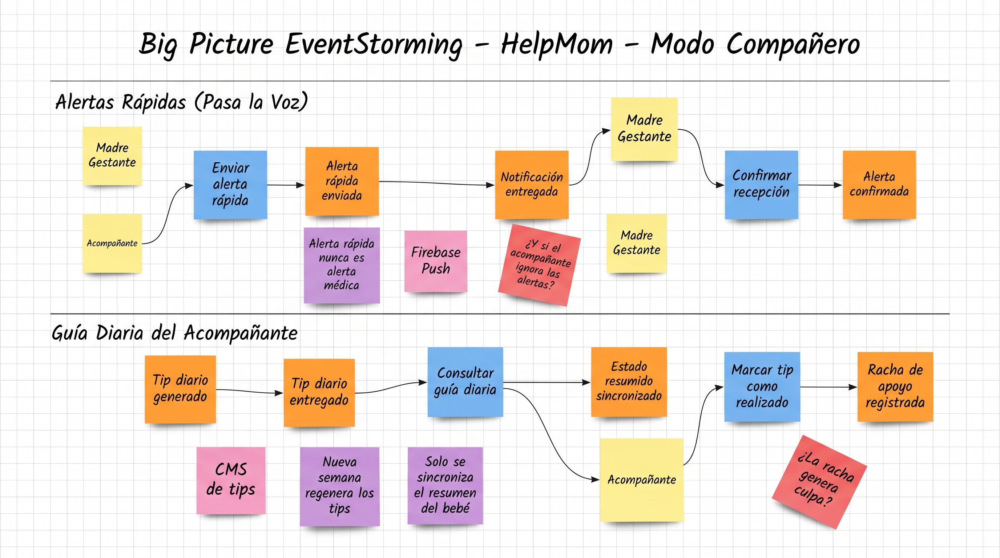
 
El séptimo mural modela la experiencia del acompañante, dividida en dos flujos complementarios. El primero es reactivo: la madre pulsa un botón de "Pasa la Voz" (antojo, náuseas, necesidad de descanso) y el sistema entrega una notificación push predefinida al acompañante, quien puede acusar recibo sin necesidad de intercambiar mensajes largos. El segundo es proactivo: cada mañana el sistema genera el "Tip del Día" contextualizado a la semana exacta de gestación, traduciendo los cambios hormonales y físicos de la madre en acciones concretas de apoyo. La política de no alarma médica es clave: ninguna alerta rápida se comunica como evento clínico, para evitar falsos positivos de emergencia.
 
- **Actores:** Madre Gestante, Acompañante.
- **Commands:** Enviar alerta rápida, Confirmar recepción de alerta, Consultar guía diaria, Marcar tip como realizado, Consultar estado resumido del bebé.
- **Domain Events:** Alerta rápida enviada, Notificación entregada al acompañante, Alerta confirmada por el acompañante, Tip diario generado, Tip diario entregado, Tip marcado como realizado, Guía de preparación desbloqueada, Estado resumido del bebé sincronizado, Racha de apoyo registrada.
- **Policies:** Cuando la madre envía una alerta rápida, entonces se entrega como notificación de apoyo y nunca como alerta médica. Cuando cambia la semana gestacional, entonces se regenera el set de tips del acompañante. Cuando se publica un estado IoT, entonces se sincroniza únicamente el resumen (color y mensaje) hacia el acompañante. Cuando el acompañante no confirma una alerta en un lapso definido, entonces se reenvía el recordatorio una sola vez.
- **External Systems:** Firebase Cloud Messaging, CMS de contenidos (tips del acompañante).
- **Hotspots:** ¿Qué ocurre si el acompañante ignora sistemáticamente las alertas? ¿Debe la madre ver si su pareja leyó el tip del día? ¿La racha de apoyo puede generar presión o culpa en la pareja? ¿Se permiten alertas rápidas personalizadas además de las predefinidas?
---

## 2.3.6. Ubiquitous Language
 
A continuación, se define el lenguaje ubicuo (*Ubiquitous Language*) del proyecto **HelpMom**. Este vocabulario compartido garantiza un entendimiento común entre los miembros del equipo de desarrollo, los expertos del dominio materno-infantil y los usuarios finales, evitando ambigüedades en un contexto donde la precisión terminológica tiene implicancias directas sobre la seguridad de la usuaria. Los términos se presentan en inglés (nomenclatura técnica utilizada en el código y los diagramas) acompañados de su equivalente en español y su definición funcional dentro del dominio.
 
### 1. Stakeholders y Roles
 
- **User Account (Cuenta de Usuario):** Entidad que representa la cuenta, credenciales y perfil de acceso de una persona registrada en la plataforma, independientemente de su rol.
- **Role (Rol):** Nivel de autorización dentro de la aplicación que determina la interfaz y los datos accesibles. Existen dos principales: `PREGNANT_MOTHER` y `COMPANION`.
- **Pregnant Mother (Madre Gestante):** Usuaria principal del sistema. Es la titular de la gestación, la única propietaria de los registros clínicos privados y la generadora del vínculo con su acompañante.
- **Companion (Acompañante):** Pareja, familiar o persona de confianza vinculada a la cuenta de la madre. Accede a una interfaz adaptada con información resumida, sin visibilidad sobre el expediente clínico privado.
- **Trusted Contact (Contacto de Confianza):** Persona designada por la madre para ser notificada automáticamente ante una alerta de emergencia. Puede coincidir o no con el acompañante.
- **Content Team (Equipo de Contenido):** Rol interno de WebExpert responsable de curar, validar y publicar el material educativo y los tips del acompañante.
### 2. Gestación y Cronología
 
- **Gestational Week (Semana Gestacional):** Unidad temporal central del dominio. Determina dinámicamente el contenido desbloqueado, los tips del acompañante y los hitos celebrados.
- **LMP – Last Menstrual Period (FUM – Fecha de Última Menstruación):** Dato base declarado por la madre en el registro, a partir del cual el sistema calcula toda la cronología del embarazo.
- **EDD – Estimated Due Date (FPP – Fecha Probable de Parto):** Fecha estimada de nacimiento calculada automáticamente a partir de la FUM.
- **Trimester (Trimestre):** Agrupación de tres meses gestacionales que condiciona el tipo de contenido, la frecuencia de monitoreo y la prioridad de las alertas.
- **Growth Milestone (Hito del Bebé):** Logro relevante del desarrollo fetal asociado a una semana específica, que dispara una notificación celebratoria hacia la madre y el acompañante.
- **Postpartum (Posparto):** Etapa posterior al nacimiento en la que la plataforma continúa brindando contenido y soporte adaptado.
### 3. Monitoreo IoT y Estado de Salud
 
- **IoT Sensor (Sensor IoT):** Dispositivo físico de monitoreo que captura la frecuencia cardíaca fetal y la transmite a la plataforma mediante conexión inalámbrica.
- **Pairing (Emparejamiento):** Proceso de vinculación del sensor físico con la cuenta de la madre para habilitar la captura de mediciones.
- **Reading (Lectura):** Registro individual de datos crudos recibido desde el sensor en un momento determinado.
- **Signal Quality (Calidad de Señal):** Indicador interno que evalúa la confiabilidad de una lectura antes de clasificarla; una calidad insuficiente impide emitir un estado verde o rojo.
- **Traffic Light System (Sistema de Semáforo):** Mecanismo de diseño que traduce los datos médicos crudos en tres estados visuales comprensibles —verde, amarillo y rojo— con el fin de reducir la ansiedad de la usuaria.
- **Status Card (Tarjeta de Estado):** Componente de interfaz que comunica el resultado del semáforo mediante un ícono, un color y un mensaje en lenguaje cálido, nunca mediante valores numéricos.
- **Green State (Estado Verde):** Clasificación que indica que los parámetros monitoreados se encuentran dentro del rango esperado.
- **Yellow State (Estado Amarillo):** Clasificación que indica una lectura poco confiable o un parámetro fuera de rango leve; instruye reposo y reposicionamiento del sensor.
- **Red Alert (Alerta Roja):** Clasificación crítica que dispara el protocolo de emergencia y la derivación inmediata a un centro de salud.
- **Summarized Status (Estado Resumido):** Versión reducida del estado del bebé —únicamente color y mensaje— que se sincroniza hacia la vista del acompañante preservando la privacidad clínica.
### 4. Asistente IA y Seguridad
 
- **AI Assistant (Asistente IA):** Bot conversacional disponible 24/7 que resuelve dudas de rutina contextualizadas a la semana gestacional de la usuaria.
- **Routine Query (Consulta de Rutina):** Pregunta de baja criticidad que el asistente puede responder de forma autónoma sin activar mecanismos de emergencia.
- **Intelligent Triage (Triage Inteligente):** Proceso de análisis que evalúa todo mensaje entrante antes de generar una respuesta, con el fin de detectar indicios de riesgo obstétrico.
- **Critical Keyword (Palabra Clave Crítica):** Término o patrón lingüístico asociado a una situación de riesgo (ej. sangrado abundante, ausencia de movimiento fetal) que activa el bloqueo de seguridad.
- **Safety Block (Bloqueo de Seguridad):** Política que interrumpe la conversación normal del asistente cuando se detecta un patrón crítico, impidiendo que el bot continúe respondiendo.
- **Emergency Modal (Modal de Emergencia):** Pantalla completa de color rojo que instruye acudir al centro de emergencias más cercano y habilita la llamada directa a emergencias o al contacto de confianza.
- **Confidence Threshold (Umbral de Confianza):** Nivel mínimo de certeza bajo el cual el asistente deriva a consulta médica presencial en lugar de emitir una respuesta.
- **Emergency Episode (Episodio de Emergencia):** Registro histórico de una activación del triage, conservado para trazabilidad y para su posterior consulta médica.
### 5. Expediente Personal de la Madre
 
- **My Body (Mi Cuerpo):** Módulo privado donde la madre registra y visualiza su peso, síntomas y horas de sueño a lo largo de la gestación.
- **Symptom Log (Registro de Síntomas):** Anotación fechada de una molestia o manifestación física experimentada por la madre.
- **Sleep Log (Registro de Sueño):** Anotación de las horas y calidad de descanso, utilizada para detectar patrones de fatiga.
- **Recurring Pattern (Patrón Recurrente):** Repetición de un mismo síntoma dentro de un periodo definido, que genera una sugerencia de consulta sin constituir un diagnóstico.
- **Monthly Summary (Resumen Mensual):** Documento generado automáticamente que consolida los registros del mes para ser presentado en el control obstétrico.
- **Clinical Privacy (Privacidad Clínica):** Regla transversal del dominio que impide que cualquier dato del módulo Mi Cuerpo se propague hacia la vista del acompañante.
### 6. Modo Compañero y Vinculación
 
- **Companion Mode (Modo Compañero):** Experiencia diferenciada del acompañante, compuesta por el estado resumido del bebé, la guía diaria y la recepción de alertas rápidas.
- **Pairing Code / QR Invitation (Código de Vinculación):** Código único y temporal generado por la madre para que el acompañante se enlace a su cuenta.
- **Partner Link (Vínculo de Pareja):** Relación establecida entre la cuenta de la madre y la del acompañante, revocable en cualquier momento por la madre.
- **Quick Alert / "Pasa la Voz" (Alerta Rápida):** Notificación predefinida que la madre envía con un solo toque para comunicar una necesidad cotidiana (antojo, náusea, descanso) sin redactar mensajes.
- **Non-Medical Notification (Notificación No Médica):** Clasificación que garantiza que una alerta rápida jamás se comunique como evento clínico, evitando alarma innecesaria.
- **Daily Guide / "Tips para Papá" (Guía Diaria):** Feed de microconsejos prácticos y contextualizados a la semana exacta de gestación, dirigido al acompañante.
- **Tip of the Day (Tip del Día):** Notificación matutina accionable que traduce los cambios hormonales y físicos de la madre en una acción concreta de apoyo.
- **Hormonal Translation (Traducción de Cambios Hormonales):** Explicación sin tecnicismos de lo que experimenta la madre, orientada a generar empatía en el acompañante.
### 7. Contenido y Bienestar Emocional
 
- **Learning Feed (Aprendizaje):** Sección tipo feed con artículos, videos y tips sobre nutrición, ejercicios prenatales y preparación para el parto.
- **Dynamic Unlocking (Desbloqueo Dinámico):** Mecanismo por el cual el contenido se habilita progresivamente conforme avanza la semana gestacional, evitando la sobreinformación.
- **Self-Esteem Pill (Píldora de Autoestima):** Notificación push programada con un mensaje cálido y validante enfocado en el cambio corporal y la maternidad.
- **Notification Preference (Preferencia de Notificación):** Configuración mediante la cual el usuario regula la frecuencia y el tipo de alertas que desea recibir.
### 8. Suscripciones y Monetización
 
- **Subscription (Suscripción):** Contrato mensual o anual que habilita el acceso a las funcionalidades de la plataforma, con estados `TRIAL`, `ACTIVE`, `GRACE_PERIOD`, `CANCELLED` o `EXPIRED`.
- **Basic Plan (Plan Básico):** Nivel de servicio orientado a la organización e información confiable: módulo Mi Cuerpo, contenido educativo semanal, píldoras de autoestima y alertas rápidas.
- **Comprehensive Care Plan (Plan Cuidado Integral):** Nivel superior que añade el Asistente IA ilimitado, el Triage Inteligente, la lectura del sensor IoT y la guía avanzada del acompañante.
- **Free Trial (Prueba Gratuita):** Periodo inicial de 14 días con acceso parcial al Asistente IA, diseñado para impulsar la conversión a planes pagos.
- **Grace Period (Periodo de Gracia):** Lapso posterior a un pago rechazado durante el cual la cuenta conserva sus funcionalidades antes de ser degradada.
- **Downgrade (Degradación):** Transición automática al Plan Básico al expirar la suscripción, preservando siempre los registros históricos de la madre.
- **Gifted Subscription (Suscripción Regalada):** Modalidad en la que el acompañante adquiere el plan premium en nombre de la madre.
### 9. Conceptos Transversales del Sistema
 
- **Bottom Bar Navigation (Navegación por Barra Inferior):** Arquitectura de navegación principal de la app, compuesta por cuatro vistas: Inicio, Mi Cuerpo, Aprendizaje y Asistente IA.
- **Home / "Tu Embarazo" (Inicio):** Vista central que muestra la semana gestacional, la ilustración comparativa del tamaño del bebé y el estado resumido del sensor.
- **Push Notification (Notificación Push):** Mensaje emitido por el sistema hacia el dispositivo del usuario para comunicar hitos, tips, píldoras o alertas.
- **Policy (Política de Dominio):** Regla de negocio que conecta automáticamente un evento con un comando, sin intervención del usuario.
- **Hotspot (Punto Crítico):** Punto de incertidumbre identificado durante el EventStorming que debe resolverse antes del diseño técnico definitivo.
---

## 2.4. Requirements Specification
 
En esta sección se presenta la especificación de requerimientos de **HelpMom**, elaborada a partir de los hallazgos de las entrevistas a los dos segmentos objetivo (madres gestantes y padres/acompañantes) y de los eventos, comandos y políticas identificados durante la sesión de Big Picture EventStorming. Los requerimientos se expresan mediante **Epics**, **User Stories**, **Technical Stories** y **Spike Stories**, siguiendo el formato "Como \<rol\>, quiero \<funcionalidad\>, para \<beneficio\>" y con criterios de aceptación redactados en notación Gherkin (Dado / Cuando / Entonces).
 
La priorización responde a dos criterios: el impacto sobre la propuesta de valor central —reducir la ansiedad prenatal e involucrar activamente al acompañante— y el nivel de riesgo asociado. Por ello, las historias vinculadas al Triage Inteligente, a la traducción de datos IoT mediante el Sistema de Semáforo y a la privacidad clínica de la madre reciben prioridad Alta, ya que constituyen los puntos donde una falla funcional tendría consecuencias directas sobre la seguridad y la confianza de la usuaria.
 
### 2.4.1. User Stories
 
#### 2.4.1.1. Epics
 
| Epic ID | Título | Descripción |
| --- | --- | --- |
| EP01 | Landing page informativa | Como visitante, quiero acceder a un sitio web informativo, para conocer la propuesta de valor de HelpMom antes de registrarme. |
| EP02 | Gestión de cuentas y acceso | Como usuario, quiero registrarme y autenticarme según mi rol, para acceder a la experiencia que me corresponde. |
| EP03 | Vinculación de pareja | Como madre gestante, quiero enlazar la cuenta de mi acompañante, para compartir con él la información que yo decida. |
| EP04 | Seguimiento gestacional (Inicio) | Como madre gestante, quiero visualizar el avance de mi embarazo semana a semana, para sentirme acompañada y orientada. |
| EP05 | Monitoreo IoT y Sistema de Semáforo | Como madre gestante, quiero conocer el estado de mi bebé mediante indicadores visuales simples, para obtener paz mental sin interpretar datos médicos. |
| EP06 | Asistente IA conversacional | Como madre gestante, quiero consultar mis dudas de rutina a un asistente disponible 24/7, para obtener respuestas inmediatas a cualquier hora. |
| EP07 | Triage Inteligente y emergencias | Como madre gestante, quiero que el sistema detecte señales de riesgo y me derive a emergencias, para estar protegida ante una complicación. |
| EP08 | Mi Cuerpo (registro clínico) | Como madre gestante, quiero registrar mi peso, síntomas y sueño, para llevar un seguimiento ordenado y compartirlo en mis controles. |
| EP09 | Aprendizaje y contenido educativo | Como usuaria, quiero acceder a contenido educativo pertinente a mi semana gestacional, para informarme sin sobreinformarme. |
| EP10 | Bienestar emocional y notificaciones | Como madre gestante, quiero recibir mensajes de validación e hitos del bebé, para sostener mi ánimo durante los cambios corporales. |
| EP11 | Guía diaria del acompañante | Como acompañante, quiero recibir consejos diarios accionables, para saber exactamente cómo apoyar a mi pareja. |
| EP12 | Alertas rápidas "Pasa la Voz" | Como madre gestante, quiero avisar mis necesidades con un toque, para comunicarme sin esfuerzo ni alarma innecesaria. |
| EP13 | Suscripciones y pagos | Como usuario, quiero contratar y administrar un plan, para habilitar las funcionalidades de IA e IoT. |
| EP14 | Perfil, configuración y privacidad | Como usuario, quiero administrar mis datos, preferencias y seguridad, para mantener el control sobre mi información. |
| EP15 | Internacionalización y accesibilidad | Como usuario, quiero usar la app en mi idioma y con ajustes de accesibilidad, para una experiencia cómoda y personalizada. |
 
#### 2.4.1.2. User Stories
 
| Story ID | User | Priority | Epic |
| --- | --- | --- | --- |
| US01 | Visitante | Alta | EP01 |
 
**Title:** Conocer la propuesta de valor de HelpMom
 
**Description:** Como visitante del sitio, quiero conocer qué ofrece HelpMom, para evaluar si la aplicación resuelve mis necesidades durante el embarazo.
 
**Acceptance Criteria:**
 
**Escenario 1:**
Dado que el visitante accede a la landing page,
Cuando visualiza la sección principal,
Entonces observa una descripción clara de la app, sus beneficios y un llamado a la acción para registrarse.
 
**Escenario 2:**
Dado que el visitante desea profundizar en una funcionalidad,
Cuando selecciona la opción "Conocer más",
Entonces el sistema despliega una explicación ampliada de esa funcionalidad.
 
---
 
| Story ID | User | Priority | Epic |
| --- | --- | --- | --- |
| US02 | Visitante | Alta | EP01 |
 
**Title:** Comparar los planes disponibles
 
**Description:** Como visitante del sitio, quiero comparar el Plan Básico y el Plan Cuidado Integral, para decidir cuál se ajusta a mis necesidades y presupuesto.
 
**Acceptance Criteria:**
 
**Escenario 1:**
Dado que el visitante accede a la sección de planes,
Cuando visualiza las tarjetas comparativas,
Entonces observa el precio, la periodicidad y la lista de beneficios de cada plan.
 
**Escenario 2:**
Dado que el visitante selecciona un plan,
Cuando confirma su elección,
Entonces el sistema lo redirige al formulario de registro con el plan preseleccionado.
 
---
 
| Story ID | User | Priority | Epic |
| --- | --- | --- | --- |
| US03 | Visitante | Media | EP01 |
 
**Title:** Consultar testimonios de otras familias
 
**Description:** Como visitante del sitio, quiero leer testimonios de otras madres y acompañantes, para generar confianza en la plataforma.
 
**Acceptance Criteria:**
 
**Escenario 1:**
Dado que el visitante accede a la landing page,
Cuando navega a la sección de testimonios,
Entonces visualiza opiniones de usuarios reales con su nombre y etapa gestacional.
 
**Escenario 2:**
Dado que existen múltiples testimonios,
Cuando el visitante navega el carrusel,
Entonces el sistema muestra testimonios adicionales sin recargar la página.
 
---
 
| Story ID | User | Priority | Epic |
| --- | --- | --- | --- |
| US04 | Visitante | Media | EP01 |
 
**Title:** Consultar preguntas frecuentes sobre seguridad
 
**Description:** Como visitante del sitio, quiero resolver dudas sobre la confiabilidad del asistente IA y el sensor IoT, para reducir mi desconfianza inicial hacia la tecnología.
 
**Acceptance Criteria:**
 
**Escenario 1:**
Dado que el visitante accede a la sección de preguntas frecuentes,
Cuando selecciona una pregunta,
Entonces el sistema despliega la respuesta correspondiente de forma expandible.
 
**Escenario 2:**
Dado que el visitante consulta sobre el manejo de emergencias,
Cuando lee la respuesta,
Entonces se le explica que el asistente deriva automáticamente a un centro de emergencias ante señales de riesgo.
 
---
 
| Story ID | User | Priority | Epic |
| --- | --- | --- | --- |
| US05 | Usuario | Alta | EP02 |
 
**Title:** Registrarse en la plataforma
 
**Description:** Como usuario, quiero crear una cuenta con mis datos básicos, para acceder a las funcionalidades de HelpMom.
 
**Acceptance Criteria:**
 
**Escenario 1:**
Dado que el usuario completa el formulario con un correo válido y una contraseña segura,
Cuando envía el registro,
Entonces el sistema crea la cuenta e inicia sesión automáticamente.
 
**Escenario 2:**
Dado que el usuario ingresa un correo ya registrado,
Cuando envía el formulario,
Entonces el sistema rechaza el registro y muestra un mensaje indicando que el correo ya está en uso.
 
---
 
| Story ID | User | Priority | Epic |
| --- | --- | --- | --- |
| US06 | Usuario | Alta | EP02 |
 
**Title:** Seleccionar rol al registrarse
 
**Description:** Como usuario, quiero indicar si soy madre gestante o acompañante, para acceder a la interfaz adecuada a mi rol.
 
**Acceptance Criteria:**
 
**Escenario 1:**
Dado que el usuario se encuentra en el flujo de registro,
Cuando selecciona el rol "Madre gestante",
Entonces el sistema lo dirige al formulario de datos gestacionales.
 
**Escenario 2:**
Dado que el usuario selecciona el rol "Acompañante",
Cuando continúa el registro,
Entonces el sistema le solicita el código de vinculación generado por la madre.
 
---
 
| Story ID | User | Priority | Epic |
| --- | --- | --- | --- |
| US07 | Madre gestante | Alta | EP02 |
 
**Title:** Registrar la fecha de última menstruación
 
**Description:** Como madre gestante, quiero ingresar mi FUM o mi semana gestacional actual, para que la app calcule automáticamente mi cronología de embarazo.
 
**Acceptance Criteria:**
 
**Escenario 1:**
Dado que la madre ingresa una FUM válida,
Cuando confirma el dato,
Entonces el sistema calcula y muestra su semana gestacional actual y su fecha probable de parto.
 
**Escenario 2:**
Dado que la madre ingresa una fecha futura o inconsistente,
Cuando intenta continuar,
Entonces el sistema rechaza el dato y solicita una corrección.
 
**Escenario 3:**
Dado que la madre desconoce su FUM,
Cuando selecciona la opción alternativa,
Entonces el sistema le permite ingresar directamente su semana gestacional indicada por su médico.
 
---
 
| Story ID | User | Priority | Epic |
| --- | --- | --- | --- |
| US08 | Usuario | Alta | EP02 |
 
**Title:** Iniciar sesión con redirección por rol
 
**Description:** Como usuario, quiero iniciar sesión con mis credenciales, para acceder directamente a la vista correspondiente a mi rol.
 
**Acceptance Criteria:**
 
**Escenario 1:**
Dado que el usuario ingresa credenciales válidas,
Cuando inicia sesión,
Entonces el sistema lo redirige a la vista Inicio si es madre, o al Modo Compañero si es acompañante.
 
**Escenario 2:**
Dado que el usuario ingresa credenciales incorrectas,
Cuando intenta iniciar sesión,
Entonces el sistema deniega el acceso con un mensaje genérico de error.
 
---
 
| Story ID | User | Priority | Epic |
| --- | --- | --- | --- |
| US09 | Usuario | Media | EP02 |
 
**Title:** Recuperar contraseña
 
**Description:** Como usuario, quiero restablecer mi contraseña, para recuperar el acceso a mi cuenta si la olvido.
 
**Acceptance Criteria:**
 
**Escenario 1:**
Dado que el usuario ingresa un correo registrado,
Cuando solicita la recuperación,
Entonces el sistema envía un enlace de restablecimiento a ese correo.
 
**Escenario 2:**
Dado que el enlace de restablecimiento ha expirado,
Cuando el usuario intenta usarlo,
Entonces el sistema informa que el enlace ya no es válido y ofrece generar uno nuevo.
 
---
 
| Story ID | User | Priority | Epic |
| --- | --- | --- | --- |
| US10 | Usuario | Alta | EP02 |
 
**Title:** Cerrar sesión
 
**Description:** Como usuario, quiero cerrar mi sesión, para proteger mi información en dispositivos compartidos.
 
**Acceptance Criteria:**
 
**Escenario 1:**
Dado que el usuario tiene una sesión activa,
Cuando selecciona "Cerrar sesión",
Entonces el sistema invalida el token y lo redirige a la pantalla de acceso.
 
---
 
| Story ID | User | Priority | Epic |
| --- | --- | --- | --- |
| US11 | Madre gestante | Alta | EP03 |
 
**Title:** Generar código de vinculación QR
 
**Description:** Como madre gestante, quiero generar un código QR de invitación, para enlazar la cuenta de mi acompañante a mi embarazo.
 
**Acceptance Criteria:**
 
**Escenario 1:**
Dado que la madre accede a la sección Modo Compañero,
Cuando solicita generar la invitación,
Entonces el sistema muestra un código QR y un código alfanumérico equivalente.
 
**Escenario 2:**
Dado que el código generado supera su tiempo de vigencia,
Cuando el acompañante intenta usarlo,
Entonces el sistema lo rechaza e indica a la madre generar uno nuevo.
 
---
 
| Story ID | User | Priority | Epic |
| --- | --- | --- | --- |
| US12 | Acompañante | Alta | EP03 |
 
**Title:** Vincularse mediante código QR
 
**Description:** Como acompañante, quiero escanear el código QR de mi pareja, para acceder al Modo Compañero y seguir el embarazo.
 
**Acceptance Criteria:**
 
**Escenario 1:**
Dado que el acompañante escanea un código vigente,
Cuando el sistema lo valida,
Entonces se confirma el vínculo y se activa su perfil de acompañante.
 
**Escenario 2:**
Dado que el acompañante no puede escanear el QR,
Cuando ingresa el código alfanumérico manualmente,
Entonces el sistema realiza la misma validación y confirma el vínculo.
 
---
 
| Story ID | User | Priority | Epic |
| --- | --- | --- | --- |
| US13 | Madre gestante | Alta | EP03 |
 
**Title:** Revocar el vínculo con el acompañante
 
**Description:** Como madre gestante, quiero revocar el acceso de mi acompañante en cualquier momento, para mantener el control sobre quién ve mi información.
 
**Acceptance Criteria:**
 
**Escenario 1:**
Dado que existe un vínculo activo,
Cuando la madre selecciona revocar el acceso y confirma,
Entonces el sistema elimina el vínculo y el acompañante deja de visualizar cualquier información.
 
**Escenario 2:**
Dado que el vínculo fue revocado,
Cuando el acompañante abre la aplicación,
Entonces el sistema le informa que ya no tiene una gestación asociada.
 
---
 
| Story ID | User | Priority | Epic |
| --- | --- | --- | --- |
| US14 | Madre gestante | Alta | EP04 |
 
**Title:** Visualizar mi semana gestacional
 
**Description:** Como madre gestante, quiero ver de forma destacada la semana exacta en la que me encuentro, para ubicarme en el proceso de mi embarazo.
 
**Acceptance Criteria:**
 
**Escenario 1:**
Dado que la madre accede a la vista Inicio,
Cuando la pantalla carga,
Entonces visualiza en tamaño destacado su semana gestacional y los días transcurridos.
 
**Escenario 2:**
Dado que transcurre un cambio de semana gestacional,
Cuando la madre ingresa a la app,
Entonces el contador se muestra actualizado automáticamente.
 
---
 
| Story ID | User | Priority | Epic |
| --- | --- | --- | --- |
| US15 | Madre gestante | Media | EP04 |
 
**Title:** Ver la ilustración del tamaño del bebé
 
**Description:** Como madre gestante, quiero ver una ilustración comparativa del tamaño actual de mi bebé, para conectar emocionalmente con su desarrollo.
 
**Acceptance Criteria:**
 
**Escenario 1:**
Dado que la madre se encuentra en la vista Inicio,
Cuando visualiza la tarjeta de desarrollo,
Entonces observa una ilustración y un texto comparativo acorde a su semana.
 
**Escenario 2:**
Dado que la madre selecciona la ilustración,
Cuando accede al detalle,
Entonces visualiza una descripción de los cambios del bebé en esa semana.
 
---
 
| Story ID | User | Priority | Epic |
| --- | --- | --- | --- |
| US16 | Usuario | Alta | EP04 |
 
**Title:** Navegar mediante la barra inferior
 
**Description:** Como usuario, quiero desplazarme entre las secciones principales desde una barra inferior, para acceder rápidamente a cualquier módulo.
 
**Acceptance Criteria:**
 
**Escenario 1:**
Dado que la madre ha iniciado sesión,
Cuando visualiza cualquier pantalla,
Entonces observa una barra inferior con las opciones Inicio, Mi Cuerpo, Aprendizaje y Asistente IA.
 
**Escenario 2:**
Dado que el usuario tiene rol de acompañante,
Cuando accede a la aplicación,
Entonces la barra inferior muestra únicamente las secciones habilitadas para su rol.
 
---
 
| Story ID | User | Priority | Epic |
| --- | --- | --- | --- |
| US17 | Madre gestante | Alta | EP05 |
 
**Title:** Emparejar el sensor IoT
 
**Description:** Como madre gestante, quiero vincular mi sensor a la aplicación, para comenzar a monitorear los latidos de mi bebé desde casa.
 
**Acceptance Criteria:**
 
**Escenario 1:**
Dado que la madre cuenta con el Plan Cuidado Integral y el sensor encendido,
Cuando inicia el emparejamiento,
Entonces el sistema detecta el dispositivo y confirma la vinculación exitosa.
 
**Escenario 2:**
Dado que el emparejamiento falla,
Cuando el sistema detecta el error,
Entonces muestra instrucciones guiadas de solución y permite reintentar.
 
---
 
| Story ID | User | Priority | Epic |
| --- | --- | --- | --- |
| US18 | Madre gestante | Alta | EP05 |
 
**Title:** Consultar el estado del bebé mediante semáforo
 
**Description:** Como madre gestante, quiero ver el estado de mi bebé mediante un indicador de color y un mensaje claro, para tranquilizarme sin interpretar datos médicos.
 
**Acceptance Criteria:**
 
**Escenario 1:**
Dado que existe una lectura reciente dentro de los parámetros esperados,
Cuando la madre consulta la tarjeta de estado,
Entonces visualiza un ícono verde con un mensaje tranquilizador.
 
**Escenario 2:**
Dado que la lectura presenta baja calidad de señal,
Cuando el sistema la clasifica,
Entonces muestra un ícono amarillo indicando reposo y reposicionamiento del sensor.
 
**Escenario 3:**
Dado que la madre intenta acceder a los valores numéricos,
Cuando navega la tarjeta de estado,
Entonces el sistema no expone datos crudos en la interfaz principal.
 
---
 
| Story ID | User | Priority | Epic |
| --- | --- | --- | --- |
| US19 | Madre gestante | Media | EP05 |
 
**Title:** Repetir una medición
 
**Description:** Como madre gestante, quiero repetir una medición cuando el resultado fue poco confiable, para obtener una lectura válida.
 
**Acceptance Criteria:**
 
**Escenario 1:**
Dado que la última lectura fue clasificada en estado amarillo,
Cuando la madre selecciona "Repetir medición",
Entonces el sistema inicia una nueva captura y reemplaza la tarjeta de estado.
 
**Escenario 2:**
Dado que la nueva lectura vuelve a ser de baja calidad,
Cuando se repite el resultado por tercera vez consecutiva,
Entonces el sistema sugiere revisar la colocación del sensor o contactar a su médico.
 
---
 
| Story ID | User | Priority | Epic |
| --- | --- | --- | --- |
| US20 | Madre gestante | Media | EP05 |
 
**Title:** Consultar el historial de mediciones
 
**Description:** Como madre gestante, quiero revisar el historial de estados registrados, para observar la regularidad del bienestar de mi bebé en el tiempo.
 
**Acceptance Criteria:**
 
**Escenario 1:**
Dado que existen mediciones previas,
Cuando la madre accede al historial,
Entonces visualiza una línea de tiempo con los estados de semáforo por fecha.
 
**Escenario 2:**
Dado que no existen mediciones registradas,
Cuando la madre accede al historial,
Entonces el sistema muestra un mensaje invitándola a realizar su primera medición.
 
---
 
| Story ID | User | Priority | Epic |
| --- | --- | --- | --- |
| US21 | Madre gestante | Media | EP05 |
 
**Title:** Recibir aviso de batería baja del sensor
 
**Description:** Como madre gestante, quiero ser notificada cuando la batería del sensor esté baja, para no interrumpir el monitoreo.
 
**Acceptance Criteria:**
 
**Escenario 1:**
Dado que el sensor reporta un nivel de batería bajo,
Cuando el sistema recibe ese dato,
Entonces envía una notificación push informativa a la madre.
 
---
 
| Story ID | User | Priority | Epic |
| --- | --- | --- | --- |
| US22 | Madre gestante | Alta | EP06 |
 
**Title:** Consultar dudas al Asistente IA
 
**Description:** Como madre gestante, quiero preguntar mis dudas de rutina a un asistente disponible las 24 horas, para obtener respuestas inmediatas incluso de madrugada.
 
**Acceptance Criteria:**
 
**Escenario 1:**
Dado que la madre escribe una consulta de rutina,
Cuando envía el mensaje,
Entonces el asistente responde con información contextualizada a su semana gestacional.
 
**Escenario 2:**
Dado que la consulta excede el umbral de confianza del asistente,
Cuando el sistema lo detecta,
Entonces recomienda consultar con su obstetra en lugar de emitir una respuesta.
 
---
 
| Story ID | User | Priority | Epic |
| --- | --- | --- | --- |
| US23 | Madre gestante | Media | EP06 |
 
**Title:** Consultar el historial de conversaciones
 
**Description:** Como madre gestante, quiero revisar mis conversaciones anteriores con el asistente, para recordar recomendaciones que ya recibí.
 
**Acceptance Criteria:**
 
**Escenario 1:**
Dado que existen conversaciones previas,
Cuando la madre accede al historial del chat,
Entonces visualiza los mensajes ordenados cronológicamente.
 
**Escenario 2:**
Dado que la madre desea eliminar una conversación,
Cuando confirma la acción,
Entonces el sistema la elimina de su historial.
 
---
 
| Story ID | User | Priority | Epic |
| --- | --- | --- | --- |
| US24 | Madre gestante | Media | EP06 |
 
**Title:** Consultar mediante preguntas sugeridas
 
**Description:** Como madre gestante, quiero acceder a preguntas frecuentes sugeridas según mi semana, para iniciar la conversación sin tener que redactar.
 
**Acceptance Criteria:**
 
**Escenario 1:**
Dado que la madre abre el Asistente IA,
Cuando la pantalla carga,
Entonces visualiza tres sugerencias de consulta relacionadas con su etapa gestacional.
 
**Escenario 2:**
Dado que la madre selecciona una sugerencia,
Cuando el sistema la procesa,
Entonces el asistente responde como si hubiera sido escrita manualmente.
 
---
 
| Story ID | User | Priority | Epic |
| --- | --- | --- | --- |
| US25 | Madre gestante | Alta | EP07 |
 
**Title:** Activación del bloqueo de seguridad ante señales de riesgo
 
**Description:** Como madre gestante, quiero que el asistente detenga la conversación si detecta un síntoma grave, para no recibir respuestas que retrasen mi atención médica.
 
**Acceptance Criteria:**
 
**Escenario 1:**
Dado que la madre describe un síntoma asociado a una palabra clave crítica,
Cuando el triage analiza el mensaje,
Entonces el sistema bloquea la conversación normal y despliega el modal de emergencia.
 
**Escenario 2:**
Dado que el mensaje no contiene indicios de riesgo,
Cuando el triage lo clasifica como rutina,
Entonces el asistente responde con normalidad sin activar alertas.
 
**Escenario 3:**
Dado que el mensaje es ambiguo respecto a su gravedad,
Cuando el triage no alcanza certeza suficiente,
Entonces el sistema opta por la alternativa conservadora y recomienda atención médica presencial.
 
---
 
| Story ID | User | Priority | Epic |
| --- | --- | --- | --- |
| US26 | Madre gestante | Alta | EP07 |
 
**Title:** Llamar a emergencias desde el modal de alerta
 
**Description:** Como madre gestante, quiero llamar a emergencias con un solo toque desde la alerta, para actuar de inmediato ante una complicación.
 
**Acceptance Criteria:**
 
**Escenario 1:**
Dado que el modal de emergencia está desplegado,
Cuando la madre selecciona el botón de llamada,
Entonces el sistema abre el marcador telefónico con el número de emergencias precargado.
 
**Escenario 2:**
Dado que la madre prefiere avisar a su entorno,
Cuando selecciona "Llamar a mi contacto de confianza",
Entonces el sistema inicia la llamada al contacto previamente registrado.
 
---
 
| Story ID | User | Priority | Epic |
| --- | --- | --- | --- |
| US27 | Acompañante | Alta | EP07 |
 
**Title:** Recibir notificación automática de emergencia
 
**Description:** Como acompañante, quiero ser notificado de inmediato cuando se active una alerta de emergencia, para acudir o asistir a mi pareja cuanto antes.
 
**Acceptance Criteria:**
 
**Escenario 1:**
Dado que se despliega un modal de emergencia en la cuenta de la madre,
Cuando el sistema registra el evento,
Entonces envía una notificación push prioritaria al acompañante vinculado.
 
**Escenario 2:**
Dado que el acompañante recibe la notificación,
Cuando la selecciona,
Entonces la app abre una pantalla con la indicación de contactar a su pareja y el acceso directo a llamada.
 
---
 
| Story ID | User | Priority | Epic |
| --- | --- | --- | --- |
| US28 | Madre gestante | Media | EP07 |
 
**Title:** Registrar un contacto de confianza
 
**Description:** Como madre gestante, quiero designar un contacto de confianza, para que sea avisado ante una emergencia.
 
**Acceptance Criteria:**
 
**Escenario 1:**
Dado que la madre accede a la configuración de emergencia,
Cuando registra un nombre y un número válido,
Entonces el sistema guarda el contacto y lo muestra en el modal de emergencia.
 
**Escenario 2:**
Dado que la madre no ha registrado un contacto,
Cuando se despliega el modal de emergencia,
Entonces el sistema muestra únicamente el botón de llamada a emergencias.
 
---
 
| Story ID | User | Priority | Epic |
| --- | --- | --- | --- |
| US29 | Madre gestante | Alta | EP08 |
 
**Title:** Registrar mi peso
 
**Description:** Como madre gestante, quiero registrar mi peso periódicamente, para llevar un seguimiento ordenado de mi evolución.
 
**Acceptance Criteria:**
 
**Escenario 1:**
Dado que la madre ingresa un valor de peso válido,
Cuando confirma el registro,
Entonces el sistema lo guarda con la fecha y actualiza el gráfico de progreso.
 
**Escenario 2:**
Dado que la madre ingresa un valor fuera de rango razonable,
Cuando intenta guardar,
Entonces el sistema solicita confirmación antes de registrarlo.
 
---
 
| Story ID | User | Priority | Epic |
| --- | --- | --- | --- |
| US30 | Madre gestante | Alta | EP08 |
 
**Title:** Registrar síntomas
 
**Description:** Como madre gestante, quiero registrar los síntomas que experimento, para no olvidarlos al momento de mi control médico.
 
**Acceptance Criteria:**
 
**Escenario 1:**
Dado que la madre accede al módulo Mi Cuerpo,
Cuando selecciona uno o más síntomas de la lista y confirma,
Entonces el sistema los registra con la fecha correspondiente.
 
**Escenario 2:**
Dado que el síntoma no figura en la lista,
Cuando la madre lo ingresa como texto libre,
Entonces el sistema lo guarda como registro personalizado.
 
---
 
| Story ID | User | Priority | Epic |
| --- | --- | --- | --- |
| US31 | Madre gestante | Media | EP08 |
 
**Title:** Registrar mis horas de sueño
 
**Description:** Como madre gestante, quiero registrar cuánto dormí, para identificar patrones de descanso durante la gestación.
 
**Acceptance Criteria:**
 
**Escenario 1:**
Dado que la madre ingresa las horas dormidas,
Cuando confirma el registro,
Entonces el sistema lo guarda y actualiza el gráfico semanal de sueño.
 
---
 
| Story ID | User | Priority | Epic |
| --- | --- | --- | --- |
| US32 | Madre gestante | Media | EP08 |
 
**Title:** Visualizar mi progreso en gráficos amigables
 
**Description:** Como madre gestante, quiero ver mi evolución en gráficos comprensibles y positivos, para entender mi progreso sin sentir presión.
 
**Acceptance Criteria:**
 
**Escenario 1:**
Dado que existen registros acumulados,
Cuando la madre accede a la sección de progreso,
Entonces visualiza gráficos de peso, síntomas y sueño con un lenguaje celebratorio.
 
**Escenario 2:**
Dado que la madre alcanza un hito de seguimiento,
Cuando el sistema lo detecta,
Entonces muestra un mensaje de reconocimiento dentro de la vista.
 
---
 
| Story ID | User | Priority | Epic |
| --- | --- | --- | --- |
| US33 | Madre gestante | Alta | EP08 |
 
**Title:** Generar resumen para el control médico
 
**Description:** Como madre gestante, quiero generar un resumen de mis registros, para presentárselo a mi obstetra en el control.
 
**Acceptance Criteria:**
 
**Escenario 1:**
Dado que existen registros del periodo seleccionado,
Cuando la madre solicita el resumen,
Entonces el sistema genera un documento descargable con peso, síntomas y sueño consolidados.
 
**Escenario 2:**
Dado que el resumen fue generado,
Cuando la madre selecciona compartir,
Entonces el sistema habilita las opciones de envío del dispositivo.
 
---
 
| Story ID | User | Priority | Epic |
| --- | --- | --- | --- |
| US34 | Madre gestante | Alta | EP08 |
 
**Title:** Mantener privados mis registros clínicos
 
**Description:** Como madre gestante, quiero que mis registros de Mi Cuerpo permanezcan privados, para compartir con mi pareja solo lo que yo decida.
 
**Acceptance Criteria:**
 
**Escenario 1:**
Dado que la madre registra información en Mi Cuerpo,
Cuando el acompañante accede a su interfaz,
Entonces no visualiza ningún dato de peso, síntomas ni sueño.
 
**Escenario 2:**
Dado que el acompañante intenta acceder al recurso por una vía alterna,
Cuando el sistema valida los permisos,
Entonces deniega el acceso y registra el intento.
 
---
 
| Story ID | User | Priority | Epic |
| --- | --- | --- | --- |
| US35 | Madre gestante | Media | EP08 |
 
**Title:** Recibir sugerencia ante síntomas recurrentes
 
**Description:** Como madre gestante, quiero que la app me avise si un síntoma se repite con frecuencia, para mencionarlo en mi próximo control.
 
**Acceptance Criteria:**
 
**Escenario 1:**
Dado que un mismo síntoma se registra repetidamente en un periodo corto,
Cuando el sistema detecta el patrón,
Entonces emite una sugerencia de comentarlo en el próximo control médico.
 
**Escenario 2:**
Dado que se emite la sugerencia,
Cuando la madre la visualiza,
Entonces el mensaje no incluye ningún diagnóstico ni causa probable.
 
---
 
| Story ID | User | Priority | Epic |
| --- | --- | --- | --- |
| US36 | Madre gestante | Alta | EP09 |
 
**Title:** Acceder al contenido de mi semana
 
**Description:** Como madre gestante, quiero acceder a contenido educativo correspondiente a mi semana actual, para informarme de manera pertinente y sin abrumarme.
 
**Acceptance Criteria:**
 
**Escenario 1:**
Dado que la madre accede a la sección Aprendizaje,
Cuando la pantalla carga,
Entonces visualiza un feed con artículos, videos y tips correspondientes a su semana gestacional.
 
**Escenario 2:**
Dado que cambia la semana gestacional,
Cuando la madre ingresa nuevamente,
Entonces el sistema desbloquea y muestra el nuevo contenido correspondiente.
 
---
 
| Story ID | User | Priority | Epic |
| --- | --- | --- | --- |
| US37 | Usuario | Media | EP09 |
 
**Title:** Guardar contenido como favorito
 
**Description:** Como usuario, quiero guardar artículos que me interesan, para volver a consultarlos cuando lo necesite.
 
**Acceptance Criteria:**
 
**Escenario 1:**
Dado que el usuario visualiza un contenido,
Cuando selecciona la opción de guardar,
Entonces el sistema lo agrega a su lista de favoritos.
 
**Escenario 2:**
Dado que el usuario accede a sus favoritos,
Cuando consulta la lista,
Entonces visualiza todos los contenidos guardados, incluso los de semanas anteriores.
 
---
 
| Story ID | User | Priority | Epic |
| --- | --- | --- | --- |
| US38 | Usuario | Baja | EP09 |
 
**Title:** Buscar contenido por tema
 
**Description:** Como usuario, quiero buscar contenido por palabra clave, para resolver una duda puntual sin navegar todo el feed.
 
**Acceptance Criteria:**
 
**Escenario 1:**
Dado que el usuario ingresa un término de búsqueda,
Cuando confirma la búsqueda,
Entonces el sistema muestra los contenidos relacionados disponibles para su etapa.
 
**Escenario 2:**
Dado que no existen coincidencias,
Cuando el sistema procesa la búsqueda,
Entonces muestra un mensaje indicando que no se encontraron resultados y sugiere consultar al Asistente IA.
 
---
 
| Story ID | User | Priority | Epic |
| --- | --- | --- | --- |
| US39 | Madre gestante | Media | EP10 |
 
**Title:** Recibir píldoras de autoestima
 
**Description:** Como madre gestante, quiero recibir mensajes de validación durante el día, para sentirme acompañada frente a los cambios de mi cuerpo.
 
**Acceptance Criteria:**
 
**Escenario 1:**
Dado que la madre tiene las notificaciones activas,
Cuando llega el horario programado,
Entonces el sistema entrega una píldora de autoestima con un mensaje cálido y validante.
 
**Escenario 2:**
Dado que un mensaje ya fue entregado recientemente,
Cuando el sistema selecciona el siguiente,
Entonces no repite el mismo contenido dentro del periodo definido.
 
---
 
| Story ID | User | Priority | Epic |
| --- | --- | --- | --- |
| US40 | Usuario | Media | EP10 |
 
**Title:** Recibir notificaciones de hitos del bebé
 
**Description:** Como usuario, quiero ser notificado cuando mi bebé alcanza un hito de desarrollo, para celebrar cada etapa del embarazo.
 
**Acceptance Criteria:**
 
**Escenario 1:**
Dado que se alcanza una semana asociada a un hito,
Cuando el sistema lo detecta,
Entonces envía una notificación celebratoria a la madre y al acompañante vinculado.
 
**Escenario 2:**
Dado que el usuario selecciona la notificación,
Cuando la app se abre,
Entonces muestra una tarjeta con la descripción del hito alcanzado.
 
---
 
| Story ID | User | Priority | Epic |
| --- | --- | --- | --- |
| US41 | Usuario | Media | EP10 |
 
**Title:** Configurar la frecuencia de notificaciones
 
**Description:** Como usuario, quiero ajustar cuántas notificaciones recibo, para que la app no resulte invasiva.
 
**Acceptance Criteria:**
 
**Escenario 1:**
Dado que el usuario accede a la configuración de notificaciones,
Cuando ajusta la frecuencia o desactiva una categoría,
Entonces el sistema guarda la preferencia y la aplica de inmediato.
 
**Escenario 2:**
Dado que el usuario desactiva todas las categorías opcionales,
Cuando ocurre una alerta de emergencia,
Entonces el sistema la entrega igualmente por ser de carácter crítico.
 
---
 
| Story ID | User | Priority | Epic |
| --- | --- | --- | --- |
| US42 | Acompañante | Alta | EP11 |
 
**Title:** Recibir el Tip del Día
 
**Description:** Como acompañante, quiero recibir cada mañana un consejo accionable, para saber cómo apoyar concretamente a mi pareja ese día.
 
**Acceptance Criteria:**
 
**Escenario 1:**
Dado que el acompañante tiene un vínculo activo,
Cuando llega el horario matutino configurado,
Entonces recibe una notificación con un tip contextualizado a la semana gestacional actual.
 
**Escenario 2:**
Dado que cambia la semana gestacional,
Cuando el sistema genera los tips,
Entonces el contenido entregado corresponde a la nueva semana.
 
---
 
| Story ID | User | Priority | Epic |
| --- | --- | --- | --- |
| US43 | Acompañante | Alta | EP11 |
 
**Title:** Comprender los cambios de mi pareja
 
**Description:** Como acompañante, quiero entender sin tecnicismos qué le está ocurriendo a mi pareja esta semana, para responder con empatía y no malinterpretar su estado.
 
**Acceptance Criteria:**
 
**Escenario 1:**
Dado que el acompañante accede a la guía diaria,
Cuando consulta la sección de cambios,
Entonces visualiza una explicación clara y sin lenguaje médico de los cambios físicos y hormonales de esa semana.
 
**Escenario 2:**
Dado que el acompañante desea profundizar,
Cuando selecciona el contenido,
Entonces accede a una cápsula formativa breve sobre el tema.
 
---
 
| Story ID | User | Priority | Epic |
| --- | --- | --- | --- |
| US44 | Acompañante | Media | EP11 |
 
**Title:** Marcar un tip como realizado
 
**Description:** Como acompañante, quiero marcar los consejos que ya cumplí, para llevar registro de mi participación en el proceso.
 
**Acceptance Criteria:**
 
**Escenario 1:**
Dado que el acompañante visualiza el tip del día,
Cuando lo marca como realizado,
Entonces el sistema registra la acción y actualiza su indicador de apoyo.
 
---
 
| Story ID | User | Priority | Epic |
| --- | --- | --- | --- |
| US45 | Acompañante | Alta | EP11 |
 
**Title:** Consultar el estado resumido del bebé
 
**Description:** Como acompañante, quiero ver el indicador de estado del bebé, para tranquilizarme sin tener que preguntarle constantemente a mi pareja.
 
**Acceptance Criteria:**
 
**Escenario 1:**
Dado que existe una medición reciente,
Cuando el acompañante accede a su pantalla principal,
Entonces visualiza el color y el mensaje de estado, sin datos numéricos ni registros clínicos.
 
**Escenario 2:**
Dado que no existe una medición reciente,
Cuando el acompañante consulta el estado,
Entonces el sistema indica que aún no hay una lectura del día.
 
---
 
| Story ID | User | Priority | Epic |
| --- | --- | --- | --- |
| US46 | Acompañante | Media | EP11 |
 
**Title:** Acceder a la guía de preparación logística
 
**Description:** Como acompañante, quiero recibir información sobre trámites, el bolso de clínica y los controles médicos, para llegar preparado a cada etapa.
 
**Acceptance Criteria:**
 
**Escenario 1:**
Dado que el embarazo alcanza una etapa con contenido logístico asociado,
Cuando el acompañante accede a la guía,
Entonces visualiza las cápsulas de preparación correspondientes a esa etapa.
 
**Escenario 2:**
Dado que el acompañante consulta una cápsula de checklist,
Cuando marca los elementos completados,
Entonces el sistema guarda el avance de la lista.
 
---
 
| Story ID | User | Priority | Epic |
| --- | --- | --- | --- |
| US47 | Madre gestante | Alta | EP12 |
 
**Title:** Enviar una alerta rápida "Pasa la Voz"
 
**Description:** Como madre gestante, quiero avisar a mi pareja con un solo toque que tengo náuseas, un antojo o necesito descansar, para comunicarme sin tener que redactar mensajes.
 
**Acceptance Criteria:**
 
**Escenario 1:**
Dado que la madre tiene un acompañante vinculado,
Cuando selecciona una alerta rápida predefinida,
Entonces el sistema envía una notificación push inmediata al acompañante.
 
**Escenario 2:**
Dado que la madre no tiene un acompañante vinculado,
Cuando intenta enviar una alerta rápida,
Entonces el sistema la invita a generar un código de vinculación.
 
**Escenario 3:**
Dado que se entrega una alerta rápida,
Cuando el acompañante la recibe,
Entonces el mensaje se presenta como una solicitud de apoyo y nunca como una alerta médica.
 
---
 
| Story ID | User | Priority | Epic |
| --- | --- | --- | --- |
| US48 | Acompañante | Media | EP12 |
 
**Title:** Confirmar la recepción de una alerta rápida
 
**Description:** Como acompañante, quiero confirmar que vi la alerta de mi pareja, para que ella sepa que estoy atendiendo su necesidad.
 
**Acceptance Criteria:**
 
**Escenario 1:**
Dado que el acompañante recibe una alerta rápida,
Cuando la confirma desde la notificación o la app,
Entonces la madre visualiza el acuse de recibo en su pantalla.
 
**Escenario 2:**
Dado que la alerta no ha sido confirmada tras un lapso definido,
Cuando el sistema lo detecta,
Entonces reenvía el recordatorio al acompañante una única vez.
 
---
 
| Story ID | User | Priority | Epic |
| --- | --- | --- | --- |
| US49 | Usuario | Alta | EP13 |
 
**Title:** Iniciar la prueba gratuita
 
**Description:** Como usuario, quiero probar las funciones premium durante un periodo gratuito, para evaluar la app antes de pagar.
 
**Acceptance Criteria:**
 
**Escenario 1:**
Dado que el usuario no ha utilizado antes la prueba gratuita,
Cuando la activa,
Entonces el sistema habilita el acceso parcial al Asistente IA por el periodo definido.
 
**Escenario 2:**
Dado que la prueba gratuita expira sin conversión,
Cuando el usuario ingresa a la app,
Entonces el sistema degrada la cuenta al Plan Básico conservando sus registros históricos.
 
---
 
| Story ID | User | Priority | Epic |
| --- | --- | --- | --- |
| US50 | Usuario | Alta | EP13 |
 
**Title:** Contratar un plan de suscripción
 
**Description:** Como usuario, quiero contratar el Plan Básico o el Plan Cuidado Integral, para habilitar las funcionalidades que necesito.
 
**Acceptance Criteria:**
 
**Escenario 1:**
Dado que el usuario selecciona un plan y registra un medio de pago válido,
Cuando confirma la transacción,
Entonces el sistema activa la suscripción y habilita las funcionalidades correspondientes.
 
**Escenario 2:**
Dado que el pago es rechazado por la pasarela,
Cuando el sistema recibe la respuesta,
Entonces informa el motivo y permite reintentar con otro medio de pago.
 
---
 
| Story ID | User | Priority | Epic |
| --- | --- | --- | --- |
| US51 | Usuario | Media | EP13 |
 
**Title:** Consultar el estado de mi suscripción
 
**Description:** Como usuario, quiero ver mi plan actual y su fecha de renovación, para conocer qué beneficios tengo activos.
 
**Acceptance Criteria:**
 
**Escenario 1:**
Dado que el usuario tiene una suscripción activa,
Cuando accede a la sección de suscripción,
Entonces visualiza el nombre del plan, su estado, el costo y la fecha de renovación.
 
**Escenario 2:**
Dado que el usuario no tiene un plan contratado,
Cuando accede a la sección,
Entonces el sistema muestra el catálogo de planes disponibles.
 
---
 
| Story ID | User | Priority | Epic |
| --- | --- | --- | --- |
| US52 | Acompañante | Baja | EP13 |
 
**Title:** Regalar la suscripción premium
 
**Description:** Como acompañante, quiero adquirir el Plan Cuidado Integral para mi pareja, para brindarle una herramienta de apoyo durante su embarazo.
 
**Acceptance Criteria:**
 
**Escenario 1:**
Dado que el acompañante está vinculado a una gestante,
Cuando selecciona la opción de regalar la suscripción y completa el pago,
Entonces el sistema activa el plan en la cuenta de la madre y la notifica.
 
---
 
| Story ID | User | Priority | Epic |
| --- | --- | --- | --- |
| US53 | Usuario | Media | EP13 |
 
**Title:** Cancelar la suscripción
 
**Description:** Como usuario, quiero cancelar mi plan, para dejar de ser cobrado al finalizar el ciclo vigente.
 
**Acceptance Criteria:**
 
**Escenario 1:**
Dado que el usuario tiene una suscripción activa,
Cuando confirma la cancelación,
Entonces el sistema detiene la renovación automática y mantiene el acceso hasta el fin del periodo pagado.
 
**Escenario 2:**
Dado que finaliza el periodo pagado,
Cuando el sistema procesa el vencimiento,
Entonces degrada la cuenta al Plan Básico sin eliminar los registros de la madre.
 
---
 
| Story ID | User | Priority | Epic |
| --- | --- | --- | --- |
| US54 | Usuario | Media | EP14 |
 
**Title:** Consultar y editar mi perfil
 
**Description:** Como usuario, quiero visualizar y actualizar mis datos personales, para mantener mi información al día.
 
**Acceptance Criteria:**
 
**Escenario 1:**
Dado que el usuario accede a su perfil,
Cuando consulta la información,
Entonces visualiza su nombre, correo, teléfono y rol.
 
**Escenario 2:**
Dado que el usuario edita un campo con formato inválido,
Cuando intenta guardar,
Entonces el sistema muestra un mensaje de error y no persiste el cambio.
 
---
 
| Story ID | User | Priority | Epic |
| --- | --- | --- | --- |
| US55 | Usuario | Baja | EP14 |
 
**Title:** Personalizar mi foto de perfil
 
**Description:** Como usuario, quiero establecer una imagen de perfil, para personalizar mi experiencia en la app.
 
**Acceptance Criteria:**
 
**Escenario 1:**
Dado que el usuario selecciona una imagen desde su dispositivo,
Cuando confirma la carga,
Entonces el sistema actualiza el avatar en todas las pantallas.
 
**Escenario 2:**
Dado que el usuario no ha cargado una imagen,
Cuando visualiza su perfil,
Entonces el sistema muestra un avatar predeterminado.
 
---
 
| Story ID | User | Priority | Epic |
| --- | --- | --- | --- |
| US56 | Usuario | Alta | EP14 |
 
**Title:** Cambiar mi contraseña
 
**Description:** Como usuario, quiero actualizar mi contraseña, para mantener segura mi cuenta y mis datos de salud.
 
**Acceptance Criteria:**
 
**Escenario 1:**
Dado que el usuario ingresa su contraseña actual correcta y una nueva contraseña válida,
Cuando confirma el cambio,
Entonces el sistema la actualiza y notifica el cambio por correo.
 
**Escenario 2:**
Dado que el usuario ingresa una contraseña actual errónea,
Cuando intenta guardar,
Entonces el sistema rechaza la operación con un mensaje de error.
 
---
 
| Story ID | User | Priority | Epic |
| --- | --- | --- | --- |
| US57 | Madre gestante | Media | EP14 |
 
**Title:** Exportar o eliminar mis datos
 
**Description:** Como madre gestante, quiero exportar o eliminar la información que la app guarda sobre mí, para ejercer control sobre mis datos personales.
 
**Acceptance Criteria:**
 
**Escenario 1:**
Dado que la madre solicita la exportación de sus datos,
Cuando confirma la acción,
Entonces el sistema genera un archivo con toda su información y lo pone a disposición.
 
**Escenario 2:**
Dado que la madre solicita eliminar su cuenta,
Cuando confirma la acción de forma explícita,
Entonces el sistema elimina sus datos, revoca los vínculos existentes y cierra la sesión.
 
---
 
| Story ID | User | Priority | Epic |
| --- | --- | --- | --- |
| US58 | Usuario | Baja | EP15 |
 
**Title:** Seleccionar el idioma de la aplicación
 
**Description:** Como usuario, quiero elegir el idioma de la interfaz, para usar la app en el idioma de mi preferencia.
 
**Acceptance Criteria:**
 
**Escenario 1:**
Dado que el usuario selecciona un idioma disponible,
Cuando confirma la selección,
Entonces todo el contenido de la interfaz se muestra en ese idioma.
 
**Escenario 2:**
Dado que el usuario ya eligió un idioma previamente,
Cuando vuelve a ingresar,
Entonces la app se muestra en el último idioma seleccionado.
 
---
 
| Story ID | User | Priority | Epic |
| --- | --- | --- | --- |
| US59 | Usuario | Baja | EP15 |
 
**Title:** Ajustar el tamaño de texto y contraste
 
**Description:** Como usuario, quiero ajustar el tamaño del texto y el contraste, para leer cómodamente incluso con cansancio visual.
 
**Acceptance Criteria:**
 
**Escenario 1:**
Dado que el usuario modifica el tamaño de texto en la configuración,
Cuando guarda el cambio,
Entonces la interfaz completa se ajusta sin romper el diseño.
 
---

#### 2.4.1.3. Technical Stories
 
| Story ID | User | Priority | Epic |
| --- | --- | --- | --- |
| TS01 | Desarrollador | Alta | EP02 |
 
**Title:** Registrar usuario y emitir token
 
**Description:** Como desarrollador, quiero exponer un endpoint de registro que persista al usuario y emita un token, para habilitar el acceso a las rutas protegidas.
 
**Acceptance Criteria:**
 
**Escenario 1:**
Dado que se recibe una solicitud POST con un payload válido (email único, password, rol),
Cuando la API persiste el usuario y encripta la contraseña,
Entonces responde con **201 Created** y devuelve el token de acceso.
 
**Escenario 2:**
Dado que el email ya se encuentra registrado,
Cuando la API valida la unicidad,
Entonces responde con **409 Conflict**.
 
---
 
| Story ID | User | Priority | Epic |
| --- | --- | --- | --- |
| TS02 | Desarrollador | Alta | EP02 |
 
**Title:** Validar token de sesión por rol
 
**Description:** Como desarrollador, quiero validar el token y el rol en cada solicitud, para proteger los recursos según el perfil del usuario.
 
**Acceptance Criteria:**
 
**Escenario 1:**
Dado que se recibe una petición con un header Authorization válido,
Cuando la API verifica la firma y la vigencia,
Entonces permite el acceso y devuelve el recurso.
 
**Escenario 2:**
Dado que el token está caducado o el rol no corresponde al recurso,
Cuando la API lo evalúa,
Entonces responde con **401 Unauthorized** o **403 Forbidden**.
 
---
 
| Story ID | User | Priority | Epic |
| --- | --- | --- | --- |
| TS03 | Desarrollador | Alta | EP02 |
 
**Title:** Calcular cronología gestacional
 
**Description:** Como desarrollador, quiero exponer un servicio que calcule la semana gestacional y la fecha probable de parto a partir de la FUM, para alimentar todos los módulos dependientes del tiempo.
 
**Acceptance Criteria:**
 
**Escenario 1:**
Dado que se recibe una FUM válida,
Cuando el servicio ejecuta el cálculo,
Entonces responde con **200 OK** devolviendo la semana gestacional, el día y la FPP.
 
**Escenario 2:**
Dado que se recibe una fecha inválida o futura,
Cuando la validación falla,
Entonces responde con **400 Bad Request** detallando el error.
 
---
 
| Story ID | User | Priority | Epic |
| --- | --- | --- | --- |
| TS04 | Desarrollador | Alta | EP03 |
 
**Title:** Generar y validar código de vinculación
 
**Description:** Como desarrollador, quiero generar códigos de vinculación con expiración y validarlos, para implementar el enlace seguro entre madre y acompañante.
 
**Acceptance Criteria:**
 
**Escenario 1:**
Dado que se recibe una solicitud POST de generación desde una cuenta con rol de madre,
Cuando la API crea el código,
Entonces responde con **201 Created** devolviendo el código y su fecha de expiración.
 
**Escenario 2:**
Dado que se recibe un código expirado o inexistente en la validación,
Cuando la API lo evalúa,
Entonces responde con **410 Gone** o **404 Not Found** según corresponda.
 
---
 
| Story ID | User | Priority | Epic |
| --- | --- | --- | --- |
| TS05 | Desarrollador | Alta | EP05 |
 
**Title:** Ingestar lecturas del sensor IoT
 
**Description:** Como desarrollador, quiero exponer un endpoint de ingesta de lecturas del sensor, para persistir la telemetría recibida desde el dispositivo.
 
**Acceptance Criteria:**
 
**Escenario 1:**
Dado que se recibe una lectura con un identificador de sensor válido y emparejado,
Cuando la API la persiste,
Entonces responde con **201 Created**.
 
**Escenario 2:**
Dado que el sensor no está emparejado a ninguna cuenta,
Cuando la API valida el origen,
Entonces responde con **403 Forbidden**.
 
---
 
| Story ID | User | Priority | Epic |
| --- | --- | --- | --- |
| TS06 | Desarrollador | Alta | EP05 |
 
**Title:** Clasificar lecturas en el Sistema de Semáforo
 
**Description:** Como desarrollador, quiero implementar el servicio de clasificación que traduce una lectura a un estado verde, amarillo o rojo, para alimentar la tarjeta de estado de la interfaz.
 
**Acceptance Criteria:**
 
**Escenario 1:**
Dado que se procesa una lectura con calidad de señal suficiente,
Cuando el servicio aplica los umbrales configurados,
Entonces devuelve el estado clasificado junto con su mensaje asociado.
 
**Escenario 2:**
Dado que la calidad de señal es insuficiente,
Cuando el servicio la evalúa,
Entonces devuelve obligatoriamente el estado amarillo, sin clasificar en verde ni en rojo.
 
**Escenario 3:**
Dado que la clasificación resulta en estado rojo,
Cuando se emite el resultado,
Entonces el servicio publica el evento que dispara el protocolo de emergencia.
 
---
 
| Story ID | User | Priority | Epic |
| --- | --- | --- | --- |
| TS07 | Desarrollador | Alta | EP05 |
 
**Title:** Exponer el estado resumido para el acompañante
 
**Description:** Como desarrollador, quiero exponer un endpoint que devuelva únicamente el color y el mensaje de estado, para alimentar la vista del acompañante sin filtrar datos clínicos.
 
**Acceptance Criteria:**
 
**Escenario 1:**
Dado que un acompañante autenticado y vinculado solicita el estado,
Cuando la API procesa la solicitud,
Entonces responde con **200 OK** devolviendo solo el color y el mensaje.
 
**Escenario 2:**
Dado que el solicitante no tiene un vínculo activo,
Cuando la API valida la relación,
Entonces responde con **403 Forbidden**.
 
---
 
| Story ID | User | Priority | Epic |
| --- | --- | --- | --- |
| TS08 | Desarrollador | Alta | EP07 |
 
**Title:** Implementar el pipeline de triage previo a la respuesta
 
**Description:** Como desarrollador, quiero que todo mensaje entrante pase por el servicio de triage antes de ser enviado al modelo de lenguaje, para garantizar que ninguna consulta crítica reciba una respuesta conversacional.
 
**Acceptance Criteria:**
 
**Escenario 1:**
Dado que se recibe un mensaje del usuario,
Cuando el pipeline lo procesa,
Entonces la invocación al modelo solo ocurre si el triage clasificó la consulta como rutina.
 
**Escenario 2:**
Dado que el triage detecta un patrón crítico,
Cuando la API responde,
Entonces devuelve **200 OK** con una respuesta de tipo EMERGENCY y ningún contenido conversacional.
 
**Escenario 3:**
Dado que el servicio de triage no está disponible,
Cuando la API procesa el mensaje,
Entonces bloquea la respuesta del asistente y devuelve un mensaje de derivación médica en lugar de omitir la validación.
 
---
 
| Story ID | User | Priority | Epic |
| --- | --- | --- | --- |
| TS09 | Desarrollador | Alta | EP07 |
 
**Title:** Registrar episodios de emergencia
 
**Description:** Como desarrollador, quiero persistir cada activación del triage con su marca temporal, para asegurar la trazabilidad de los eventos críticos.
 
**Acceptance Criteria:**
 
**Escenario 1:**
Dado que se dispara un modal de emergencia,
Cuando el sistema registra el evento,
Entonces persiste el episodio con fecha, hora, disparador y notificaciones emitidas.
 
---
 
| Story ID | User | Priority | Epic |
| --- | --- | --- | --- |
| TS10 | Desarrollador | Alta | EP08 |
 
**Title:** Gestionar los registros de Mi Cuerpo
 
**Description:** Como desarrollador, quiero exponer endpoints CRUD para los registros de peso, síntomas y sueño, para soportar el módulo Mi Cuerpo.
 
**Acceptance Criteria:**
 
**Escenario 1:**
Dado que se recibe una solicitud de creación con datos válidos,
Cuando la API persiste el registro,
Entonces responde con **201 Created** devolviendo el recurso con su identificador.
 
**Escenario 2:**
Dado que se solicita un registro perteneciente a otra cuenta,
Cuando la API valida la propiedad del recurso,
Entonces responde con **403 Forbidden**.
 
---
 
| Story ID | User | Priority | Epic |
| --- | --- | --- | --- |
| TS11 | Desarrollador | Media | EP08 |
 
**Title:** Generar el resumen mensual en PDF
 
**Description:** Como desarrollador, quiero generar un documento consolidado de los registros del periodo, para que la madre lo presente en su control obstétrico.
 
**Acceptance Criteria:**
 
**Escenario 1:**
Dado que se solicita el resumen de un periodo con registros disponibles,
Cuando el servicio genera el documento,
Entonces responde con **200 OK** y la URL de descarga del archivo.
 
**Escenario 2:**
Dado que el periodo solicitado no contiene registros,
Cuando la API lo evalúa,
Entonces responde con **204 No Content**.
 
---
 
| Story ID | User | Priority | Epic |
| --- | --- | --- | --- |
| TS12 | Desarrollador | Alta | EP09 |
 
**Title:** Servir contenido filtrado por semana gestacional
 
**Description:** Como desarrollador, quiero exponer un endpoint que devuelva el contenido educativo correspondiente a una semana, para implementar el desbloqueo dinámico del feed.
 
**Acceptance Criteria:**
 
**Escenario 1:**
Dado que se recibe una solicitud con la semana gestacional del usuario,
Cuando la API consulta el CMS,
Entonces responde con **200 OK** y el arreglo de contenidos de esa semana.
 
**Escenario 2:**
Dado que no existe contenido publicado para esa semana,
Cuando la API procesa la solicitud,
Entonces responde con **200 OK** y un arreglo vacío.
 
---
 
| Story ID | User | Priority | Epic |
| --- | --- | --- | --- |
| TS13 | Desarrollador | Alta | EP12 |
 
**Title:** Enviar notificaciones push segmentadas por tipo
 
**Description:** Como desarrollador, quiero implementar un servicio de notificaciones que distinga entre alertas críticas, alertas rápidas y contenido informativo, para respetar las preferencias del usuario sin bloquear las emergencias.
 
**Acceptance Criteria:**
 
**Escenario 1:**
Dado que se solicita el envío de una notificación de tipo informativo,
Cuando el usuario tiene esa categoría desactivada,
Entonces el servicio omite el envío y responde con **200 OK** indicando la omisión.
 
**Escenario 2:**
Dado que se solicita el envío de una notificación de tipo crítico,
Cuando el usuario tiene las notificaciones desactivadas,
Entonces el servicio realiza el envío de todas formas.
 
---
 
| Story ID | User | Priority | Epic |
| --- | --- | --- | --- |
| TS14 | Desarrollador | Alta | EP13 |
 
**Title:** Procesar transacciones y actualizar el estado de la suscripción
 
**Description:** Como desarrollador, quiero integrar la pasarela de pagos y reflejar el resultado en el estado de la suscripción, para habilitar o degradar funcionalidades automáticamente.
 
**Acceptance Criteria:**
 
**Escenario 1:**
Dado que la pasarela confirma un pago exitoso,
Cuando la API recibe el webhook,
Entonces actualiza la suscripción a estado ACTIVE y responde con **200 OK**.
 
**Escenario 2:**
Dado que la pasarela reporta un pago rechazado,
Cuando la API procesa el evento,
Entonces coloca la suscripción en estado GRACE_PERIOD y programa la degradación.
 
---

# Software Architecture

## 2.5.3.1. Software Architecture Context Level Diagrams

El Diagrama de Contexto presenta la visión global de HelpMom, destacando cómo el sistema central interactúa directamente con sus dos actores principales (la Madre Gestante y el Padre/Acompañante) y cómo se integra con servicios externos esenciales; estos incluyen el hardware IoT para la telemetría de salud, un proveedor de Inteligencia Artificial para procesar las consultas del chat y un servicio en la nube para gestionar las notificaciones push de emergencia.

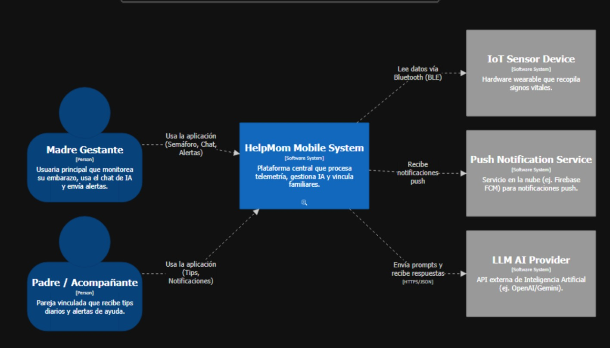

## 2.5.3.2. Software Architecture Container Level Diagrams

El Diagrama de Contenedores detalla la arquitectura interna del sistema basada en microservicios, donde la aplicación móvil multiplataforma se comunica mediante un API Gateway con tres servicios backend especializados (Identidad/Sincronización, Telemetría IoT y Triage IA), utilizando un enfoque de persistencia de datos políglota que separa la información estructurada de usuarios en una base de datos relacional (PostgreSQL) y el registro flexible de conversaciones en una base documental (MongoDB).

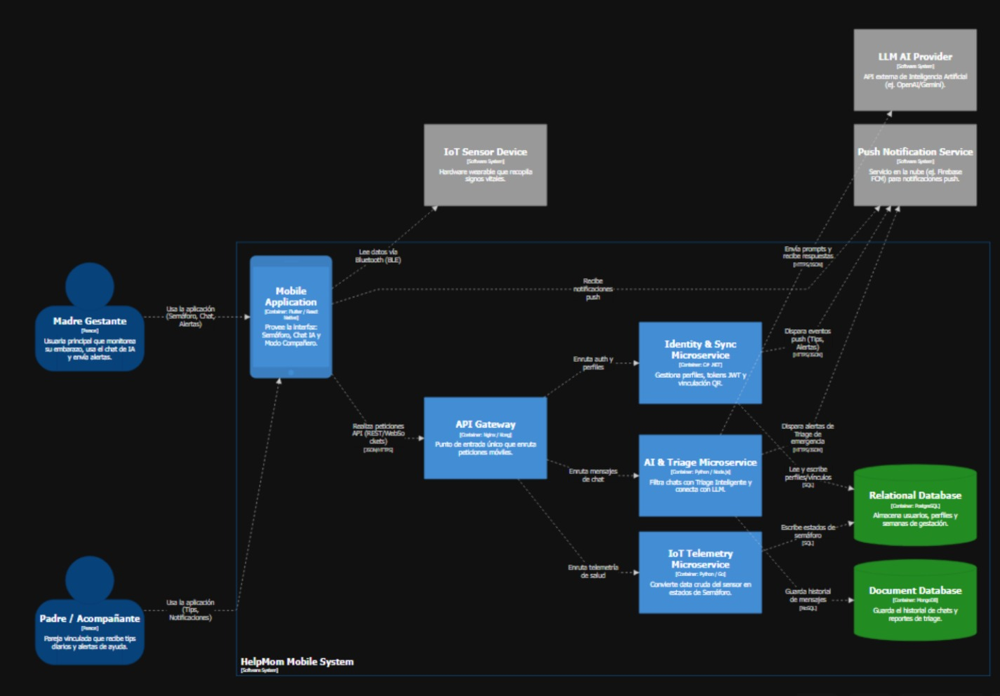

## 2.5.3.3. Software Architecture Deployment Diagrams

El Diagrama de Despliegue ilustra la distribución de la infraestructura en producción, ubicando la ejecución de la aplicación y la conexión del sensor Bluetooth directamente en los dispositivos móviles de los clientes, mientras que toda la lógica de negocio, el enrutamiento y las bases de datos administradas se alojan de forma segura y escalable en un entorno Cloud orquestado mediante clústeres de Kubernetes.

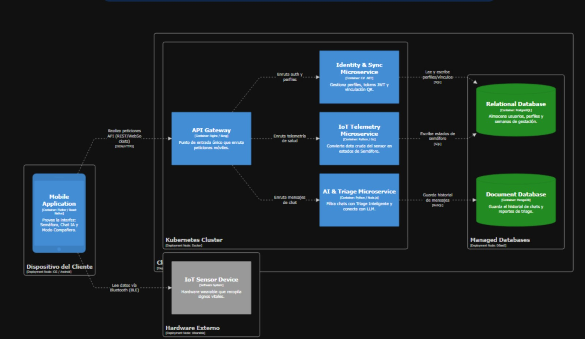

## 2.5.3.4. Software Architecture Domain Message Flow Modelling Diagrams

Esta sección utilizará el Domain Message Flow Modelling, una técnica que ilustra cómo fluyen los mensajes de dominio, como comandos, eventos y consultas, entre los distintos contextos delimitados del sistema. Esto permite clarificar las interacciones y responsabilidades de cada contexto.

### Scenario 01: Madre Gestante se registra e inicializa su seguimiento

Este flujo modela el momento en que la madre se une a la plataforma y el sistema crea su perfil de identidad y automáticamente inicializa su expediente de embarazo.

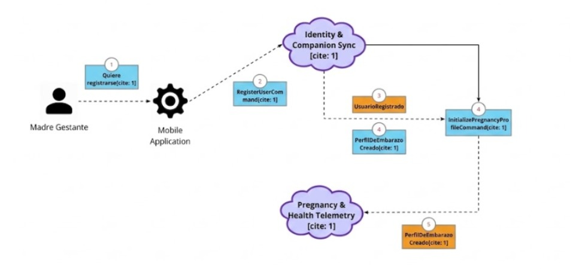

### Scenario 02: El Sensor IoT detecta anomalía (Alerta Roja) y dispara Triage

Este es el flujo más crítico de la aplicación. Muestra cómo una lectura del hardware IoT se procesa y, al detectar peligro, cruza hacia el contexto de IA para lanzar la emergencia.

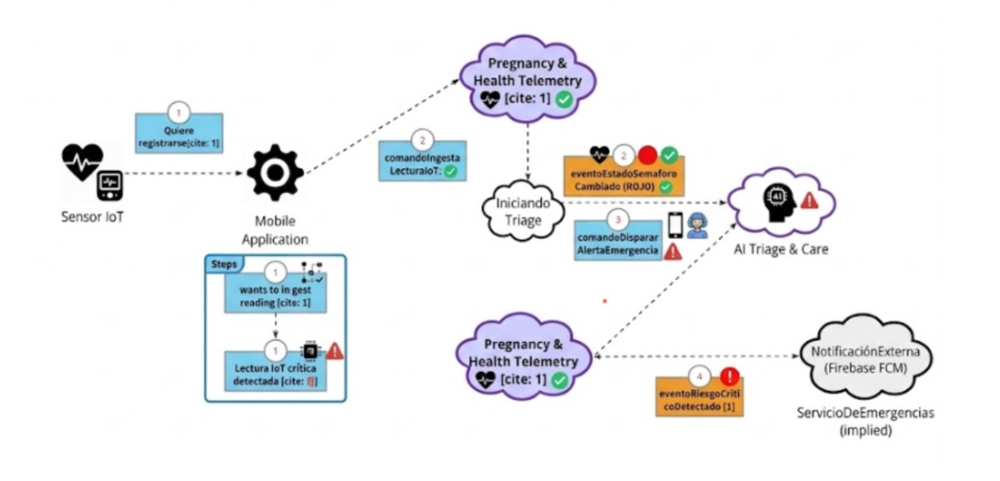

### Scenario 03: Madre envía alerta "Pasa la Voz" al Acompañante

Refleja la funcionalidad de Modo Compañero, donde una alerta no médica necesita consultar la base de datos de identidad para saber a quién enviarle el Push.

## 2.6. Tactical-Level Domain-Driven Design

Esta sección detalla el diseño táctico de HelpMom siguiendo Clean Architecture. A partir del Software Architecture Container Level Diagram, el sistema backend se descompone en tres Bounded Contexts, cada uno respaldado por un servicio independiente: **Identity & Companion Sync**, **Pregnancy & Health Telemetry** y **AI Triage & Care**. Esta separación responde a los criterios de Candidate Context Discovery aplicados sobre el EventStorming del dominio: eventos como `UsuarioRegistrado`, `AcompañanteVinculado`, `LecturaIoTRecibida`, `EstadoSemaforoCambiado`, `MensajeDeRiesgoDetectado` y `AlertaRapidaEnviada` evidencian responsabilidades y ciclos de vida claramente distintos, lo que sustenta trazar límites (bounded contexts) separados en lugar de un único modelo monolítico.

Para cada Bounded Context se documentan las capas de Domain, Interface, Application e Infrastructure, además de los diagramas de nivel Component y Code (Class Diagram y Database Design Diagram) correspondientes.

---

### 2.6.1. Bounded Context: Identity & Companion Sync

El Bounded Context Identity & Companion Sync gestiona la autenticación y autorización de los dos roles de la plataforma (Madre Gestante y Padre/Acompañante), la vinculación de cuentas mediante el "Modo Compañero", así como la gestión de suscripciones y privacidad del perfil. Este contexto actúa como punto de entrada de identidad para los demás contextos, publicando eventos de integración que disparan la creación de perfiles en Pregnancy & Health Telemetry.

#### 2.6.1.1. Domain Layer

**Sub-capa Model — Aggregates:**

| Tipo | Nombre | Descripción | Responsabilidad Principal | Relación con otros elementos |
|---|---|---|---|---|
| Aggregate Root | User | Representa a un usuario autenticable de la plataforma (Madre o Acompañante). | Mantener credenciales, rol asignado y el estado de verificación de la cuenta. | Referenciado por CompanionLink y Subscription mediante UserId. |
| Aggregate | CompanionLink | Representa el vínculo entre la cuenta de la Madre y la del Acompañante. | Controlar el ciclo de vida del código de invitación (generado, pendiente, vinculado, revocado). | Se apoya en User para validar ambos extremos del vínculo. |
| Aggregate | Subscription | Representa el plan contratado por un usuario (Gratuito / Cuidado Integral). | Gestionar el estado de la suscripción y las funcionalidades habilitadas (IA, IoT). | Referenciado por User; consultado por AI Triage & Care para validar acceso al chat 24/7. |

---

**Sub-capa Model — Commands:**

| Tipo | Nombre | Descripción | Responsabilidad Principal | Relación con otros elementos |
|---|---|---|---|---|
| Command | RegisterUserCommand | Comando para registrar una nueva cuenta. | Representar la intención de crear un User con su rol y datos de embarazo básicos. | Disparado desde AuthController. |
| Command | AuthenticateUserCommand | Comando para autenticar credenciales. | Representar la intención de validar email/contraseña y emitir un token. | Consumido por AuthenticationDomainService. |
| Command | GenerateInvitationCodeCommand | Comando para generar un código/QR de vinculación. | Representar la intención de crear un CompanionLink en estado pendiente. | Emitido por la Madre Gestante. |
| Command | AcceptInvitationCommand | Comando para aceptar un código de invitación. | Representar la intención del Acompañante de completar el vínculo. | Actualiza el estado de CompanionLink a vinculado. |
| Command | UpdateSubscriptionPlanCommand | Comando para actualizar el plan contratado. | Representar la intención de cambiar de plan Gratuito a Cuidado Integral o viceversa. | Modifica el Aggregate Subscription. |

---

**Sub-capa Model — Queries:**

| Tipo | Nombre | Descripción | Responsabilidad Principal | Relación con otros elementos |
|---|---|---|---|---|
| Query | GetUserProfileQuery | Consulta el perfil y rol de un usuario. | Recuperar datos básicos de cuenta y privacidad. | Usado en la vista de Perfil/Configuración. |
| Query | GetCompanionStatusQuery | Consulta el estado del vínculo de pareja. | Determinar si existe un Acompañante vinculado y su estado. | Usado por el Bottom Bar para habilitar "Modo Compañero". |
| Query | GetActiveSubscriptionQuery | Consulta el plan vigente de un usuario. | Verificar si el usuario tiene habilitado el sensor IoT y el Asistente IA. | Consultado (vía integración) por AI Triage & Care. |

---

**Sub-capa Model — Events:**

| Tipo | Nombre | Descripción | Responsabilidad Principal | Relación con otros elementos |
|---|---|---|---|---|
| Domain Event | UserRegistered | Emitido al completar el registro de una Madre Gestante. | Notificar que existe una nueva cuenta para inicializar su seguimiento. | Consumido por Pregnancy & Health Telemetry para crear el PregnancyProfile inicial. |
| Domain Event | CompanionLinked | Emitido cuando el Acompañante acepta la invitación. | Notificar que ambas cuentas quedaron enlazadas. | Habilita la vista de Acompañante y las Alertas Rápidas en AI Triage & Care. |
| Domain Event | SubscriptionActivated | Emitido al activar el plan Cuidado Integral. | Notificar que el usuario tiene acceso a IoT e IA. | Consumido por Pregnancy & Health Telemetry (habilita ingesta IoT) y AI Triage & Care (habilita chat 24/7). |

---

**Sub-capa Model — Value Objects:**

| Tipo | Nombre | Descripción | Responsabilidad Principal | Relación con otros elementos |
|---|---|---|---|---|
| Value Object | Role | Enumera los roles válidos: MOTHER, COMPANION. | Restringir la asignación de permisos y vistas por rol. | Usado en User. |
| Value Object | InvitationCode | Código alfanumérico/QR con expiración. | Garantizar unicidad y vigencia temporal del código de vinculación. | Usado en CompanionLink. |
| Value Object | PlanType | Enumera FREE, CARE_PLUS. | Determinar features habilitadas por plan. | Usado en Subscription. |
| Value Object | Email | Encapsula validación de formato de correo. | Evitar direcciones inválidas en el registro. | Usado en User. |

---

**Sub-capa Services:**

| Tipo | Nombre | Descripción | Responsabilidad Principal | Relación con otros elementos |
|---|---|---|---|---|
| Domain Service | PairingDomainService | Servicio de dominio para vinculación de cuentas. | Validar reglas de negocio del emparejamiento (un solo Acompañante activo por Madre, expiración de código). | Orquesta CompanionLink y User. |
| Domain Service | PasswordPolicyService | Servicio de dominio para validar reglas de contraseña. | Verificar longitud mínima y complejidad antes de crear/actualizar credenciales. | Usado por RegisterUserCommand. |
| Interface | IAuthenticationDomainService | Interfaz para autenticación de credenciales. | Definir el contrato de verificación de credenciales y emisión de identidad autenticada. | Implementado en Application Layer. |

---

**Sub-capa Repositories:**

| Tipo | Nombre | Descripción | Responsabilidad Principal | Relación con otros elementos |
|---|---|---|---|---|
| Interface | IUserRepository | Repositorio de usuarios. | Definir operaciones de persistencia para User. | Implementado en Infrastructure con PostgreSQL. |
| Interface | ICompanionLinkRepository | Repositorio de vínculos de pareja. | Definir operaciones de persistencia para CompanionLink. | Implementado en Infrastructure con PostgreSQL. |
| Interface | ISubscriptionRepository | Repositorio de suscripciones. | Definir operaciones de persistencia para Subscription. | Implementado en Infrastructure con PostgreSQL. |

#### 2.6.1.2. Interface Layer

**Sub-capa REST — Resources:**

| Tipo | Nombre | Descripción | Responsabilidad Principal | Relación con otros elementos |
|---|---|---|---|---|
| Resource | UserResource | Representación pública de un usuario. | Exponer id, nombre, rol y estado de verificación al cliente móvil. | Usado en AuthController. |
| Resource | CompanionLinkResource | Representación pública de un vínculo. | Exponer el estado del emparejamiento y el código QR vigente. | Usado en CompanionController. |
| Resource | SubscriptionResource | Representación pública de una suscripción. | Exponer el plan activo y sus features habilitadas. | Usado en SubscriptionController. |

**Sub-capa REST — Transform:**

| Tipo | Nombre | Descripción | Responsabilidad Principal | Relación con otros elementos |
|---|---|---|---|---|
| Assembler | UserResourceFromEntityAssembler | Convierte User a UserResource. | Transformar el agregado de dominio a formato de respuesta API. | Usado en AuthController. |
| Assembler | CompanionLinkResourceFromEntityAssembler | Convierte CompanionLink a CompanionLinkResource. | Transformar entidad de dominio a respuesta API. | Usado en CompanionController. |

**Sub-capa REST — Controllers:**

| Tipo | Nombre | Descripción | Responsabilidad Principal | Relación con otros elementos |
|---|---|---|---|---|
| Controller | AuthController | Expone endpoints de registro, login y recuperación de contraseña. | Recibir requests HTTP, invocar Application Layer y devolver UserResource. | Consume IUserCommandService e IUserQueryService. |
| Controller | CompanionController | Expone endpoints de vinculación de pareja. | Recibir requests de generación y aceptación de invitación. | Consume IPairingCommandService. |
| Controller | SubscriptionController | Expone endpoints de gestión de plan. | Recibir requests de activación/cambio de plan y confirmaciones de pago. | Consume ISubscriptionCommandService; se integra con el webhook del proveedor de pagos. |

#### 2.6.1.3. Application Layer

| Tipo | Nombre | Descripción | Responsabilidad Principal | Relación con otros elementos |
|---|---|---|---|---|
| Command Handler | RegisterUserCommandHandler | Maneja RegisterUserCommand. | Orquestar validaciones, hashear contraseña, persistir User y publicar UserRegistered. | Usa IUserRepository, PasswordPolicyService. |
| Command Handler | AuthenticateUserCommandHandler | Maneja AuthenticateUserCommand. | Orquestar verificación de credenciales y emisión de token JWT. | Usa IAuthenticationDomainService, IUserRepository. |
| Command Handler | GenerateInvitationCodeCommandHandler | Maneja GenerateInvitationCodeCommand. | Orquestar creación de CompanionLink con código temporal. | Usa PairingDomainService, ICompanionLinkRepository. |
| Command Handler | AcceptInvitationCommandHandler | Maneja AcceptInvitationCommand. | Orquestar validación del código y publicación de CompanionLinked. | Usa ICompanionLinkRepository. |
| Command Handler | UpdateSubscriptionPlanCommandHandler | Maneja UpdateSubscriptionPlanCommand. | Orquestar actualización del plan y publicación de SubscriptionActivated. | Usa ISubscriptionRepository, PaymentGatewayAdapter. |
| Query Service | UserQueryService | Implementa las consultas de perfil y estado de vínculo. | Resolver GetUserProfileQuery y GetCompanionStatusQuery. | Usa IUserRepository, ICompanionLinkRepository. |
| Event Handler | OnUserRegisteredIntegrationHandler | Reacciona a UserRegistered. | Publicar el evento de integración consumido por Pregnancy & Health Telemetry para crear el PregnancyProfile inicial. | Publica en el message broker compartido. |

#### 2.6.1.4. Infrastructure Layer

| Tipo | Nombre | Descripción | Responsabilidad Principal | Relación con otros elementos |
|---|---|---|---|---|
| Repository Impl. | UserRepository | Implementación JPA/PostgreSQL de IUserRepository. | Persistir y recuperar usuarios. | Implementa IUserRepository. |
| Repository Impl. | CompanionLinkRepository | Implementación JPA/PostgreSQL de ICompanionLinkRepository. | Persistir vínculos de pareja. | Implementa ICompanionLinkRepository. |
| Repository Impl. | SubscriptionRepository | Implementación JPA/PostgreSQL de ISubscriptionRepository. | Persistir suscripciones. | Implementa ISubscriptionRepository. |
| Service Impl. | JwtAuthenticationDomainService | Implementación de IAuthenticationDomainService basada en JWT. | Firmar y validar tokens de sesión. | Implementa IAuthenticationDomainService. |
| Adapter | PaymentGatewayAdapter | Cliente hacia el proveedor de pagos externo (p. ej. Culqi/Stripe). | Procesar cobros recurrentes y recibir webhooks de confirmación. | Usado por UpdateSubscriptionPlanCommandHandler. |
| Adapter | EmailNotificationAdapter | Cliente de envío de correos transaccionales. | Enviar correos de verificación de cuenta y recuperación de contraseña. | Usado por AuthController. |

#### 2.6.1.5. Bounded Context Software Architecture Component Level Diagrams

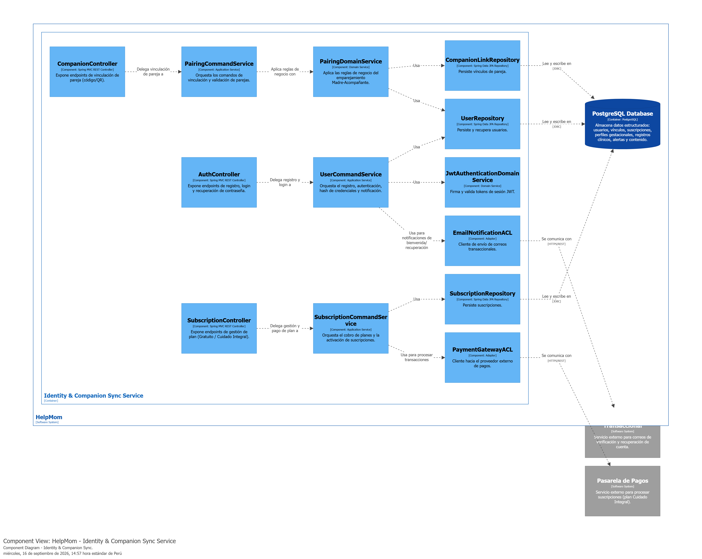

**Figura 1:** Component Diagram — Identity & Companion Sync.

#### 2.6.1.6. Bounded Context Software Architecture Code Level Diagrams

##### 2.6.1.6.1. Bounded Context Domain Layer Class Diagrams

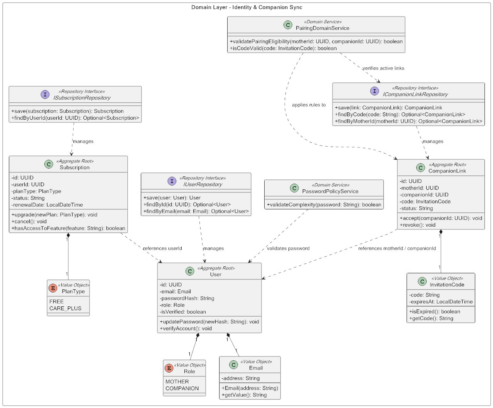

**Figura 2:** Class Diagram — Identity & Companion Sync.

##### 2.6.1.6.2. Bounded Context Database Design Diagram

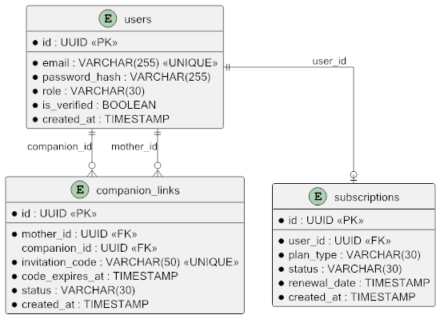

**Figura 3:** Database Design Diagram — Identity & Companion Sync.

---

### 2.6.2. Bounded Context: Pregnancy & Health Telemetry

El Bounded Context Pregnancy & Health Telemetry concentra el seguimiento gestacional (semana de embarazo, tamaño del bebé), el registro clínico "Mi Cuerpo" (peso, síntomas, sueño) y la interpretación del sensor IoT mediante el Sistema de Semáforo. Es el contexto de mayor sensibilidad de datos de la plataforma, por lo que su Domain Layer aísla la lógica de clasificación de riesgo antes de exponerla a otros contextos.

#### 2.6.2.1. Domain Layer

**Sub-capa Model — Aggregates:**

| Tipo | Nombre | Descripción | Responsabilidad Principal | Relación con otros elementos |
|---|---|---|---|---|
| Aggregate Root | PregnancyProfile | Representa el estado gestacional de una Madre. | Mantener la semana de gestación, fecha probable de parto y el tamaño ilustrado del bebé. | Creado a partir del evento de integración UserRegistered. |
| Aggregate | HealthLog | Representa un registro clínico diario. | Almacenar peso, síntomas y horas de sueño reportados por la Madre. | Referencia PregnancyProfile mediante ProfileId. |
| Aggregate Root | IoTReading | Representa una lectura cruda del sensor de latidos. | Registrar la telemetría recibida y calcular su SemaphoreStatus asociado. | Referencia PregnancyProfile mediante ProfileId; dispara eventos consumidos por AI Triage & Care. |

**Sub-capa Model — Commands:**

| Tipo | Nombre | Descripción | Responsabilidad Principal | Relación con otros elementos |
|---|---|---|---|---|
| Command | InitializePregnancyProfileCommand | Comando interno disparado por integración. | Representar la intención de crear el PregnancyProfile al registrarse una Madre. | Disparado por el Event Handler de UserRegistered. |
| Command | RegisterHealthLogCommand | Comando para registrar síntomas/peso/sueño. | Representar la intención de añadir un HealthLog al perfil. | Usado por HealthLogController. |
| Command | IngestIoTReadingCommand | Comando para procesar una lectura entrante del sensor. | Representar la intención de registrar y clasificar una nueva lectura IoT. | Usado por IoTReadingConsumer. |

**Sub-capa Model — Queries:**

| Tipo | Nombre | Descripción | Responsabilidad Principal | Relación con otros elementos |
|---|---|---|---|---|
| Query | GetCurrentGestationalWeekQuery | Consulta la semana actual de embarazo. | Recuperar el dato mostrado en la vista "Inicio". | Usado en HomeController del cliente móvil. |
| Query | GetHealthHistoryQuery | Consulta el historial clínico. | Recuperar la serie de HealthLog para graficar progreso. | Usado en la vista "Mi Cuerpo". |
| Query | GetLatestSemaphoreStatusQuery | Consulta el último estado de semáforo. | Recuperar el estado (verde/amarillo/rojo) más reciente del sensor. | Usado en la vista "Inicio" y por AI Triage & Care. |

**Sub-capa Model — Events:**

| Tipo | Nombre | Descripción | Responsabilidad Principal | Relación con otros elementos |
|---|---|---|---|---|
| Domain Event | HealthLogRegistered | Emitido al registrar un HealthLog. | Notificar que hay un nuevo registro clínico disponible. | Usado internamente para recalcular tendencias. |
| Domain Event | IoTReadingReceived | Emitido al ingerir una lectura del sensor. | Notificar que existe una nueva lectura para clasificar. | Dispara la clasificación de SemaphoreStatus. |
| Domain Event | SemaphoreStatusChanged | Emitido cuando el estado de semáforo cambia a AMARILLO o ROJO. | Notificar una posible situación de riesgo. | Consumido por AI Triage & Care para evaluar una alerta de emergencia. |
| Domain Event | GestationalMilestoneReached | Emitido al alcanzar un hito de la semana de embarazo. | Notificar hitos para las notificaciones de bienestar ("Growth Milestones"). | Consumido por AI Triage & Care para enviar la notificación push. |

**Sub-capa Model — Value Objects:**

| Tipo | Nombre | Descripción | Responsabilidad Principal | Relación con otros elementos |
|---|---|---|---|---|
| Value Object | GestationalWeek | Encapsula la semana de embarazo (1–42) y su cálculo a partir de la fecha probable de parto. | Garantizar consistencia del cálculo de semana gestacional. | Usado en PregnancyProfile. |
| Value Object | SemaphoreStatus | Enumera GREEN, YELLOW, RED. | Representar el resultado simplificado de una lectura IoT. | Usado en IoTReading. |
| Value Object | Symptom | Encapsula un síntoma reportado con severidad. | Estandarizar el vocabulario de síntomas registrables. | Usado en HealthLog. |
| Value Object | SleepRecord | Encapsula horas y calidad de sueño. | Validar rangos razonables de horas de sueño. | Usado en HealthLog. |

**Sub-capa Services:**

| Tipo | Nombre | Descripción | Responsabilidad Principal | Relación con otros elementos |
|---|---|---|---|---|
| Domain Service | SemaphoreClassificationService | Servicio de dominio que traduce datos crudos del sensor en un SemaphoreStatus. | Aplicar los umbrales clínicos configurados para clasificar cada IoTReading. | Invocado al procesar IngestIoTReadingCommand. |
| Domain Service | MilestoneCalculatorService | Servicio de dominio que determina si la semana actual corresponde a un hito. | Evaluar reglas de negocio para disparar GestationalMilestoneReached. | Invocado al actualizar PregnancyProfile. |

**Sub-capa Repositories:**

| Tipo | Nombre | Descripción | Responsabilidad Principal | Relación con otros elementos |
|---|---|---|---|---|
| Interface | IPregnancyProfileRepository | Repositorio de perfiles gestacionales. | Definir operaciones de persistencia para PregnancyProfile. | Implementado en Infrastructure con PostgreSQL. |
| Interface | IHealthLogRepository | Repositorio de registros clínicos. | Definir operaciones de persistencia para HealthLog. | Implementado en Infrastructure con PostgreSQL. |
| Interface | IIoTReadingRepository | Repositorio de lecturas del sensor. | Definir operaciones de persistencia para IoTReading. | Implementado en Infrastructure con MongoDB (datos semi-estructurados de series temporales). |

#### 2.6.2.2. Interface Layer

**Sub-capa REST — Resources:**

| Tipo | Nombre | Descripción | Responsabilidad Principal | Relación con otros elementos |
|---|---|---|---|---|
| Resource | PregnancyProfileResource | Representación pública del perfil gestacional. | Exponer semana actual, tamaño del bebé y fecha probable de parto. | Usado en HomeController. |
| Resource | HealthLogResource | Representación pública de un registro clínico. | Exponer peso, síntomas y sueño al cliente móvil. | Usado en HealthLogController. |
| Resource | SemaphoreStatusResource | Representación pública del estado de semáforo. | Exponer el color y el mensaje amigable asociado. | Usado en IoTReadingController. |

**Sub-capa REST — Transform:**

| Tipo | Nombre | Descripción | Responsabilidad Principal | Relación con otros elementos |
|---|---|---|---|---|
| Assembler | PregnancyProfileResourceFromEntityAssembler | Convierte PregnancyProfile a su recurso REST. | Transformar el agregado de dominio a formato de respuesta API. | Usado en HomeController. |
| Assembler | IoTReadingResourceFromEntityAssembler | Convierte IoTReading a SemaphoreStatusResource. | Traducir la lectura y su clasificación a un formato simple para el cliente. | Usado en IoTReadingController. |

**Sub-capa REST — Controllers / Consumers:**

| Tipo | Nombre | Descripción | Responsabilidad Principal | Relación con otros elementos |
|---|---|---|---|---|
| Controller | HomeController | Expone el endpoint del resumen gestacional (vista "Inicio"). | Recibir requests HTTP y devolver PregnancyProfileResource. | Consume IPregnancyQueryService. |
| Controller | HealthLogController | Expone endpoints CRUD del registro clínico. | Recibir requests de registro y consulta de HealthLog. | Consume IHealthLogCommandService/IHealthLogQueryService. |
| Consumer | IoTReadingConsumer | Consume el stream de telemetría enviado por el sensor Bluetooth vía el gateway móvil. | Traducir mensajes entrantes en IngestIoTReadingCommand. | Consume del message broker / canal BLE-a-backend. |

#### 2.6.2.3. Application Layer

| Tipo | Nombre | Descripción | Responsabilidad Principal | Relación con otros elementos |
|---|---|---|---|---|
| Event Handler | OnUserRegisteredHandler | Reacciona al evento de integración UserRegistered proveniente de Identity & Companion Sync. | Ejecutar InitializePregnancyProfileCommand para crear el perfil inicial. | Usa IPregnancyProfileRepository. |
| Command Handler | RegisterHealthLogCommandHandler | Maneja RegisterHealthLogCommand. | Orquestar validación y persistencia del HealthLog, y publicar HealthLogRegistered. | Usa IHealthLogRepository. |
| Command Handler | IngestIoTReadingCommandHandler | Maneja IngestIoTReadingCommand. | Orquestar clasificación mediante SemaphoreClassificationService, persistir la lectura y publicar SemaphoreStatusChanged cuando corresponda. | Usa SemaphoreClassificationService, IIoTReadingRepository. |
| Query Service | PregnancyQueryService | Implementa las consultas de semana gestacional e historial clínico. | Resolver GetCurrentGestationalWeekQuery y GetHealthHistoryQuery. | Usa IPregnancyProfileRepository, IHealthLogRepository. |
| Event Handler | OnSemaphoreStatusChangedIntegrationHandler | Reacciona a SemaphoreStatusChanged. | Publicar el evento de integración consumido por AI Triage & Care. | Publica en el message broker compartido. |

#### 2.6.2.4. Infrastructure Layer

| Tipo | Nombre | Descripción | Responsabilidad Principal | Relación con otros elementos |
|---|---|---|---|---|
| Repository Impl. | PregnancyProfileRepository | Implementación JPA/PostgreSQL de IPregnancyProfileRepository. | Persistir y recuperar perfiles gestacionales. | Implementa IPregnancyProfileRepository. |
| Repository Impl. | HealthLogRepository | Implementación JPA/PostgreSQL de IHealthLogRepository. | Persistir registros clínicos. | Implementa IHealthLogRepository. |
| Repository Impl. | IoTReadingRepository | Implementación MongoDB de IIoTReadingRepository. | Persistir lecturas de telemetría a alta frecuencia. | Implementa IIoTReadingRepository. |
| Adapter | BluetoothIoTGatewayAdapter | Adaptador que recibe la telemetría emitida por el sensor Bluetooth vía la app móvil. | Normalizar el payload del dispositivo antes de encolarlo para su ingesta. | Alimenta a IoTReadingConsumer. |
| Adapter | PushNotificationAdapter | Cliente de Firebase Cloud Messaging. | Enviar notificaciones de hitos del bebé ("Growth Milestones"). | Usado por OnMilestoneReachedHandler. |

#### 2.6.2.5. Bounded Context Software Architecture Component Level Diagrams

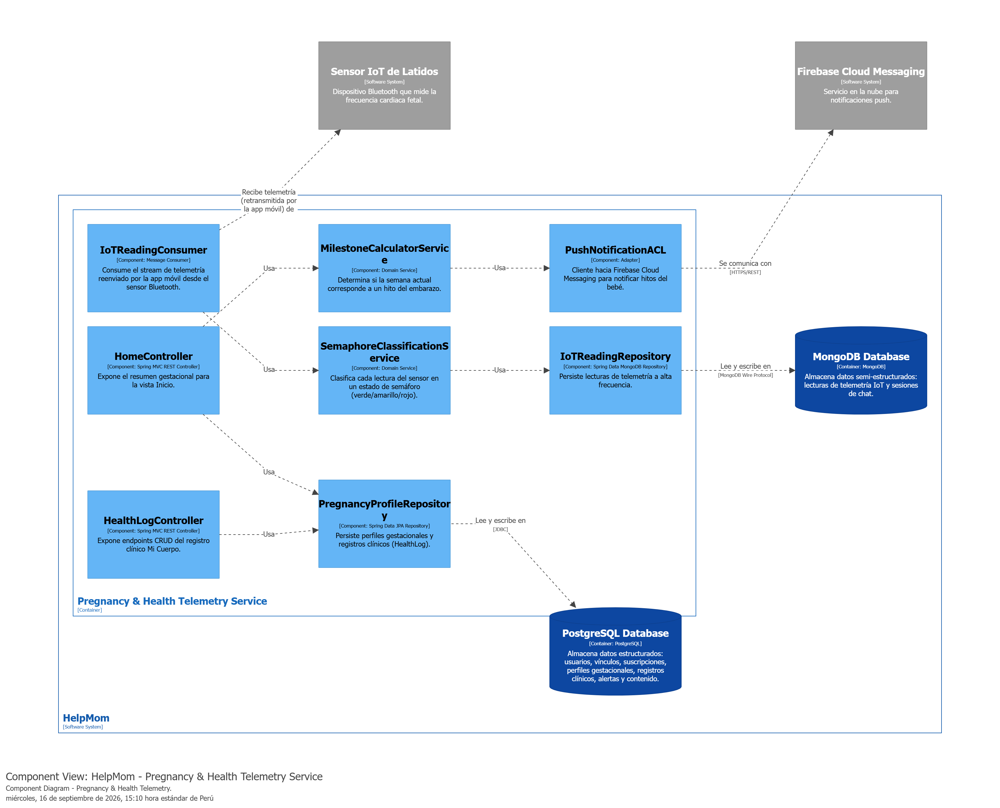

**Figura 4:** Component Diagram — Pregnancy & Health Telemetry.

#### 2.6.2.6. Bounded Context Software Architecture Code Level Diagrams

##### 2.6.2.6.1. Bounded Context Domain Layer Class Diagrams

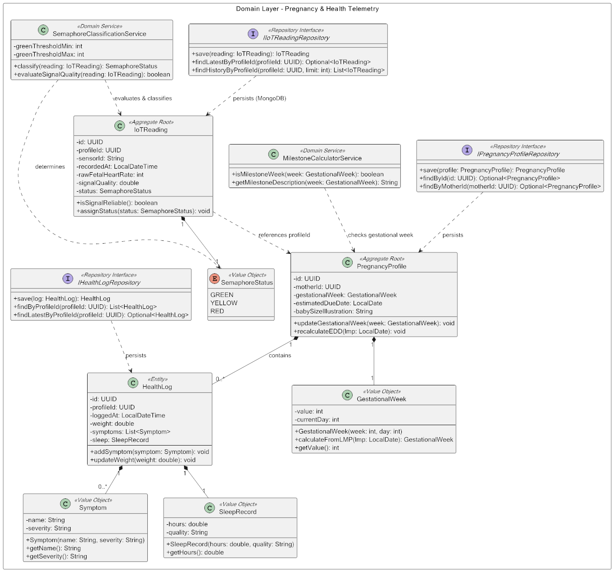

**Figura 5:** Class Diagram — Pregnancy & Health Telemetry.

##### 2.6.2.6.2. Bounded Context Database Design Diagram

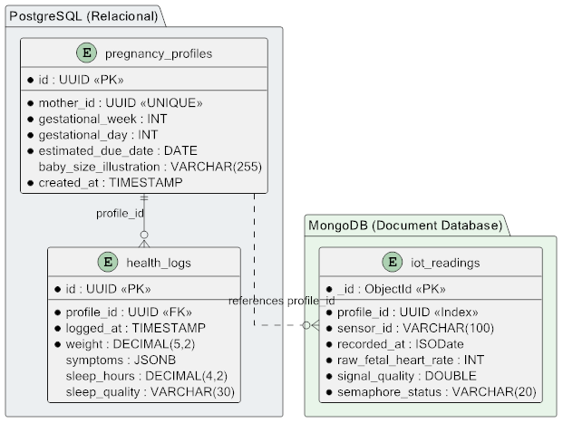

**Figura 6:** Database Design Diagram — Pregnancy & Health Telemetry.

---

### 2.6.3. Bounded Context: AI Triage & Care

El Bounded Context AI Triage & Care concentra el Asistente IA conversacional, el triage inteligente de emergencias, las Alertas Rápidas ("Pasa la Voz"), el contenido educativo desbloqueable ("Academia") y las notificaciones de bienestar emocional. Es el contexto que integra el proveedor externo de Inteligencia Artificial (ver Anexo D — Spike Story de evaluación de proveedores de IA) y los canales de notificación push/SMS de emergencia.

#### 2.6.3.1. Domain Layer

**Sub-capa Model — Aggregates:**

| Tipo | Nombre | Descripción | Responsabilidad Principal | Relación con otros elementos |
|---|---|---|---|---|
| Aggregate Root | ChatSession | Representa una conversación entre la Madre y el Asistente IA. | Mantener el historial de mensajes y el RiskLevel evaluado por turno. | Referencia al UserId de Identity & Companion Sync. |
| Aggregate | QuickAlert | Representa una alerta rápida ("Pasa la Voz") enviada al Acompañante. | Registrar el tipo de alerta, su estado de entrega y el destinatario. | Se apoya en CompanionLink (contexto Identity) para resolver el destinatario. |
| Aggregate | DailyTip | Representa un consejo diario dirigido a la Madre o al Acompañante. | Determinar qué contenido corresponde según semana gestacional y rol. | Consultado por ContentUnlockService. |
| Entity | EmotionalMessage | Representa una "píldora de autoestima" o mensaje de validación. | Almacenar el texto y la ventana horaria de envío. | Parte del catálogo de notificaciones de bienestar. |

**Sub-capa Model — Commands:**

| Tipo | Nombre | Descripción | Responsabilidad Principal | Relación con otros elementos |
|---|---|---|---|---|
| Command | SendChatMessageCommand | Comando para enviar un mensaje al Asistente IA. | Representar la intención de la Madre de consultar una duda de rutina. | Usado por ChatController. |
| Command | TriggerEmergencyAlertCommand | Comando interno para escalar una conversación a emergencia. | Representar la intención de detener el chat normal y notificar al contacto de confianza. | Disparado por TriageDetectionService al detectar RiskLevel.CRITICAL. |
| Command | SendQuickAlertCommand | Comando para enviar una alerta rápida predefinida. | Representar la intención de la Madre de avisar una necesidad puntual al Acompañante. | Usado por QuickAlertController. |
| Command | EvaluateIoTRiskCommand | Comando interno disparado por integración. | Representar la intención de evaluar si un SemaphoreStatusChanged amerita triage. | Disparado por el Event Handler de SemaphoreStatusChanged. |

**Sub-capa Model — Queries:**

| Tipo | Nombre | Descripción | Responsabilidad Principal | Relación con otros elementos |
|---|---|---|---|---|
| Query | GetChatHistoryQuery | Consulta el historial de una ChatSession. | Recuperar los mensajes previos de la conversación. | Usado en la vista "Asistente IA". |
| Query | GetDailyTipQuery | Consulta el consejo del día según rol y semana. | Recuperar el DailyTip correspondiente. | Usado en la vista "Guía Diaria del Acompañante". |
| Query | GetUnlockedContentQuery | Consulta el contenido educativo desbloqueado. | Recuperar los artículos/videos disponibles según semana gestacional. | Usado en la vista "Aprendizaje (Academia)". |

**Sub-capa Model — Events:**

| Tipo | Nombre | Descripción | Responsabilidad Principal | Relación con otros elementos |
|---|---|---|---|---|
| Domain Event | ChatMessageSent | Emitido al registrar un nuevo mensaje en una ChatSession. | Notificar que hay un mensaje pendiente de evaluación de riesgo. | Consumido internamente por TriageDetectionService. |
| Domain Event | CriticalRiskDetected | Emitido cuando el triage detecta palabras clave o un semáforo ROJO. | Notificar una situación de emergencia que requiere intervención inmediata. | Dispara notificación push/SMS al contacto de confianza. |
| Domain Event | QuickAlertSent | Emitido al enviar una Alerta Rápida. | Notificar que el Acompañante debe recibir el push correspondiente. | Consumido por PushNotificationAdapter. |
| Domain Event | ContentUnlocked | Emitido cuando nuevo contenido educativo se habilita para la semana actual. | Notificar disponibilidad de contenido nuevo en la Academia. | Consumido para la notificación de bienestar. |

**Sub-capa Model — Value Objects:**

| Tipo | Nombre | Descripción | Responsabilidad Principal | Relación con otros elementos |
|---|---|---|---|---|
| Value Object | RiskLevel | Enumera NORMAL, WARNING, CRITICAL. | Representar el nivel de riesgo evaluado en un mensaje o lectura IoT. | Usado en ChatSession. |
| Value Object | AlertType | Enumera CRAVING, DISCOMFORT, REST_NEEDED, entre otros. | Estandarizar el catálogo de Alertas Rápidas predefinidas. | Usado en QuickAlert. |
| Value Object | ContentCategory | Enumera NUTRITION, EXERCISE, CHILDBIRTH_PREP, entre otros. | Clasificar el contenido educativo de la Academia. | Usado en DailyTip. |

**Sub-capa Services:**

| Tipo | Nombre | Descripción | Responsabilidad Principal | Relación con otros elementos |
|---|---|---|---|---|
| Domain Service | TriageDetectionService | Servicio de dominio que evalúa cada ChatMessageSent y cada EvaluateIoTRiskCommand. | Aplicar reglas de negocio (palabras clave críticas, semáforo ROJO) para determinar RiskLevel y disparar TriggerEmergencyAlertCommand. | Orquesta ChatSession; consume el evento de integración SemaphoreStatusChanged. |
| Domain Service | ContentUnlockService | Servicio de dominio que determina qué DailyTip corresponde a la semana gestacional actual. | Aplicar reglas de desbloqueo progresivo de contenido. | Usa GestationalWeek (referenciado vía integración con Pregnancy & Health Telemetry). |
| Interface | IAiProviderGateway | Interfaz hacia el proveedor externo de Inteligencia Artificial. | Definir el contrato de envío de prompt y recepción de respuesta del modelo conversacional. | Implementado en Infrastructure Layer (ver Anexo D). |

**Sub-capa Repositories:**

| Tipo | Nombre | Descripción | Responsabilidad Principal | Relación con otros elementos |
|---|---|---|---|---|
| Interface | IChatSessionRepository | Repositorio de sesiones de chat. | Definir operaciones de persistencia para ChatSession. | Implementado en Infrastructure con MongoDB. |
| Interface | IQuickAlertRepository | Repositorio de alertas rápidas. | Definir operaciones de persistencia para QuickAlert. | Implementado en Infrastructure con PostgreSQL. |
| Interface | IDailyTipRepository | Repositorio de contenido diario. | Definir operaciones de persistencia para DailyTip. | Implementado en Infrastructure con PostgreSQL. |

#### 2.6.3.2. Interface Layer

**Sub-capa REST — Resources:**

| Tipo | Nombre | Descripción | Responsabilidad Principal | Relación con otros elementos |
|---|---|---|---|---|
| Resource | ChatMessageResource | Representación pública de un mensaje de chat. | Exponer el texto, remitente y, si aplica, la bandera de riesgo crítico. | Usado en ChatController. |
| Resource | QuickAlertResource | Representación pública de una alerta rápida. | Exponer el tipo de alerta y su estado de entrega. | Usado en QuickAlertController. |
| Resource | DailyTipResource | Representación pública de un consejo diario. | Exponer el contenido y la categoría del tip. | Usado en ContentController. |

**Sub-capa REST — Transform:**

| Tipo | Nombre | Descripción | Responsabilidad Principal | Relación con otros elementos |
|---|---|---|---|---|
| Assembler | ChatMessageResourceFromEntityAssembler | Convierte mensajes de ChatSession a ChatMessageResource. | Transformar el agregado de dominio a formato de respuesta API. | Usado en ChatController. |
| Assembler | DailyTipResourceFromEntityAssembler | Convierte DailyTip a su recurso REST. | Transformar la entidad de dominio a formato de respuesta API. | Usado en ContentController. |

**Sub-capa REST — Controllers:**

| Tipo | Nombre | Descripción | Responsabilidad Principal | Relación con otros elementos |
|---|---|---|---|---|
| Controller | ChatController | Expone el endpoint conversacional del Asistente IA. | Recibir mensajes de la Madre, invocar Application Layer y devolver la respuesta (o el modal de emergencia). | Consume IChatCommandService. |
| Controller | QuickAlertController | Expone el endpoint de envío de alertas rápidas. | Recibir la selección de alerta predefinida y despachar la notificación. | Consume IQuickAlertCommandService. |
| Controller | ContentController | Expone endpoints de consulta de contenido educativo y consejos diarios. | Recibir requests de la vista "Academia" y "Guía Diaria del Acompañante". | Consume IContentQueryService. |

#### 2.6.3.3. Application Layer

| Tipo | Nombre | Descripción | Responsabilidad Principal | Relación con otros elementos |
|---|---|---|---|---|
| Command Handler | SendChatMessageCommandHandler | Maneja SendChatMessageCommand. | Orquestar la persistencia del mensaje, la consulta al IAiProviderGateway y la evaluación de riesgo mediante TriageDetectionService. | Usa IChatSessionRepository, IAiProviderGateway, TriageDetectionService. |
| Command Handler | TriggerEmergencyAlertCommandHandler | Maneja TriggerEmergencyAlertCommand. | Orquestar el despacho de la notificación de emergencia (push y/o SMS) al contacto de confianza. | Usa PushNotificationAdapter, SmsGatewayAdapter. |
| Command Handler | SendQuickAlertCommandHandler | Maneja SendQuickAlertCommand. | Orquestar la persistencia de la QuickAlert y su envío push al Acompañante. | Usa IQuickAlertRepository, PushNotificationAdapter. |
| Event Handler | OnSemaphoreStatusChangedHandler | Reacciona al evento de integración SemaphoreStatusChanged proveniente de Pregnancy & Health Telemetry. | Ejecutar EvaluateIoTRiskCommand para determinar si corresponde escalar a emergencia. | Usa TriageDetectionService. |
| Query Service | ContentQueryService | Implementa las consultas de contenido educativo y consejos diarios. | Resolver GetDailyTipQuery y GetUnlockedContentQuery apoyándose en ContentUnlockService. | Usa IDailyTipRepository, ContentUnlockService. |

#### 2.6.3.4. Infrastructure Layer

| Tipo | Nombre | Descripción | Responsabilidad Principal | Relación con otros elementos |
|---|---|---|---|---|
| Repository Impl. | ChatSessionRepository | Implementación MongoDB de IChatSessionRepository. | Persistir el historial conversacional (esquema flexible de mensajes). | Implementa IChatSessionRepository. |
| Repository Impl. | QuickAlertRepository | Implementación JPA/PostgreSQL de IQuickAlertRepository. | Persistir el registro de alertas rápidas. | Implementa IQuickAlertRepository. |
| Repository Impl. | DailyTipRepository | Implementación JPA/PostgreSQL de IDailyTipRepository. | Persistir el catálogo de consejos diarios. | Implementa IDailyTipRepository. |
| Adapter | AiProviderGatewayAdapter | Cliente hacia el proveedor externo de IA generativa evaluado en el Spike Story (Anexo D). | Enviar el prompt de la Madre y traducir la respuesta del modelo al formato del dominio. | Implementa IAiProviderGateway. |
| Adapter | PushNotificationAdapter | Cliente de Firebase Cloud Messaging (compartido conceptualmente con Pregnancy & Health Telemetry). | Enviar notificaciones push de Alertas Rápidas y contenido desbloqueado. | Usado por SendQuickAlertCommandHandler. |
| Adapter | SmsGatewayAdapter | Cliente de un proveedor SMS (p. ej. Twilio). | Enviar el mensaje de emergencia al contacto de confianza cuando el push no es suficiente. | Usado por TriggerEmergencyAlertCommandHandler. |

#### 2.6.3.5. Bounded Context Software Architecture Component Level Diagrams

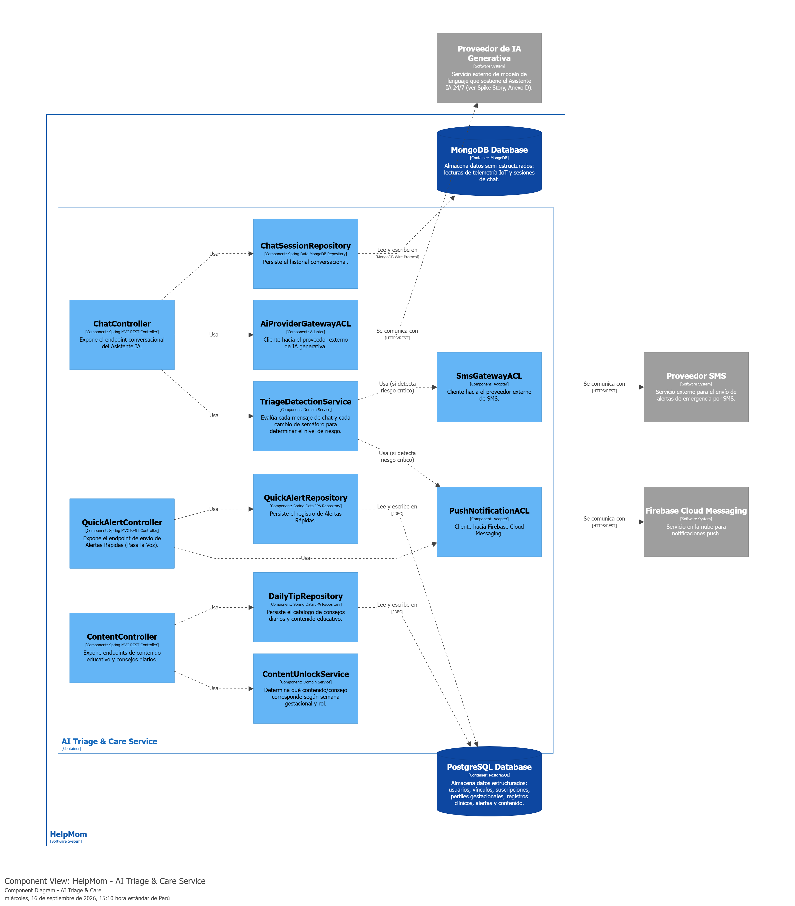

**Figura 7:** Component Diagram — AI Triage & Care.

#### 2.6.3.6. Bounded Context Software Architecture Code Level Diagrams

##### 2.6.3.6.1. Bounded Context Domain Layer Class Diagrams

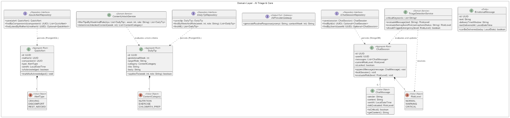

**Figura 8:** Class Diagram — AI Triage & Care.

##### 2.6.3.6.2. Bounded Context Database Design Diagram

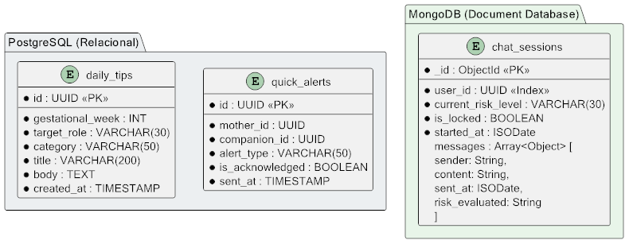

**Figura 9:** Database Design Diagram — AI Triage & Care
