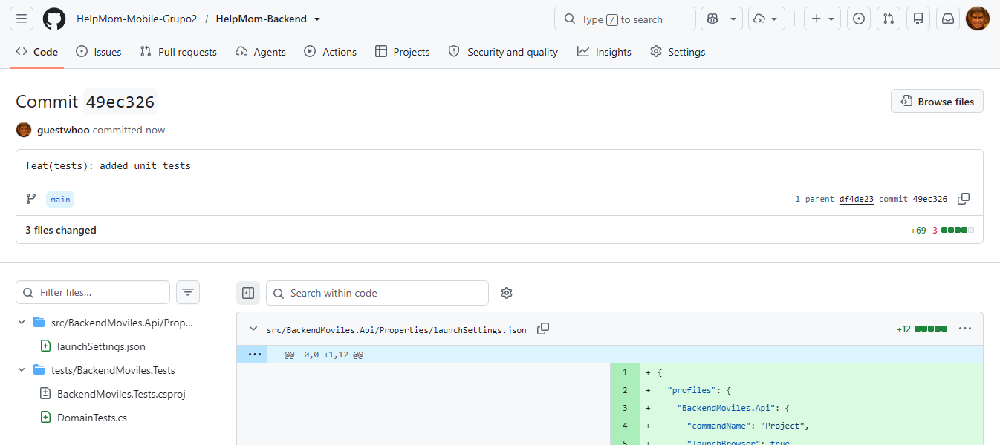
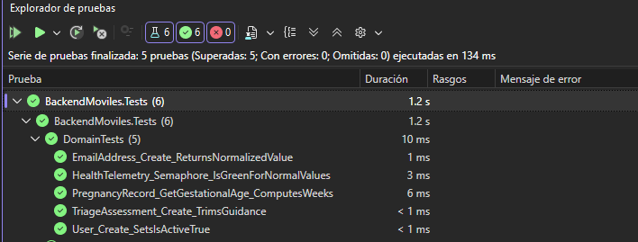
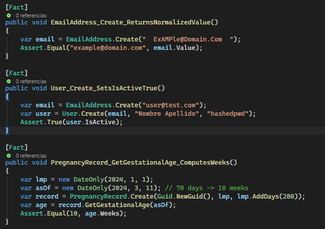
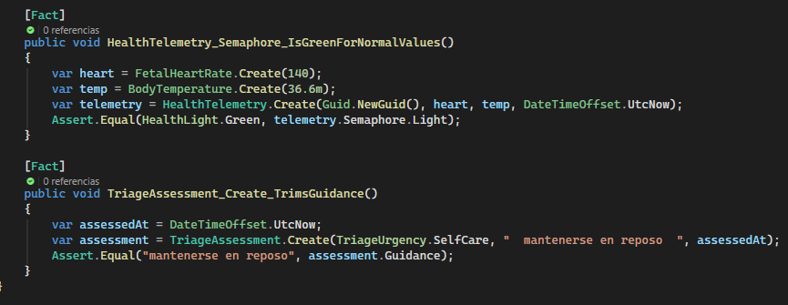
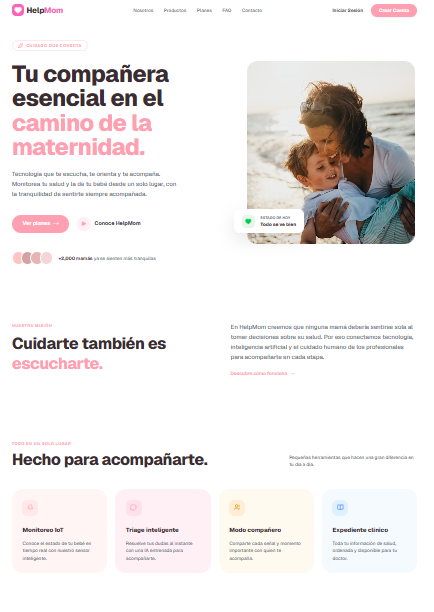
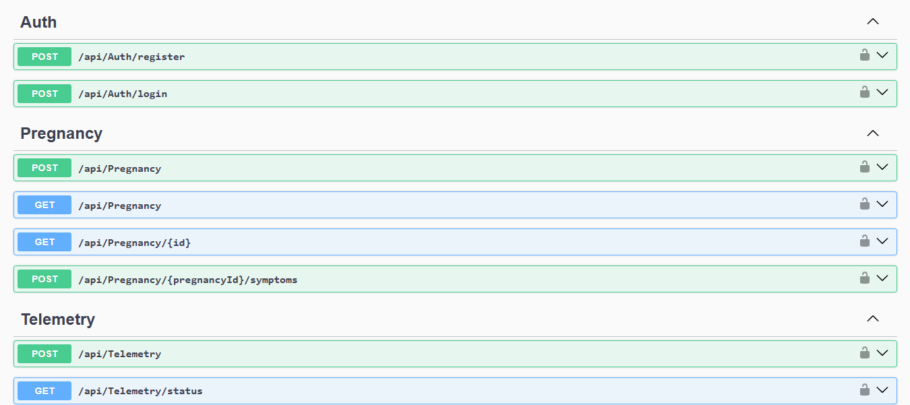
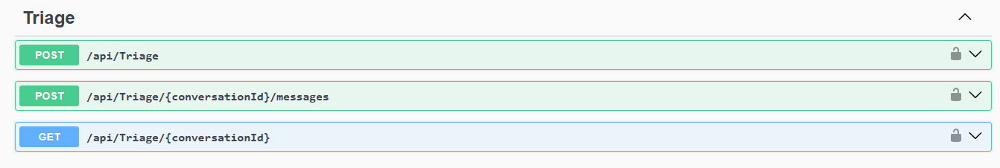
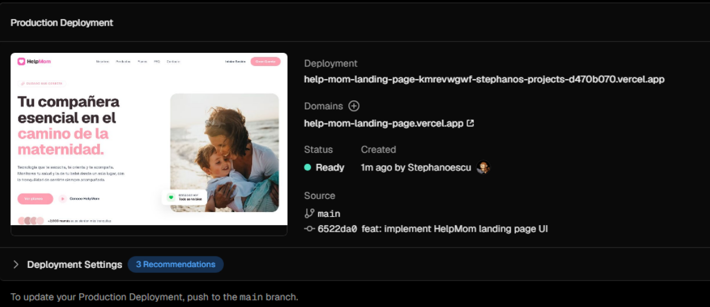
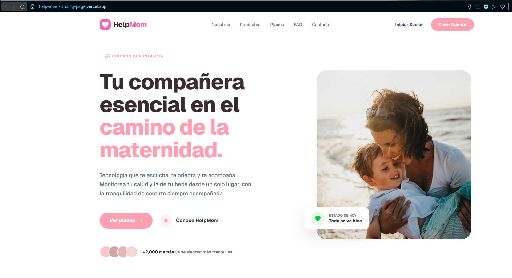

# Capítulo IV: Product Implementation & Validation

## 4.1. Software Configuration Management

La gestión de la configuración establece los estándares técnicos, herramientas y procedimientos automatizados que el equipo de desarrollo utiliza para garantizar la escalabilidad, el orden colaborativo y la calidad del código fuente a lo largo del ciclo de vida de HelpMom.

### 4.1.1. Software Development Environment Configuration

Se estandarizó un entorno de desarrollo ágil y moderno que permite al equipo trabajar de manera fluida en todas las capas del sistema (Frontend web, aplicación móvil y Backend de microservicios).

* **Entorno de Desarrollo Integrado (IDE):** Visual Studio Code, estandarizado para todo el equipo con extensiones clave (Prettier, ESLint, GitLens y asistentes de IA CopilotKit) para unificar la sintaxis y agilizar la escritura.
* **Desarrollo Web (Landing Page):** Entorno de ejecución Node.js con el framework React/Next.js y Tailwind CSS para la construcción e hidratación eficiente de componentes visuales con temas minimalistas.
* **Desarrollo Móvil:** Flutter SDK para la compilación multiplataforma (iOS y Android) de la aplicación principal.
* **Desarrollo Backend & IoT:** Entornos configurados con .NET, C# y Python para el procesamiento del triage de inteligencia artificial, la gestión de bases de datos relacionales y la recepción de telemetría desde los dispositivos IoT.

### 4.1.2. Source Code Management

El control de versiones del proyecto se gestiona íntegramente mediante Git, alojando los repositorios centrales en GitHub. Se ha adoptado un modelo de trabajo colaborativo basado en GitHub Flow para asegurar una integración continua robusta.

**Estructura de Ramas:**
* **`main`**: Rama de producción. Contiene el código estable, validado y desplegado. Está protegida contra commits directos.
* **`develop`**: Rama principal de integración donde se unifican todas las nuevas funcionalidades del Sprint antes de pasar a producción.
* **`feature/nombre-de-tarea`**: Ramas efímeras creadas a partir de develop para el desarrollo de nuevas historias de usuario (ej. `feature/landing-page-ui`, `feature/iot-bluetooth-sync`).

**Pull Requests (PR):** 
Toda integración de código requiere la apertura de un Pull Request hacia la rama `develop`, exigiendo la revisión de código (Code Review) por parte de otro miembro del equipo antes del merge.

### 4.1.3. Source Code Style Guide & Conventions

Para mantener la coherencia semántica y facilitar la lectura y mantenibilidad del código entre los distintos desarrolladores, se aplican normativas estrictas:

**Convenciones de Nomenclatura:**
* **`PascalCase`** para el nombramiento de Clases, Interfaces, Modelos de Dominio y Componentes UI (ej. `MedicalCheckUp`, `HealthCard`).
* **`camelCase`** para variables, funciones, métodos y propiedades (ej. `calculateGestationalWeek`, `vitalSigns`).
* **`kebab-case`** para nombres de archivos, directorios y rutas URL (ej. `patient-profile.tsx`, `auth-controller.cs`).

**Convenciones de Commits (Conventional Commits):** 
Los mensajes de commit se redactan en inglés, utilizando un verbo en imperativo y un prefijo estandarizado:
* **`feat:`** para nuevas funcionalidades.
* **`fix:`** para solución de errores (bugs).
* **`docs:`** para actualizaciones en la documentación técnica.
* **`refactor:`** para reestructuración de código sin alterar su comportamiento externo.

**Formateo Automático:** 
Uso de Prettier configurado en el guardado automático (format on save) para garantizar una indentación uniforme (2 espacios) y la estandarización de comillas y puntos y comas.

### 4.1.4. Software Deployment Configuration

El proceso de integración y despliegue continuo (CI/CD) está automatizado para minimizar la intervención manual y asegurar que las actualizaciones lleguen rápidamente a los usuarios.

* **Despliegue Frontend (Web):** La Landing Page y las aplicaciones web están conectadas directamente a Vercel. La plataforma detecta automáticamente los cambios en el repositorio de GitHub, ejecutando el proceso de build de Next.js y generando URLs de vista previa (Preview Deployments) por cada Pull Request. Las fusiones a la rama `main` disparan automáticamente un despliegue en el dominio de producción.
* **Despliegue Backend:** Los servicios en C#/.NET y Node.js se despliegan en instancias de la nube mediante canalizaciones automatizadas, garantizando que los Bounded Contexts operen de forma aislada y segura, respondiendo únicamente a las peticiones autorizadas (vía JWT) de las aplicaciones cliente.

### 4.2.1.4. Development Evidence for Sprint Review

En esta sección se demuestran los commits relacionados con los principales avances en la implementación.
Estos commits provienen del repositorio del Landing Page y Backend de la organización de GitHub.

Enlace al repositorio de la Landing Page: https://github.com/HelpMom-Mobile-Grupo2/HelpMom-LandingPage

Enlace al repositorio del Backend: https://github.com/HelpMom-Mobile-Grupo2/HelpMom-Backend

| Repository                                 | Branch | Commit Id                                 | Commit Message                                  | Commit Message Body | Commited on (Date) |
|------------------------------.|--------|-------------------------------------------|-------------------------------------------------|---------------------|--------------------|
| HelpMom-Mobile-Grupo2/HelpMom-LandingPage  | main   | d822c4402e13fc950c43f25a2915f0f30c59cde3  | feat: added pricing plans.                      |                     | 20/09/2026         |
| HelpMom-Mobile-Grupo2/HelpMom-LandingPage  | main   | 2db6b4c16b4cf4efe120070ad03a8cb6a181377c  | feat: added products, logo, fonts, banner image |                     | 20/09/2026         |
| HelpMom-Mobile-Grupo2/HelpMom-LandingPage  | main   | 50756f6abfdd6d3649061387d2c5281548dda5fe  | feat: add contact.                              |                     | 20/09/2026         |
| HelpMom-Mobile-Grupo2/HelpMom-LandingPage  | main   | e44f89b6f219466c6b48796457b9a890b4b7a777  | feat: added about us section with images        |                     | 20/09/2026         |
| HelpMom-Mobile-Grupo2/HelpMom-LandingPage  | main   | a2d38d2dacd1732a2e1a48d8b888e2f2a1cf9eaf  | feat: add FAQ.                                  |                     | 20/09/2026         |

### 4.2.1.5. Testing Suite Evidence for Sprint Review

Durante el Sprint 1 se implementaron pruebas unitarias e integrales para validar el correcto funcionamiento de los componentes desarrollados. Se logro validar lo siguiente:

* EmailAddress_Create_ReturnsNormalizedValue: verifica que la creación normaliza y guarda el email en minúsculas y sin espacios.
* User_Create_SetsIsActiveTrue: comprueba que al crear un usuario su propiedad IsActive queda a true.
* PregnancyRecord_GetGestationalAge_ComputesWeeks: valida que se calcula correctamente la edad gestacional (semanas) desde la fecha LMP.
* HealthTelemetry_Semaphore_IsGreenForNormalValues: asegura que para valores normales de frecuencia y temperatura el semáforo de salud es Green.
* TriageAssessment_Create_TrimsGuidance: confirma que la guía (guidance) se recorta (trim) al crear la evaluación de triaje.

Testing Commits

| Repository          | Branch | Commit ID | Commit Message               | Description                                                                                    | Committed On |
| ------------------- | ------ | --------- | ---------------------------- | ---------------------------------------------------------------------------------------------- | ------------ |
| helpmom-mobile-backend      | test   | 482e481   | feat: added unit tests | Implementación de pruebas unitarias e integrales para los componentes principales.| 2026-10-5   |

Figure 5.3.1.4.1 - GitHub commit associated with unit and integration tests.

Figure 5.3.1.4.2 - Test execution results.

Figura 5.3.1.4.3 - Tests content

### 4.2.1.6. Execution Evidence for Sprint Review

Durante el desarrollo del sprint se lograron completar todos los puntos planteados. A continuación se muestran evidencias del landing page logrado.

### 4.2.1.7. Services Documentation Evidence for Sprint Review

Se presenta la documentación técnica de la API del sistema. La imagen muestra una lista clara de todos los servicios disponibles y sus funciones, facilitando su uso y integración.

### 4.2.1.8. Software Deployment Evidence for Sprint Review

Como parte del cierre del Sprint, se evidencia que los incrementos de software desarrollados (Landing Page interactiva) han sido desplegados exitosamente y se encuentran operativos en un entorno público. El pipeline de integración continua de Vercel completó el proceso de compilación sin errores, asignando certificados SSL para navegación segura (HTTPS).

**Link Landing-Page:** [https://help-mom-landing-page.vercel.app/](https://help-mom-landing-page.vercel.app/)
