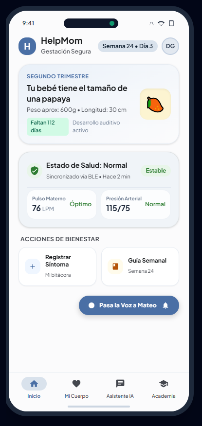
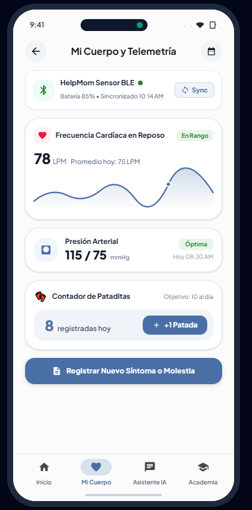
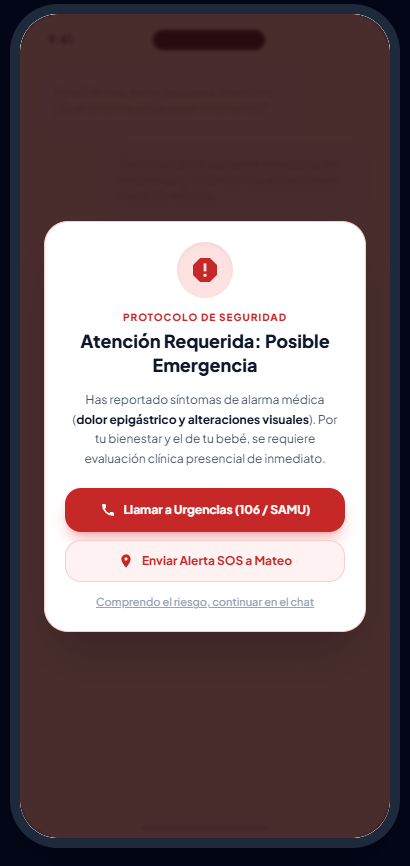
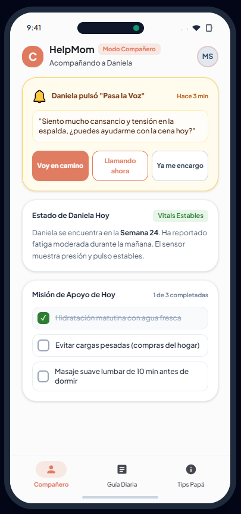
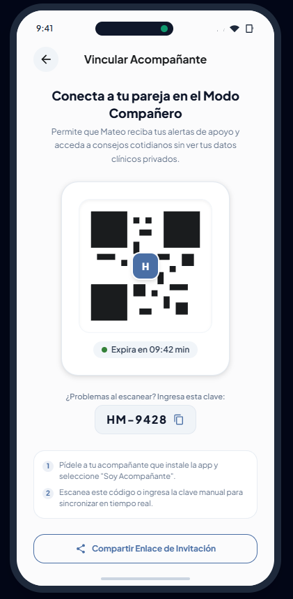
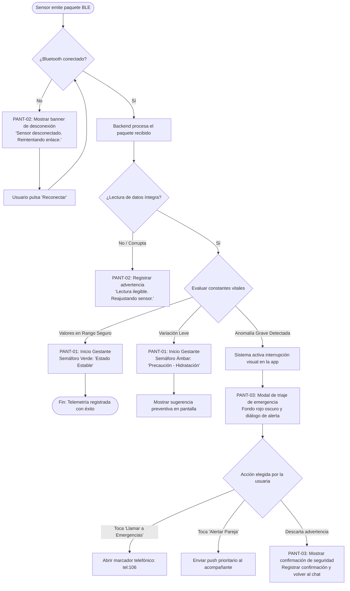
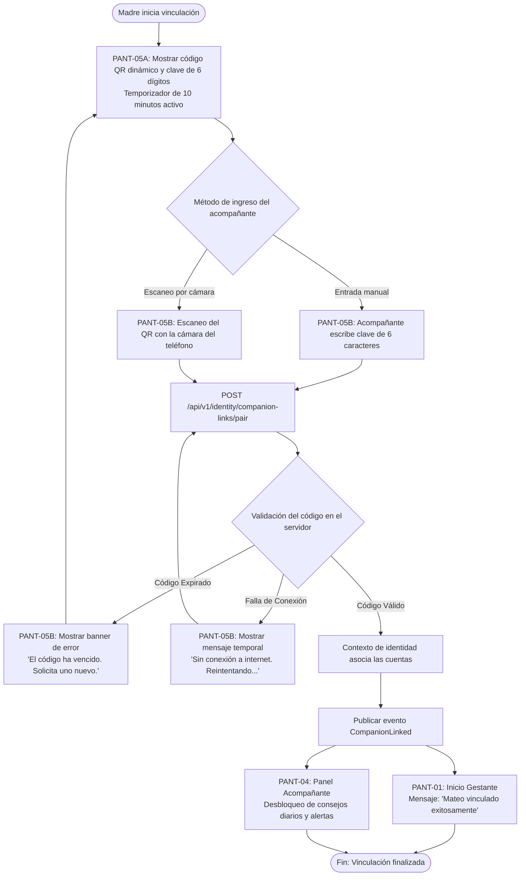
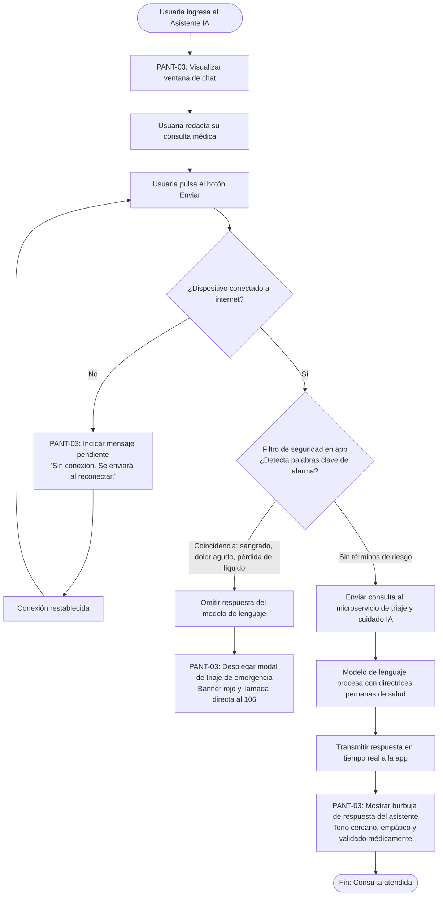

# Capítulo III: Solution UI/UX Design

## 3.1. Especificación del Diseño de la Aplicación Móvil

---

### 3.1.1. Directrices de Estilo (Style Guidelines)

#### 3.1.1.1. Directrices Generales de Estilo (General Style Guidelines)

La arquitectura visual y de interacción de **HelpMom** se fundamenta en el paradigma de **Tecnología Calma (*Calm Technology*)** y se adhiere rigurosamente al sistema de diseño **Material Design 3 (Material You)**. Dado que la etapa gestacional conlleva una alta sensibilidad emocional, fluctuaciones hormonales y situaciones de incertidumbre médica, la interfaz prescinde deliberadamente de patrones visuales de alta excitación sensorial, gamificación invasiva y paletas clínicas frías. El propósito esencial es consolidar una interfaz que transmita rigor técnico, contención emocional y una claridad cognitiva inmediata.

---

##### 1. Identidad de Marca y Filosofía Visual (Branding & Visual Identity)

La identidad de marca de HelpMom comunica **protección cercana, fiabilidad clínica y colaboración activa de la pareja**. El emblema principal integra la silueta orgánica de dos trazos continuos entrelazados que representan a la madre y al acompañante envolviendo al feto en desarrollo, enmarcados en un escudo protector abierto y acogedor.


*   **Propuesta de Valor de la Marca:** "HelpMom: Paz mental conectada durante la gestación".
*   **Pilares de Diseño:**
    *   *Serenidad sobre Estimulación:* Superficies limpias con espacios en blanco generosos y contenedores tonales sutiles que reducen la carga cognitiva.
    *   *Claridad sobre Complejidad:* Interpretación intuitiva de lecturas médicas complejas mediante estados visuales directos, sin ocultar los parámetros de salud subyacentes.
    *   *Inclusión Simétrica de la Pareja:* Respeto equilibrado tanto para el registro clínico de la gestante como para el rol de apoyo del acompañante.

---

##### 2. Tipografía (Typography)

La jerarquía tipográfica emplea **Plus Jakarta Sans** como familia tipográfica principal debido a sus proporciones geométricas modernas, generosas aperturas y excelente legibilidad en pantallas móviles de alta densidad. Como alternativa predeterminada del sistema en entornos nativos de Android, se establece la fuente **Roboto**.


La escala tipográfica sigue formalmente el estándar de **Material Design 3**, asegurando una legibilidad óptima bajo distintas condiciones lumínicas (por ejemplo, consultas en la madrugada o visualización bajo luz solar directa).

| Rol en Material Design 3 | Familia Tipográfica | Peso (*Weight*) | Tamaño (*sp*) | Altura de Línea (*sp*) | Espaciado (*sp*) | Aplicación en HelpMom |
| :--- | :--- | :--- | :---: | :---: | :---: | :--- |
| **Display Large** | Plus Jakarta Sans | Negrita (700) | 57 | 64 | -0.25 | Semanas de gestación destacadas (ej. "Semana 24") |
| **Headline Large** | Plus Jakarta Sans | Seminegrita (600) | 32 | 40 | 0.00 | Títulos principales del panel, encabezados de bienvenida |
| **Headline Small** | Plus Jakarta Sans | Seminegrita (600) | 24 | 32 | 0.00 | Títulos de sección, encabezado del modal de triaje de emergencia |
| **Title Medium** | Plus Jakarta Sans | Mediana (500) | 16 | 24 | +0.15 | Títulos de tarjetas de telemetría, encabezados de diálogos |
| **Body Large** | Plus Jakarta Sans | Regular (400) | 16 | 24 | +0.50 | Mensajes del chat con la IA, artículos educativos |
| **Body Medium** | Plus Jakarta Sans | Regular (400) | 14 | 20 | +0.25 | Descripciones del registro de síntomas, subtextos de estado |
| **Label Large** | Plus Jakarta Sans | Seminegrita (600) | 14 | 20 | +0.10 | Botones interactivos principales, selector "Pasa la Voz" |
| **Label Small** | Plus Jakarta Sans | Mediana (500) | 11 | 16 | +0.50 | Marcas de tiempo, estado de sincronización IoT, barra de navegación |

**Reglas Tipográficas Formales:**
1.  **Límite de Longitud de Línea:** Las cajas de texto de lectura continua no deben sobrepasar los 65 caracteres por línea en pantallas móviles para evitar el agotamiento visual.
2.  **Soporte de Escalado Dinámico:** Todos los estilos tipográficos se declaran en píxeles escalables de Android (`sp`), admitiendo un incremento de hasta el 200% sin truncamientos de texto ni desbordamientos de contenedores.
3.  **Legibilidad Numérica:** Es obligatorio habilitar la característica tipográfica de números tabulares en línea (*tabular figures* u OpenType `tnum`) en gráficos biométricos, frecuencias cardíacas y registros fetales para evitar saltos visuales durante la actualización de datos en tiempo real.

---

##### 3. Paleta de Colores y Cumplimiento de Accesibilidad (Color Palette & Accessibility)

La paleta cromática utiliza los esquemas tonales de Material Design 3, complementados con extensiones semánticas específicas para el **Sistema de Semáforo de Telemetría de Salud**. Todas las combinaciones de contraste entre texto y fondo cumplen estrictamente las directrices **WCAG 2.1 Nivel AA** (relación mínima de contraste de 4.5:1 para texto normal y de 3:1 para componentes de interfaz e iconografía grande), alcanzando el estándar **Nivel AAA** (7:1) en las superficies críticas de emergencia.


```
[ Color Primario: #4A6FA5 ]      --> Azul Pervinca Calmante
[ Color Secundario: #E07A5F ]    --> Terracota Cálido de Cuidado
[ Superficie Base: #FBFBFC ]     --> Blanco Puro Anti-Reflejo
[ Telemetría Normal: #2E7D32 ]   --> Verde Bosque Estable
[ Telemetría Precaución: #EF6C00]--> Ámbar Preventivo
[ Telemetría Crítica: #C62828 ]  --> Carmesí de Emergencia Médica
```

| Nombre del Token | Código Hex | Rol y Significado Semántico | Relación de Contraste | Calificación WCAG |
| :--- | :---: | :--- | :---: | :---: |
| `md.sys.color.primary` | `#4A6FA5` | Controles principales, destinos activos de navegación, botones primarios | 5.2:1 (sobre Superficie) | **Aprobado AA** |
| `md.sys.color.on-primary` | `#FFFFFF` | Texto e iconos dispuestos sobre botones primarios | 5.2:1 (sobre Primario) | **Aprobado AA** |
| `md.sys.color.primary-container` | `#D9E2EC` | Tarjetas destacadas, fondos de chips seleccionados | 8.9:1 (con Texto On-Container) | **Aprobado AAA** |
| `md.sys.color.secondary` | `#E07A5F` | Elementos del "Modo Compañero", insignias de soporte emocional | 4.6:1 (sobre Superficie) | **Aprobado AA** |
| `md.sys.color.surface` | `#FBFBFC` | Fondo base de las vistas, lienzo libre de brillos | N/A | Base |
| `md.sys.color.surface-container` | `#F0F4F8` | Tarjetas de métricas, burbujas de diálogo del asistente IA | 1.1:1 (vs Superficie) | N/A |
| `md.sys.color.on-surface` | `#1A1C1E` | Texto principal de alto contraste, cifras médicas, títulos | 15.8:1 (sobre Superficie) | **Aprobado AAA** |
| `md.sys.color.on-surface-variant`| `#44474E` | Subtítulos, marcas temporales y etiquetas secundarias | 8.2:1 (sobre Superficie) | **Aprobado AAA** |
| `md.sys.color.outline` | `#74777F` | Líneas divisorias, bordes de campos de entrada inactivos | 3.5:1 (sobre Superficie) | **Aprobado AA UI** |
| **`telemetry.status.normal`** | `#2E7D32` | Estado Verde: Signos vitales normales, sensor conectado y estable | 4.8:1 (sobre Superficie) | **Aprobado AA** |
| **`telemetry.status.caution`** | `#EF6C00` | Estado Ámbar: Ligera alteración, recordatorio preventivo de hidratación | 4.5:1 (sobre Superficie) | **Aprobado AA** |
| **`telemetry.status.critical`** | `#C62828` | Estado Rojo: Escalamiento inmediato por triaje de emergencia | 7.1:1 (sobre Superficie) | **Aprobado AAA** |

*Mitigación para Daltonismo (Deuteranopía, Protanopía y Tritanopía):* El color nunca se emplea como el único canal transmisor de información clínica. Cada estado del semáforo se acompaña obligatoriamente de un sistema de doble codificación: una insignia iconográfica distintiva (Escudo con Check para Normal, Triángulo de Advertencia para Precaución y Cruz Octogonal para Crítico) y una etiqueta textual explícita en pantalla.

---

##### 4. Espaciado, Sistema de Cuadrícula y Dimensiones de Diseño (Spacing & Grid System)

El diseño de la app se estructura a partir de un **sistema de cuadrícula de 8 puntos**, complementado por una **sub-cuadrícula de 4dp** para el ajuste fino de iconos, alineación tipográfica y micropaddings.


*   **Márgenes Laterales de Pantalla:** Fijados en `16dp` para dispositivos compactos (ancho de ventana menor a 360dp) y en `20dp` para pantallas móviles estándar (360dp a 412dp).
*   **Sistema de Columnas:** Disposición responsiva de 4 columnas para teléfonos móviles con medianiles (*gutters*) de `16dp`.
*   **Ritmo Vertical:** Intervalos de separación restringidos a múltiplos de 8: `8dp` (espaciado compacto entre elementos relacionados), `16dp` (separación estándar entre componentes), `24dp` (distancia entre grupos de contenido) y `32dp` (separación entre secciones principales).
*   **Zonas de Contacto Táctil (*Touch Targets*):** Todo elemento interactivo (botones, selectores, campos de texto, iconos de navegación) garantiza un área de contacto mínima de **48 × 48 dp**, asegurando su accesibilidad física incluso si el elemento gráfico visible posee dimensiones menores (por ejemplo, un icono de 24dp contenido dentro de un marco interactivo de 48dp).
*   **Escala de Redondeo de Esquinas (*Shape Scale*):**
    *   *Pequeño (8dp):* Cajas de texto, chips de filtrado contextual, etiquetas flotantes.
    *   *Mediano (16dp):* Tarjetas de telemetría de salud, widgets informativos, burbujas de conversación.
    *   *Grande (24dp):* Hojas de acción inferiores (*Bottom Sheets*), diálogos modales de emergencia, contenedor del código QR.
    *   *Completo (999dp):* Botones de Acción Flotante (*FAB*), botones de alerta rápida "Pasa la Voz".
*   **Elevación Tonal de Superficies:** Siguiendo los principios de Material You, la app prescinde de sombras oscuras pronunciadas, adoptando la **elevación tonal por superposición de tinte**:
    *   *Elevación 0 (0dp):* Lienzo base de la ventana (`#FBFBFC`).
    *   *Elevación 1 (1dp):* Tarjetas de contenido con un 5% de tinte del color primario.
    *   *Elevación 2 (3dp):* Barra superior fija de la aplicación y barra inferior de navegación.
    *   *Elevación 3 (6dp):* Botón de acción flotante (FAB) y menús contextuales activos.
    *   *Elevación 4 (8dp):* Diálogos modales y pantallas de interrupción por triaje de emergencia.

---

##### 5. Tono de Comunicación (Tone of Voice - Dimensiones de Nielsen Norman Group)

El tono de comunicación de HelpMom se calibra a través de las **Cuatro Dimensiones del Tono de Voz** formuladas por el Nielsen Norman Group (NN/g), proyectando la personalidad de un **acompañante empático, con respaldo médico y de apoyo incondicional**.

```
[ Humorístico ]   --------------------• [ Serio ]         (90% Serio / Empático)
[ Casual ]        --------•------------ [ Formal ]        (65% Casual / Cercano)
[ Irreverente ]   --------------------• [ Respetuoso ]    (100% Respetuoso)
[ Entusiasta ]    ------------•-------- [ Pragmático ]    (60% Pragmático / Confiable)
```

1.  **Serio frente a Humorístico (90% Serio):**
    *   *Justificación:* El embarazo involucra malestares físicos, preocupaciones y riesgos clínicos reales. Utilizar bromas o un entusiasmo superficial ante un síntoma anómalo generaría rechazo y desconfianza.
    *   *Aplicación:* Se celebran los hitos del bebé con ternura y calidez (ej. *"Tu bebé ha alcanzado el tamaño de una papaya. Sus signos vitales se mantienen estables hoy."*), pero las alertas médicas mantienen una seriedad sobria (ej. *"Tu frecuencia cardíaca en reposo ha superado el rango habitual en los últimos 15 minutos. Te guiaremos paso a paso para verificar tu bienestar."*).
2.  **Formal frente a Casual (65% Casual / Cercano):**
    *   *Justificación:* Un lenguaje médico excesivamente técnico incrementa el estrés de los futuros padres, mientras que la jerga informal debilita la autoridad del servicio.
    *   *Aplicación:* Comunicación en segunda persona (*"tú"* y *"tu bebé"*) con explicaciones comprensibles. Cuando se emplean términos clínicos, se clarifican de inmediato: *"Presión Sistólica (el valor superior): En rango óptimo"*.
3.  **Respetuoso frente a Irreverente (100% Respetuoso):**
    *   *Justificación:* La privacidad corporal, los síntomas de gestación y las rutinas del hogar son íntimos. La app debe respetar los límites emocionales sin emitir juicios de valor.
    *   *Aplicación:* Mensajes respetuosos y comprensivos: *"Registra tu síntoma cuando te sientas cómoda"* en lugar de alertas imperativas como *"¡Olvidaste ingresar tu peso hoy!"*.
4.  **Pragmático frente a Entusiasta (60% Pragmático / Equilibrado):**
    *   *Justificación:* Las exageraciones generan agotamiento emocional y contrastan negativamente ante cualquier imprevisto clínico. Se prioriza una comunicación reconfortante y objetiva.
    *   *Aplicación:* Mensajes claros y tranquilizadores: *"Lectura del sensor recibida y registrada con éxito"* en lugar de exclamaciones desmedidas.

---

### 3.1.4. Diseño UX/UI de Aplicaciones Móviles (Mobile Applications UX/UI Design)

#### 3.1.4.1. Wireframes de Aplicaciones Móviles (Mobile Applications Wireframes)

La estructura alámbrica prioriza la ergonomía digital, la sencillez de uso y la accesibilidad. Se detallan a continuación las cinco pantallas centrales de la experiencia móvil:

##### 1. Pantalla PANT-01: Panel Principal de la Madre Gestante (Home Dashboard)
*   **Distribución Estructural:**
    *   *Barra Superior Fija (*Top App Bar*):* Despliega la marca HelpMom, el contador gestacional (`Semana 24 - Día 3`) y el acceso directo al perfil de usuario.
    *   *Tarjeta de Hito Gestacional (Elemento Principal):* Presenta la equivalencia visual del tamaño del feto con ilustraciones amables, semanas transcurridas y cuenta regresiva al término.
    *   *Tarjeta del Semáforo de Telemetría (Interactivo):* Componente central de estado que muestra el semáforo de salud: color semántico, etiqueta textual (`Estado: Normal`), icono de verificación y tiempo transcurrido desde la última lectura (`Hace 2 min`).
    *   *Accesos Directos:* Distribución en dos columnas para *"Registrar Síntoma"*, *"Guía de la Semana"* y *"Consultar al Asistente IA"*.
    *   *Barra de Navegación Inferior (*Bottom Navigation Bar*):* Cuatro destinos fijos: `Inicio`, `Mi Cuerpo`, `Asistente IA` y `Academia`.
    *   *Botón de Acción Flotante Extendido (*FAB*):* Ubicado en la esquina inferior derecha sobre la barra de navegación, destinado al envío inmediato de la alerta *"Pasa la Voz"*.
*   **Diseño Inclusivo y Accesibilidad (a11y):**
    *   *Agrupación de Contenido:* La tarjeta del semáforo implementa agrupación accesible (`android:focusable="true"` y etiqueta de accesibilidad completa), permitiendo que los lectores de pantalla (TalkBack/VoiceOver) verbalicen de forma continua: *"Estado de salud: Normal. Frecuencia cardíaca y presión dentro del rango seguro. Sincronizado hace dos minutos."*.
    *   *Zonas de Contacto:* El botón "Pasa la Voz" posee una dimensión táctil de 56 × 56 dp con una zona libre de interferencia de 8dp a su alrededor.



##### 2. Pantalla PANT-02: "Mi Cuerpo" - Registro Clínico y Telemetría de Salud
*   **Distribución Estructural:**
    *   *Barra Superior:* Botón de retroceso, título de la pantalla *"Mi Cuerpo"* e icono de filtro temporal.
    *   *Cinta de Estado del Sensor IoT:* Informa el porcentaje de batería del sensor, el nivel de señal Bluetooth y un botón para forzar la sincronización manual.
    *   *Listado de Métricas Biométricas:* Tarjetas desplegables e independientes:
        1. Frecuencia Cardíaca Materna (gráfico de pulsaciones por minuto con umbrales de referencia).
        2. Presión Arterial (valores de presión sistólica y diastólica con registro horario).
        3. Contador de Movimientos Fetales (registro de pataditas con botón de incremento por toque).
    *   *Historial de Síntomas y Bienestar:* Lista cronológica de síntomas registrados cualitativamente (nivel de náuseas, horas de sueño, estado anímico).
    *   *Botón de Acción Inferior:* Botón ancho *"Registrar Nuevo Síntoma"*, anclado al final de la vista desplazable.
*   **Diseño Inclusivo y Accesibilidad (a11y):**
    *   *Bordes de Alto Contraste:* Cada bloque métrico cuenta con un borde visible de 1.5dp bajo el token `md.sys.color.outline` para usuarios con agudeza visual reducida.
    *   *Anuncios Dinámicos:* El contador de movimientos fetales usa regiones dinámicas de accesibilidad (`LiveRegion="polite"`), verbalizando el nuevo conteo de patadas sin interrumpir la lectura en curso.



##### 3. Pantalla PANT-03: Asistente IA y Modal de Interrupción por Triaje de Emergencia
*   **Distribución Estructural:**
    *   *Área de Conversación:* Historial secuencial de mensajes. Los mensajes del asistente se alinean a la izquierda con fondo `surface-container`, y los de la madre a la derecha con fondo `primary-container`.
    *   *Barra de Entrada de Mensaje:* Campo de texto multilínea, botón de dictado por voz y botón de envío de alto contraste.
    *   *Modal de Interrupción de Emergencia (Superposición Condicional):* Se activa de manera inmediata si la app detecta palabras clave críticas o anomalías severas del sensor IoT.
        *   Fondo oscurecido (*scrim*) con un 80% de opacidad y tinte rojizo oscuro.
        *   Caja de diálogo centrada: Encabezado claro *"Posible Señal de Alerta Médica"*, explicación breve sin rodeos y botón de llamada directa: *"Llamar a Emergencias (106 / Clínica)"*.
        *   Botón secundario: *"Notificar a mi Pareja con mi Ubicación"*.
        *   Acción de descarte terciaria de bajo énfasis: *"Comprendo el riesgo, deseo continuar en el chat"*.
*   **Diseño Inclusivo y Accesibilidad (a11y):**
    *   *Atrapamiento del Foco de Accesibilidad:* El modal de emergencia retiene por completo el foco de los lectores de pantalla, impidiendo navegar por elementos de fondo hasta atender la advertencia.
    *   *Respuesta Háptica:* El dispositivo ejecuta un patrón de vibración de alerta dual para alertar a usuarias con limitaciones visuales o auditivas.



##### 4. Pantalla PANT-04: Panel del Acompañante ("Modo Compañero")
*   **Distribución Estructural:**
    *   *Barra de Identificación:* Nombre de la pareja, semana gestacional compartida e indicador de estado de sincronización.
    *   *Resumen de Bienestar de la Pareja:* Tarjeta empática con información cotidiana: *"Daniela presenta cansancio acumulado y tensión en la espalda hoy"*.
    *   *Guía Diaria de Acción ("¿Cómo Apoyar Hoy?"):* Lista de microacciones prácticas recomendadas para el acompañante:
        *   [ ] *"Ten a la mano una botella con agua fresca para hidratarla."*
        *   [ ] *"Encárgate de cargar paquetes o compras pesadas hoy."*
    *   *Bandeja de Alertas Recibidas:* Muestra las solicitudes de "Pasa la Voz" con opciones de respuesta predeterminadas (*"Voy en camino"*, *"Ya me encargo"*).
*   **Diseño Inclusivo y Accesibilidad (a11y):**
    *   *Privacidad de Datos Clínicos:* Los valores médicos sensibles (como la presión exacta o registros de fluidos) permanecen ocultos para el acompañante, salvo autorización explícita de la gestante mediante los ajustes de privacidad.



##### 5. Pantalla PANT-05: Sincronización y Vinculación mediante Código QR
*   **Distribución Estructural:**
    *   *Vista de la Gestante:* Despliega un código QR con expiración automática de 10 minutos y un código numérico alternativo de 6 caracteres.
    *   *Vista del Acompañante:* Cuadro de lectura de la cámara con guías de enfoque, botón para encender la linterna del teléfono y enlace para ingresar el código manualmente.
*   **Diseño Inclusivo y Accesibilidad (a11y):**
    *   *Alternativa Accesible:* El código alfanumérico escrito brinda un camino alternativo y accesible frente a la lectura óptica por cámara para usuarias con dificultades motoras o visuales.



---

#### 3.1.4.2. Diagramas de Wireflow de Aplicaciones Móviles (Mobile Applications Wireflow Diagrams)

Los siguientes wireflows describen la transición entre vistas y las decisiones del sistema para los tres objetivos de usuario centrales.

##### 1. Objetivo de Usuario 01 (OU01): Ingesta de Telemetría IoT y Triaje Crítico de Emergencia


*   **Descripción Paso a Paso (OU01):**
    1.  *Origen:* El biosensor IoT transmite un paquete periódico vía Bluetooth de Baja Energía (*BLE*).
    2.  *Procesamiento:* El servicio en segundo plano de la app recibe la información y la procesa en el contexto de telemetría.
    3.  *Ruta Habitual (Normal):* Si las constantes están dentro de los rangos seguros, la pantalla `PANT-01` actualiza el semáforo al escudo verde. Al presionar la tarjeta, la usuaria navega a `PANT-02` para consultar el detalle de sus registros.
    4.  *Ruta Crítica (Emergencia):* Si se detecta un patrón anómalo grave (ej. indicios de crisis hipertensiva), el sistema bloquea la vista activa y muestra el modal de triaje en `PANT-03`, facilitando la llamada directa a emergencias y notificando al acompañante.

##### 2. Objetivo de Usuario 02 (OU02): Solicitud de Apoyo Inmediato ("Pasa la Voz")


*   **Descripción Paso a Paso (OU02):**
    1.  *Origen:* La gestante necesita ayuda rápida de su pareja sin redactar mensajes largos ni realizar llamadas.
    2.  *Interacción:* Toca el botón flotante "Pasa la Voz" en la pantalla `PANT-01`.
    3.  *Selección:* Se despliega una hoja inferior modal (`PANT-01B`) con opciones de apoyo preconfiguradas y áreas táctiles de 48dp.
    4.  *Transmisión:* Al tocar una opción, se envía una notificación push de alta prioridad al dispositivo del acompañante.
    5.  *Respuesta:* El acompañante recibe un aviso sonoro suave y abre `PANT-04`, donde puede confirmar su apoyo con un toque (*"Voy en camino"*), informando de inmediato a la madre.

##### 3. Objetivo de Usuario 03 (OU03): Vinculación de Cuentas mediante Código QR


*   **Descripción Paso a Paso (OU03):**
    1.  *Inicio:* La madre accede a su perfil y pulsa *"Vincular Acompañante"* (`PANT-05A`), generando un código QR dinámico temporal y una clave alfanumérica de 6 dígitos.
    2.  *Captura:* El acompañante abre HelpMom, escoge el rol *"Soy Acompañante"* e inicia el escaneo con la cámara (`PANT-05B`).
    3.  *Verificación:* El token se valida contra el microservicio de identidad.
    4.  *Confirmación:* Tras comprobarse la autenticidad, la madre visualiza un mensaje de éxito en `PANT-01` y la app del acompañante desbloquea la interfaz completa de `PANT-04`.

---

#### 3.1.4.3. Mock-ups de Aplicaciones Móviles (Mobile Applications Mock-ups)

El diseño visual de alta fidelidad concreta los esquemas anteriores mediante **componentes de Material Design 3** y principios de diseño atómico.

##### 1. Mapeo de Tokens y Estados de Componentes

```
[ Barra Superior de la App (Center-Aligned TopAppBar) ]
 ├── Color de Contenedor: md.sys.color.surface (#FBFBFC)
 ├── Estilo del Título: Typography.TitleMedium (Plus Jakarta Sans 16sp, Mediana)
 └── Iconos: md.sys.color.on-surface (#1A1C1E)

[ Tarjeta de Telemetría del Semáforo ]
 ├── Color de Contenedor: md.sys.color.surface-container (#F0F4F8)
 ├── Radio de Borde: Shape.Medium (16dp)
 ├── Borde: 1.5dp Sólido md.sys.color.outlineVariant (#C4C7C5)
 ├── Insignia de Estado Normal:
 │    ├── Fondo: telemetry.status.normal-container (#E8F5E9)
 │    ├── Texto: telemetry.status.normal (#2E7D32)
 │    └── Icono: Icons.Default.ShieldCheck (24dp)
 └── Elevación: Nivel Tonal 1

[ Botón Flotante Extendido: "Pasa la Voz" (Extended FAB) ]
 ├── Color de Fondo: md.sys.color.primary (#4A6FA5)
 ├── Color de Icono y Texto: md.sys.color.on-primary (#FFFFFF)
 ├── Radio de Borde: Shape.Full (999dp)
 ├── Altura Mínima: 56dp
 ├── Elevación: Nivel 3 (6dp de sombra difusa y tinte tonal)
 └── Estados de Interacción:
      ├── Predeterminado: Opacidad al 100%
      ├── Presionado: Opacidad al 88% con efecto ripple circular
      └── Enfocado: Halo perimetral de 3dp (md.sys.color.primary)

[ Burbuja de Mensaje del Asistente IA ]
 ├── Color de Contenedor: md.sys.color.surface-container-high (#E9EEF4)
 ├── Tipografía: Typography.BodyLarge (16sp, Regular, #1A1C1E)
 ├── Forma: 16dp superior-izq, 16dp superior-der, 16dp inferior-der, 4dp inferior-izq
 └── Elevación: 0dp (apoyado sobre la superficie base)
```

##### 2. Descripción Visual Detallada de los Mock-ups

*   **Mock-up 01: Inicio de la Gestante (Estado Normal / Semáforo Verde)**
    *   *Jerarquía Visual:* La zona superior presenta la tarjeta de evolución gestacional en un fondo degradado suave (`#E9F0F8` a `#FBFBFC`). El texto destaca: *"Semana 24: Tu bebé tiene el tamaño de una papaya"*, acompañado por una ilustración acogedora de bordes redondeados. Debajo, la tarjeta de telemetría atrae la atención con una pastilla verde claro (`#E8F5E9`) y texto esmeralda oscuro (`#2E7D32`): *"Estado Estable: Signos vitales dentro de parámetros normales"*.
    *   *Composición de Componentes:* Tarjetas con padding interno de 16dp y respuesta táctil mediante efecto ondulante (*ripple*). El botón flotante "Pasa la Voz" resalta en azul pervinca (`#4A6FA5`) sobre la barra de navegación inferior, facilitando su accionamiento con una sola mano.


*   **Mock-up 02: Modal de Triaje de Emergencia (Estado Crítico / Semáforo Rojo)**
    *   *Jerarquía Visual:* Toda la interfaz queda cubierta por una capa oscura con tinte rojizo (`#2A0808`) al 80% de opacidad. En el centro emerge un diálogo modal elevado con esquinas redondeadas de 24dp y una insignia circular roja (`#C62828`) con un icono blanco de advertencia médica.
    *   *Composición de Componentes:* Encabezado destacado en tipografía **Headline Small**: *"Atención Requerida: Posible Emergencia"*. El cuerpo de texto brinda indicaciones claras y comprensibles. El botón principal es rojo sólido (`#C62828`) con texto blanco: *"Llamar a Urgencias Médicas"* e icono de llamada directa. Debajo se sitúa un botón secundario con borde visible: *"Enviar alerta SOS a Mateo"*, y al final una acción de texto de bajo énfasis para descartar el diálogo.


*   **Mock-up 03: Panel del Modo Compañero (Perspectiva de Mateo)**
    *   *Jerarquía Visual:* Se distingue del panel de la madre por un friso cálido en color terracota (`#E07A5F`) en la barra superior, indicando claramente la vista **"Modo Compañero"**.
    *   *Composición de Componentes:* La tarjeta de empatía sintetiza el estado anímico y físico general de la madre sin exponer datos médicos confidenciales. El componente *"Misión de Apoyo de Hoy"* despliega una lista interactiva de tareas con casillas redondeadas. Al activarse una alerta "Pasa la Voz", la parte superior de la pantalla se transforma en un aviso dinámico con opciones de respuesta en un solo toque: *"Voy en camino (5 min)"*, *"Llamándote ahora"* y *"Ya me encargué"*.


---

#### 3.1.4.4. Diagramas de Flujo de Usuario de Aplicaciones Móviles (Mobile Applications User Flow Diagrams)

A continuación se presentan los diagramas de flujo completos, contemplando la **ruta principal (*Happy Path*)**, las **rutas alternativas** y las **rutas de error o excepción (*Unhappy Paths*)**, vinculadas a las vistas correspondientes de la app.

##### Flujo 01: Ingesta de Telemetría Biométrica y Triaje Autónomo de Emergencia
Modela el procesamiento de datos del sensor y el tratamiento de desconexiones, advertencias preventivas y eventos críticos.




##### Flujo 02: Emparejamiento por Código QR del Acompañante
Modela la vinculación segura de ambas cuentas, contemplando errores de cámara, códigos vencidos y fallas de red.




##### Flujo 03: Conversación con el Asistente IA e Interrupción por Palabras Clave de Riesgo
Modela la atención de consultas rutinarias versus la detección inmediata de síntomas de alarma médica mediante filtros de seguridad locales y de backend.




---

#### 3.1.4.5. Creación de Prototipos de Aplicaciones Móviles (Mobile Applications Prototyping)

El prototipo interactivo en Figma plasma la experiencia de uso para ambos roles (Madre Gestante y Acompañante), enlazando la arquitectura de información con patrones de interacción reales.


##### 1. Criterios de Creación de Prototipos y Microinteracciones

*   **Comportamiento de la Navegación Principal:**
    *   *Navegación Superior Persistente:* Gestionada mediante la **barra de navegación inferior de Material Design 3**. El cambio entre pestañas se produce de forma inmediata mediante una transición de disolución cruzada (*cross-fade*) sin desplazamientos horizontales, preservando la posición de lectura de la usuaria.
    *   *Navegación en Profundidad:* El paso de una tarjeta resumen a su detalle (ej. de la tarjeta de telemetría en `PANT-01` a la vista detallada de `PANT-02`) aplica una animación de **transformación de contenedor en el eje Z (*Shared Axis / Container Transform*)** durante **300ms** con curva de aceleración estándar (`cubic-bezier(0.2, 0.0, 0, 1.0)`). El contenedor se expande ocupando la pantalla completa, facilitando la comprensión espacial del flujo.
*   **Microinteracciones en Diálogos y Hojas de Acción:**
    *   *Hojas Inferiores (*Bottom Sheets*, ej. selector de "Pasa la Voz"):* Emergen verticalmente en el eje Y durante **250ms** con una curva de desaceleración acentuada (*Emphasized Decelerate*, `cubic-bezier(0.05, 0.7, 0.1, 1.0)`). El cierre se efectúa en **200ms** mediante aceleración acentuada.
    *   *Modal de Triaje de Emergencia:* Omite retrasos de animación decorativos. Al activarse, la capa de oscurecimiento aparece en **100ms** mientras el diálogo central pasa del 90% al 100% de escala en **150ms**, transmitiendo urgencia y nitidez visual inmediata.
*   **Gestión de Estados en Componentes del Prototipo:**
    *   *Botones Interactivos:* Cada botón implementa los estados de interacción: `Predeterminado`, `Puntero sobre elemento` (para pruebas en web o escritorio), `Enfocado`, `Presionado` (con expansión de onda circular *ripple*) y `Deshabilitado`.
    *   *Selector del Semáforo de Telemetría:* El prototipo incluye una variante de prueba interactiva: un botón de depuración oculto permite conmutar el estado del semáforo entre **Normal (Verde)**, **Precaución (Ámbar)** y **Crítico (Rojo)** para evaluar la usabilidad en cada escenario.
    *   *Botones de Respuesta Rápida del Acompañante:* Al pulsar un botón de respuesta en `PANT-04` (*"Voy en camino"*), el elemento cambia al estado de confirmación (`"Respondido ✓"`) en **150ms**, generando a su vez una notificación de confirmación en la vista de la madre.

##### 2. Trazabilidad con la Arquitectura de Información

El prototipo refleja de manera directa los cinco dominios funcionales definidos en el diseño del sistema:


```
Arquitectura de la Información de HelpMom
├── [1.0] Inicio (Panel Principal de la Gestante)
│    ├── [1.1] Seguimiento de Semana Gestacional e Hito del Bebé
│    ├── [1.2] Semáforo de Telemetría IoT en Tiempo Real
│    └── [1.3] Disparador de Alerta Rápida "Pasa la Voz" (Botón Flotante FAB)
├── [2.0] Mi Cuerpo (Registro Clínico y Telemetría)
│    ├── [2.1] Sincronización y Estado de Batería del Sensor IoT
│    ├── [2.2] Gráficos y Tendencias de Frecuencia Cardíaca y Presión Arterial
│    └── [2.3] Formulario de Registro Cualitativo de Síntomas
├── [3.0] Asistente de Cuidado IA (Chatbot Prenatal)
│    ├── [3.1] Historial de Conversación para Dudas Cotidianas
│    └── [3.2] Mecanismo de Triaje Clínico e Interrupción de Emergencia
├── [4.0] Academia (Educación y Soporte Emocional)
│    ├── [4.1] Artículos Médicos Semanales Validados
│    └── [4.2] Píldoras de Autoestima y Bienestar Materno
└── [5.0] Modo Compañero (Entorno Especializado de la Pareja)
     ├── [5.1] Resumen Cotidiano del Estado de la Gestante
     ├── [5.2] Guía de Acción Práctica ("¿Cómo Apoyar Hoy?")
     └── [5.3] Bandeja de Recepción y Respuesta de Alertas "Pasa la Voz"
```

Cada marco de trabajo dentro del archivo de Figma se rotula formalmente conforme a esta jerarquía estructural (ej. `MARCO-1.2-TELEMETRIA-NORMAL`, `MARCO-3.2-TRIAJE-MODAL-CRITICO`), garantizando una trazabilidad rigurosa entre la especificación de requisitos del software, los diagramas de arquitectura C4 y la posterior implementación en código fuente con Kotlin para Android.
